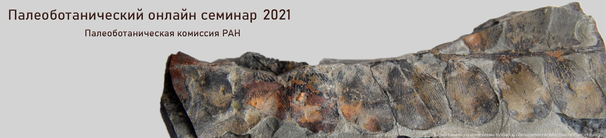

<!-- # Тезисы докладов 2021 года -->

[[toc]]

## Предисловие 

В 2021 году Палеоботаническая комиссия при Научном совете РАН начала работу палеоботанического онлайн семинара. Состоялось тринадцать докладов, тезисы которых опубликованы в настоящем сборнике. 

Целью семинара видится широкое обсуждение специалистами актуальных вопросов палеоботаники и палеопалинологии. Примерная продолжительность доклада – от получаса до часа. Стандартный доклад на конференции обычно соответствует одной статье, палеоботанический онлайн семинар преимущественно ориентирован на более обширные доклады. Это может быть рассказ о результатах исследований в рамках одной темы, например, выполненных по гранту, в процессе подготовки диссертации, в русле многолетних интересов автора. Второй возможный вариант доклада – рассмотрение какой-нибудь проблемы или перспектив метода работы (с произвольным соотношением оригинальных результатов и данных литературы). Бывает, что результаты даже и небольшого исследования трудно изложить в стандартные 15-20 минут доклада, в особенности если на суд коллег хочется вынести и оставшиеся сомнения. Для таких случаев «длинные доклады = короткие лекции» тоже подходят. После доклада - активное и не ограниченное временем обсуждение. Все мы работаем на бесконечном конвейере «один результат – одна статья», а хотелось бы иметь возможность задуматься, в какую общую картину складываются накапливаемые результаты, и обсудить ее с коллегами.  Каждое заседание посвящено одному докладу, но для начинающих ученых оставлена возможность короткого доклада, которые в таких случаях будут сгруппированы по два или три.

Семинар задуман как постоянно действующий, а его онлайн формат позволяет преодолевать как пандемические, так и географические ограничения. 

<i>С уважением, Наталья Завьялова</i>

## Бугдаева Е. В.

### Юрско-раннемеловые растения-углеобразователи юга Сибири и российского Дальнего Востока
[bugdaeva@biosoil.ru](mailto:bugdaeva@biosoil.ru)

Федеральный Научный Центр Биоразнообразия наземной биоты Восточной Азии ДВО РАН, Владивосток

В результате мацерации углей среднеюрской камалинской свиты Канско-Ачинского бассейна были получены кутикулы *Pachypteris* sp., _Czekanowskia_ aff. _obiensis_, _Cz_. cf. _australis_, _Phoenicopsis_ sp. A, _Pseudotorellia_ sp., _Baierella_ sp. A, _Brachyphyllum_ sp. Основными углеобразователями итатской свиты являются _Ginkgo insolita_, _Phoenicopsis_(три вида). Нами выявлены из углей бородинской свиты _Pseudotorellia_ sp. B, _Ps_. sp. C, _Ps_. sp., _Sagenopteris_ (?) sp., _Phoenicopsis_ sp. В средней юре Канско-Ачинского бассейна камалинские и итатские болотные растительные сообщества и растительность возвышенных мест почти не отличались, в то время как бородинские отличались кардинально.

Среднеюрская флора присаянской и кудинской свит Иркутского бассейна представлена папоротниками, _Ginkgo sibirica_ Heer, _Czekanowskia_ и _Phoenicopsis_, хвойными (Frolov, Mashchuk, 2018). Мацерация углей выявила кутикулы _Phoenicopsis_, _Pseudotorellia_, _Ginkgo insolita_ и хвойных.

Дисперсные кутикулы растений из углей среднеюрской улугхемской свиты, Улуг-Хемский бассейн, Республика Тыва, представлены _Pseudotorellia_ cf. _angustifolia_, репродуктивными органами этого растения _Umaltolepis_ sp., а также листьями _Eretmophyllum neimengguensis_. Подчиненное значение имели хвойные. Доминирование _Pseudotorellia_ сближает флору Тывы с флорами Канско-Ачинского и Иркутского бассейнов, Ангрена Узбекистана и бассейна Ордос Внутренней Монголии, Китай.

Изучены нижнемеловые угленосные отложения Республики Бурятия, Забайкальского края, Буреинской впадины Приамурья, Раздольненской и Партизанской впадин Приморья.

Углеобразователями селенгинской и тугнуйской свит являлись умальтолепидиевые и хвойные. Во флоре кутинской свиты Тарбагатайской впадины обнаружены _Anomozamites_ sp., _Czekanowskia vachrameevii_, _Ginkgo_ cf. _coriacea_, _G_. cf. _insolita_, _Pseudotorellia_ sp., _Pagiophyllum_ sp., _Pityophyllum_ sp. 1. Угли тигнинской свиты Халяртинского месторождения Бадинской впадины сложены остатками растений _Arctopitys_ sp. A, _Tarphyderma_ sp. nov. Из углей Черновского и Татауровского месторождений Читино-Ингодинской впадины выявлены Bennettitales sp. indet., _Czekanowskia vachrameevii_, _Phoenicopsis parva_, _Ph_. sp., _Pseudotorellia palustris_, _Ps. resinosa_, _Pseudotorellia_ sp., _Elatides_ cf. _zhoui_, _Pagiophyllum_ sp. Из углей тургинской свиты Букачачинской впадины выявлены _Pseudotorellia transbaikalica_, _P_. sp., _Elatides asiatica_, _Pityophyllum_ sp. 1, _Pagiophyllum_ sp., _P_. ( _Farndalea fragilis_ ) sp. Основными углеобразователями кутинской свиты Тургино-Харанорской впадины являлись _Nilssoniopteris_ aff. _prynadae_, _Pseudotorellia kharanorica_, _Elatides_ sp. A, _E_. cf. _zhoui_, _Holkopitys_ sp. A, _Pagiophyllum_ sp.

Угли чагдамынской свиты Буреинского бассейна сложены остатками _Pseudotorellia_ sp., _Podozamites doludenkoae_, чемчукинской свиты – _Pseudotorellia_ cf. _palustris_, _Marskea_ sp.

Характерная особенность комплекса мезофоссилий углей липовецкой свиты Раздольненского бассейна Южного Приморья заключается в доминировании мировиевых. Нарядуснимивстречены _Nilssoniopteris rithidorachis_, _Pterophyllum_ (2 вида), _Anomozamites_ sp., _Athtrotaxites orientalis_, _Elatides asiatica_, _Tarphyderma_ sp. A.

Одновозрастные угли (верхняя часть старосучанской свиты) Партизанского бассейна Южного Приморья сложены преимущественно _Elatides asiatica_; подчиненное значение имеют мировиевые, редки _Pseudotorellia_ sp. и _Nilssoniopteris rithidorachis_.

Наши исследования были поддержаны грантами РФФИ № 17-04-01582 и № 20-04-00355.

## Гаврилова О.А.  <Badge type="info" text="1" />, Мамонтов Д.А. <Badge type="info" text="2" />

1. Ботанический институт им. В.Л. Комарова РАН, Санкт-Петербург 
2. Московский государственный университет имени М.В. Ломоносова, Москва

### Автофлуоресценция ископаемых и современных спородерм: возможности конфокального микроскопа

По крайней мере с 60-х годов 20 века палеопалинологи отмечали разницу в «свечении» разновозрастных пыльцы и спор (Ефимова, Бессоненко, 1966). Было выдвинуто предположение, что по автофлуоресценции можно отличать возраст ископаемых объектов и подтверждать, что конкретные пыльца и споры являются «переотложенными». Однако в то время исследования проводились с использованием флуоресцентного микроскопа, а результаты описывались «на глазок»: зеленый цвет, светло-желтый цвет и т. п. Современный конфокальный микроскоп позволяет количественно оценить спектры излучения объекта (Бисерова, 2013). Для определения дополнительной возможности идентификации морфологически сходных палинологических объектов было предпринято изучение спектров автофлуоресценции спородерм с помощью конфокального лазерного сканирующего микроскопа (КЛСМ). Автофлуоресценция пыльцы и спор современных растений использовалась при описаниях видов и сортов или экологических условий произрастания (Roshchina et al., 2004; Mitsumoto et al., 2009; Castro et al., 2010; Hoyle et al., 2018; Saulene et al., 2019). Обычно оценивалась интенсивность автофлуоресценции всего пыльцевого зерна или споры, мы же определяли спектры как у конкретного типа спор, так и у разных слоев спородермы, выявляли возможности разграничения спородерм и других ископаемых тканей, которые часто физически неотделимы. Эта методика опробована на различных таксонах карбоновых ямчато-сетчатых дисперсных спорах, спорах девонских _Svalbardia_, триасовых спорах, современных спорах представителей родов _Huperzia_, _Loxsoma_, _Botrychium_ и _Ophioglossum_, а также на современных нормальных и аномальных пыльцевых зернах. У всех экзин максимум длины волны излучения выявлен в оранжево- красной части спектра 615-690 нм. Пики флуоресценции спородерм _Svalbardia_ 623-645 нм, небольшие отличия максимумов флуоресценции существуют между внешним и внутренним слоями оболочки. Оболочка сетчато-ямчатых спор имеет пик спектра при 626 нм, однако у ряда спор обнаружены точечные включения из зеленой части спектра предположительно сохранившиеся от других слоев оболочки или прилегающих тканей. У таксонов триасовых спор и некоторых современных пыльцевых зерен выявлен пик в интенсивно красной части спектра при 670-680 нм. Современные аномальные пыльцевые зерна показали два пика флюоресценции при длинах волн 580 и 670 нм. Планируется продолжить микроспектрофлуориметрию интересующих объектов. Исследование проводилось в ЦКП «Клеточные и молекулярные технологии изучения растений и грибов» БИН РАН.

Работа выполнена при финансовой поддержке РФФИ, проект № 19-04- 00498.

## Герман А.Б.

[alexeiherman@gmail.com](mailto:alexeiherman@gmail.com)

Геологический институт РАН, Москва

### Растения (ископаемые растения) как индикаторы климата (палеоклимата)

Тесная зависимость растений от климата, в котором они произрастают, вполне очевидна. Использовать ископаемые растения для суждения о древних климатах начали практически с началом палеоботанических исследований. В настоящее время литература по этой теме весьма обширна. Из отечественных публикаций наиболее подробно данным вопросом занимались такие известные палеоботаники, как А.Н. Криштофoвич, В.А. Вахрамеев, С.В. Мейен, В.А. Красилов и Л.Ю. Буданцев. В представляемом сообщении рассмотрены основные признаки ископаемых растений, древних флор и растительности, которые наиболее часто используются для реконструкции палеоклиматов; они условно классифицированы следующим образом.

   Морфолого-анатомические индикаторы: параллелизм морфологии растения в зависимости от климата.

1. Морфолого-анатомические индикаторы: параллелизм морфологии растения в зависимости от климата.

   1.1. Индикаторы температуры: мангры, каулифлория, досковидные корни лианы, пикноксилические и маноксилические стволы, листья с цельным и зубчатым краем.
   
   1.2. Индикаторы влажности климата /количества осадков: капельное остриё листьев, корни-«подпорки», дыхательные корни (пневматофоры), водные растения, опушенность листьев (волоски, папиллы), восковой покров поверхности листьев, площадь листовых пластинок.
   
   1.3. Индикаторы сезонности климата: годичные кольца в древесине, клеточная характеристика годичных колец (число клеток, истинные и ложные кольца), сезонно сбрасываемые листья и облиственные побеги, «ископаемый листопад», возможные причины сезонности климата (температура, количество осадков, годичный фотопериодизм).
   
2. Метод реконструкции растительности: физиономические особенности региональной растительности, мангры, карта глобальных климатов Л.С. Берга, номограммы зависимости типов растительности от климатических параметров (J. Wolfe).

3. Метод ближайшего современного родственника (Nearest Living Relative method): примеры (пальмы, пандановые, диптерокарповые).

4. Метод совместного существования (Coexistence Approach): преимущества и ограничения метода.

5. Метод [CLAMP](http://clamp.ibcas.ac.cn) (Climate-Leaf Analysis Multivariate Program).

Ископаемые растения часто предоставляют исследователю свидетельства о климате, в котором они произрастали. Однако палеоботанические индикаторы палеоклимата далеко не всегда можно интерпретировать однозначно. Поэтому изучение ископаемых растений для реконструкции древнего климата должно сопровождаться комплексом иных независимых методов палеоклиматических реконструкций, таких как использование палеозоологических и литологических индикаторов климата, изотопная палеотермометрия, компьютерное моделирование климатов прошлого с использованием современных моделей общей циркуляции.

<iframe width="560" height="315" src="https://www.youtube.com/embed/CUVCYbDHyrY" title="YouTube video player" frameborder="0" allow="accelerometer; autoplay; clipboard-write; encrypted-media; gyroscope; picture-in-picture" allowfullscreen></iframe>

## Гоманьков А.В.

Ботанический институт им. В.Л. Комарова РАН, Санкт-Петербург

[gomankov@mail.ru](gomankov@mail.ru)

### Морфологическая и таксономическая интерпретация остатков  _Orestovia_ - подобных растений из девона России

В средне-верхнедевонских отложениях России ещё с начала XX в. известны странные растения, характеризующиеся простой макроморфологией и очень толстой «кутикулой» (внешней оболочкой, устойчивой к стандартной процедуре мацерации). Среди этих растений выделяется обычно несколько родов, которые группируются вокруг рода _Orestovia_, хотя никакого семейства, объединяющего эти роды, до сих пор не установлено и принадлежность их к какому-либо таксону более высокого ранга остаётся дискуссионной.

Впервые растения из этой группы были описаны в 1915 г. М. Д. Залесским под названием _Himanthaliopsis sniatkovii_, а в 1934 г. З. В. Ергольская обнародовала родовое название _Orestovia_ с двумя видами – _O_. _devonica_ и _O_. _petzii_. Из её описаний и рисунков можно понять, что _O_. _petzii_ фактически ничем не отличается от _H_. _sniatkovii_, тогда как _O_. _devonica_ действительно представляет собой новый таксон, отличный от _H_. _sniatkovii_, может быть, даже не на видовом, а на родовом уровне. Ергольская относила род _Orestovia_ к высшим растениям, тогда как Залесский сближал _H_. _sniatkovii_ с бурыми водорослями. В 1957 г. Е. Ф. Чиркова-Залесская описала ещё одно _Orestovia_ - подобное растение – _Schuguria ornata_, однако сравнения своего материала с родами _Himanthaliopsis_ и _Orestovia_ она не проводила. В 1966 г. Р. Крёйзель и Б. С. Венкатачала описали _Orestovia_-подобные растения из типового местонахождения рода _Orestovia_ в Кузбассе, а также из местонахождения Поши в южном Китае. Однако название _O_. _devonica_ они присвоили остаткам из Китая, идентичным виду _S_. _ornata_, а остатки из Кузбасса описали под названием _Aculeophyton sibiricum_. Поскольку в дальнейшем вид _O_. _devonica_ был признан типовым для рода _Orestovia_, то для сохранения этого родового названия (против названий _Himanthaliopsis_ и _Schuguria_), уже широко вошедшего в палеоботаническую литературу, необходимо рассматривать виды Ергольской как относящиеся к разным родам и, соответственно, считать вид _O_. _petzii_ младшим синонимом _H_. _sniatkovii_.

Ключевым моментом для определения таксономического положения _Orestovia_ - подобных растений является интерпретация своеобразных устьице-подобных структур, во множестве присутствующих на их «кутикуле». Одни исследователи гомологизировали эти структуры с устьицами высших растений, а другие – с органами размножения водорослей. Наиболее убедительными свидетельствами в пользу «устьичной гипотезы» были результаты, полученные на СЭМ, В. А. Красиловым для _O_. _devonica_, а также на СЭМ и ТЭМ П. Г. Гензель и Н. Г. Джонсон для _H_. _sniatkovii_.

Мои исследования фитолейм _S _. _ornata_ и _H_. _sniatkovii_ с помощью СЭМ и конфокального лазерного микроскопа показали, что, по крайней, мере у _S _. _ornatа_ «устьицеподобные структуры» имеют организацию, сильно отличающуюся от устьиц высших растений. Скорее всего, это были крупные клетки, вырабатывавшие слизь и снабжённые своеобразной «апертурой», через которую эта слизь выделялась на поверхность растения. По аналогии можно предположить, что такими же секреторными клетками были те структуры, которые описывались как устьица у _H_. _sniatkovii_ и _O_. _devonica_. Кроме того, у _H_. _sniatkovii_ был обнаружен многогнёздный репродуктивный орган. По форме он напоминает гаметангий диктиокарповых бурых водорослей, но, возможно, является спорангием, т. к. помимо клеточных стенок его клетки сохранили содержимое несмотря на прохождение через стандартную процедуру мацерации. Таким образом, полученные данные свидетельствуют о принадлежности рассматриваемой группы скорее к бурым водорослям, чем к высшим растениям.

<iframe width="560" height="315" src="https://www.youtube.com/embed/g2NjSQYVt_U" title="YouTube video player" frameborder="0" allow="accelerometer; autoplay; clipboard-write; encrypted-media; gyroscope; picture-in-picture" allowfullscreen></iframe>

## Гоманьков А.В.

Ботанический институт им. В.Л. Комарова РАН, Санкт-Петербург

[gomankov@mail.ru](gomankov@mail.ru)

### Необычные лепидофиты из местонахождения Яман-Ус (пермотриас Южной Монголии)

Местонахождение Яман-Ус в Южной Гоби лежит на границе Ангарской и Субангарской палеофлористических областей. В нём представлены две флороносные толщи, объединяемые в яманусскую свиту, – нижняя угленосная с кордаитами и верхняя песчаниковая, где кордаиты не встречаются. По обилию сульцивных кордаитов и отсутствию руфлорий угленосная толща может быть сопоставлена с флористическим комплексом S Ангарской области. Этот комплекс распространён в тайлуганском и грамотеинском горизонтах Кузбасса, а также в гагрьеостровском горизонте Тунгусского бассейна, но в Субангарской области (на Восточно-Европейской платформе) его аналоги не известны. Напротив, песчаниковая толща на основании присутствия в ней многочисленных остатков _Pursongia_ sp. и _Peltaspermopsis_ sp. может быть сопоставлена с вятским горизонтом Восточно-Европейской платформы. В целом же по совокупности данных возраст яманусской свиты можно оценить как позднепермский (Лувсанцэдэн, 2020).

В 2003 и 2011 годах палеоэнтомологический отряд Палеонтологического института РАН собрал в яманусской свите обширную коллекцию насекомых. На основании присутствия в песчаниковой толще гриллоблаттидовых семейства Chaulioditidae, а также нимф подёнок М. С. Игнатов и Д. Е. Щербаков (Ignatov, Shcherbakov, 2011) сопоставляли эту толщу с мальцевской свитой Кузбасса и вулканогенными отложениями Тунгусского бассейна и приписывали ей триасовый возраст. Следует, однако, помнить, что эти надугленосные отложения центральной Ангариды также содержат ряд растительных остатков, характерных для вятского горизонта Восточно-Европейской платформы, и кажется очень вероятным, что, по крайней мере, их нижняя часть относится к перми. Это обстоятельство снимает противоречие в датировках песчаниковой толщи Яман-Уса по флоре и по насекомым, но заставляет относить данную толщу к перми, а никак не к триасу.

Вместе с насекомыми палеоэнтомологи Палеонтологического института собрали в песчаниковой толще большое количество растительных остатков, которые по предварительным определениям можно было отнести частью к мхам, а частью к плауновидным. На основании изучения «моховидной» части коллекции Игнатов и Щербаков описали четыре вида мхов, однако изучение «плауновидной» части коллекции показало, что остатки одного из этих видов ( _Palaeosyrrhopodon grossiserratus_ ) в действительности являются листьями очень своеобразных лепидофитов. Эти растения имели сравнительно тонкие (6–15 мм в толщину) гладкие стебли, на которых по спирали сидели колбовидные пельтатные листья с микроскопическими зубчиками по краю. Листья прикреплялись к стеблю в центре своей расширенной проксимальной части, оставляя на стебле овальные или ромбические листовые рубцы. На месте внутренней коры в стебле была полость, сохранявшаяся в виде слепка с характерными чередующимися рёбрами и желобками. Микро- и мегаспорангии, по-видимому, были собраны в фертильные зоны и сидели в пазухах листьев, мало чем отличавшихся от вегетативных. В основании стебля находился ризофор неправильно-бугристой формы, который (в отличие от стеблей и листьев) был покрыт кутикулой и нёс корневые рубцы, аналогичные листовым рубцам на стебле. На кутикуле присутствуют структуры, внешне напоминающие погруженные устьица, но в действительности представляющие собой мелкие клетки с утолщенной периклинальной стенкой. Линейные дихотомирующие органы с единственной ундулирующей жилкой, возможно, являются корнями описываемых растений, но более вероятно, что это – талломы печёночников.

По наличию полости на месте внутренней коры _Palaeosyrrhopodon_ близок к родам _Suchonodendron_ и _Takhtajanodoxa_. Эти три рода (возможно также вместе с родом _Tomiodendron_) образуют «компактную» группу лепидофитов, которая, по-видимому, играла существенную роль в пограничных пермо-триасовых флорах Ангариды и породила известную плевромейевую флору, ставшую космополитной уже в оленёкском веке.

Литература

_Лувсанцэдэн У._ Фитостратиграфия и флора средне-верхнепермских угленосных отложений Южной Монголии. М.: ПИН РАН, 2020, 144 с.

_Ignatov M. S., Shcherbakov E. D._ Lower Triassic mosses from Yaman Us (Mongolia) // Arctoa, 2011, vol. 20, p. 65–80.

<iframe width="560" height="315" src="https://www.youtube.com/embed/krCF1n_CEMI" title="YouTube video player" frameborder="0" allow="accelerometer; autoplay; clipboard-write; encrypted-media; gyroscope; picture-in-picture" allowfullscreen></iframe>

## Гоманьков А.В.

Ботанический институт им. В.Л. Комарова РАН, Санкт-Петербург

[gomankov@mail.ru](gomankov@mail.ru)

### Цикадовые в перми Ангариды

Цикадовые традиционно считаются группой, типичной для мезозоя. Их присутствие в палеозое долгое время лишь предполагалось на основе находок «цикадоподобных» вегетативных листьев (р. _Taeniopteris_ и др.) и не было подтверждено находками генеративных органов. В Ангарском палеофлористическом царстве остатки рода _Taeniopteris_ были известны из ряда пермских местонахождений на Восточно-Европейской платформе, одного местонахождения в Кузбассе, а также из района Кабула. К этому роду морфологически близки листья, описанные также из гвадалупия–чансиния Восточно-Европейской платформы под названием _Fefilopteris_ и относившиеся первоначально к папоротникам. В дальнейшем, однако, выяснилось, что название _Fefilopteris_ является более поздним синонимом названия _Rhabdotaenia_, а сами листья должны относиться скорее к голосеменным. В терминальной перми Кузнецкого и Тунгусского бассейнов распространены простоперистые листья, известные под наванием _Yavorskyia_, которые так же могли принадлежать цикадовым. К роду _Yavorskyia_ близки листья, описанные под родовым названием _Guramsania_ из гвадалупских отложений южно-монгольского местонахождения Яман-Ус, которое находится на стыке Ангарской и Субангарской палеофлористичеких областей. В более молодых (возможно, чансиньских) отложениях того же местонахождения были найдены очень своеобразные простоперистые листья, условно сближающиеся с родом _Yavorskyia_, но заслуживающие, вероятно, выделения в отдельный род, который пока не описан из-за недостаточности материала.

В 2006 г. в местонахождении Чепаниха (казанский ярус Удмуртии) впервые для Ангарского царства были обнаружены остатки женских фруктификаций, несомненно принадлежащих цикадовым. Это отпечатки кладоспермов, которые можно отнести к роду _Dioonitocarpidium_, известному с начала XX в. из среднего-верхнего триаса Западной Европы, а в 2001 г. найденному также в нижней перми США. С данными фруктификациями, скорее всего, можно связывать листья рода _Taeniopteris_, присутствующие в местонахождении Чепаниха, а также в географически и стратиграфически близком к нему местонахождении Костоваты. Кроме того, на поверхности кладоспермов _Dioonitocarpidium_ из Чепанихи, возможно, присутствовало большое количество одноклеточных волосков и этот признак позволяет сближать данные кладоспермы с листьями _Rhabdotaenia_, которые также несли многочисленные волоски.

Широкое распространение рода _Dioonitocarpidium_, а также находки других женских фруктификаций в США (_Spermopteris_, _Archaeocycas_, _Phasmatocycas_) и Китае (_Crossozamia_) позволяют считать, что в перми цикадовые были уже достаточно разнообразной (хотя и редкой) группой. При этом кладоспермы _Dioonitocarpidium_ выглядят достаточно примитивными и в тоже время имеют сравнительно древний возраст, что позволяет выдвинуть новую гипотезу для ранней эволюции цикадовых. Возможно, что редукция листовидной фертильной пластинки в основании кладосперма _Dioonitocarpidium_ привела к образованию кладоспермов такого типа, как у _Cycas__revoluta_, а параллельное преобразование простоперистой стерильной части в пальчато рассечённую – к появлению кладоспермов _Crossozamia_. Кладоспермы цикадовых с нерассечённой дистальной частью (типа _Zamia_) могли возникнуть из гипотетических предковых форм (ещё более примитивных, чем _Dioonitocarpidium_), обладавших полностью цельной листовидной пластинкой, через промежуточные формы типа _Beania_.

<iframe width="560" height="315" src="https://www.youtube.com/embed/NCrnvQXIpMI" title="YouTube video player" frameborder="0" allow="accelerometer; autoplay; clipboard-write; encrypted-media; gyroscope; picture-in-picture" allowfullscreen></iframe>

## Завьялова Н. Е., Теклева М. В.

[zavial@mail.ru](mailto:zavial@mail.ru)

Палеонтологический институт им. А. А. Борисяка РАН, Москва

### Признаки покрытосеменных у пыльцы из домеловых отложений

Будут рассмотрены находки ископаемой пыльцы, проявляющей черты сходства с пыльцой покрытосеменных, из отложений, в которых макроостатки этой группы растений, принимаемые как несомненные всеми экспертами, не известны (Завьялова, Теклева, 2021).

Со времен дарвиновской «отвратительной тайны» палеоботаникой пройден большой путь и накоплен значительный фактический материал, в том числе и по происхождению и ранней эволюции покрытосеменных. Больше нет оснований думать, что где-то от нас спрятан неизученный материк. Открыта и задокументирована раннемеловая история покрытосеменных. В более древних отложениях обнаружены ранее неизвестные крупные группы высших растений. Появилась палеопалинология - наука об ископаемых пыльцевых зернах и спорах. Тем не менее, остатки бесспорных покрытосеменных в домеловых отложениях не найдены. Громкие юрские находки покрытосеменных оказывались меловыми после более тщательных датировок вмещающих отложений, или же первоначальная интерпретация находок в качестве покрытосеменных развенчивалась в процессе дополнительных исследований.

Тем не менее, представление о том, что важные этапы возникновения и ранней эволюции покрытосеменных не отражены в известной ископаемой летописи, получает постоянное подкрепление в связи с резким несовпадением палеоботанических данных и датировок, реконструируемых для покрытосеменных методами молекулярной филогенетики. "Молекулярные часы" удревняют момент возникновения покрытосеменных до юры, триаса или даже перми и карбона. Противоречие между молекулярными и палеоботаническими выводами объясняют все той же неполнотой палеонтологической летописи из-за редкой встречаемости ранних покрытосеменных в растительном покрове, их неподходящих для фоссилизации свойств, мелких размеров цветков или комбинации этих факторов.

Однако упрек в неполноте малоприменим к палинологическим данным. Дисперсные пыльцевые зерна встречаются очень часто, в самых разных отложениях. Они гораздо более многочисленны и разнообразны, чем любые другие типы растительных фоссилий, а объем накопленных палинологических данных (в связи с их востребованностью для целей биостратиграфии и, в частности, поисков горючих ископаемых) исключительно велик. Из всех типов ископаемых остатков, которые могли остаться от ранних цветковых растений, наибольший шанс дойти до исследователя имеют пыльцевые зерна.

Пыльцевые зерна, проявляющие те или иные признаки покрытосеменных, известны из юрских, триасовых, пермских отложений. Признаки общей морфологии, скульптуры, ультраструктуры, имеющиеся для некоторых палинотипов данные о связи с макроостатками, позволяют вполне убедительно интерпретировать подавляющее большинство таких находок как пыльцу голосеменных. В домеловой палеонтологической летописи такие находки встречаются спорадически и не складываются в цепь находок, соответствующую реконструированной эволюционной последовательности, но выглядят единичными звеньями не из самого начала цепи, тогда как последовательное появление палинотипов покрытосеменных в меловых отложениях вполне согласуется с молекулярно-филогенетическими реконструкциями диверсификации этой группы. Наиболее интригующими оказываются находки домеловой сетчатой пыльцы, однако пермская сетчатая пыльца известна из микроспорангиев хвойных, а для одного из триасовых палинотипов показан характерный для голосемянных тип ультраструктуры эндэкзины. 
Работа выполнена при поддержке гранта РФФИ № 19-04-99498.

- _Завьялова, Н. Е., Теклева, М. В._ (2021). Признаки покрытосеменных у домеловой пыльцы. Ботанический журнал, 106(7), 627-657.

<iframe width="560" height="315" src="https://www.youtube.com/embed/uvYrY0qX5Os" title="YouTube video player" frameborder="0" allow="accelerometer; autoplay; clipboard-write; encrypted-media; gyroscope; picture-in-picture" allowfullscreen></iframe>

## Карасев Е.В. <Badge type="info" text="1,2" />, Давыдов В.И. <Badge type="info" text="2,3" />

[karasev@paleo.ru](mailto:karasev@paleo.ru)

1. Палеонтологический институт им. А. А. Борисяка РАН, Москва {#pin}
2. Казанский (Приволжский) федеральный университет, Казань
3. Университет Бойсе, Бойсе, США 

::: details Цитировать
Карасев Е.В., Давыдов В.И. Динамика таксономического разнообразия растений перми и триаса Кузбасса // Палеоботанический онлайн семинар. М.: ПИН РАН. 2021. С. 15–16.
:::

### Динамика таксономического разнообразия растений перми и триаса Кузбасса и Тунгусского бассейна

Представление об изменениях в палеоэкосистемах Земли на границе перми и триаса связывают с глобальным экологическим кризисом, ярким проявлением которого является факт внезапного вымирания морских биот (~95%) поздней перми по всему миру. В тоже время происходящие изменения в континентальных палеоэкосистемах постепенны и, вероятно, асинхронны. Трапповый магматизм поздней перми – раннего триаса Сибири считается основным фактором внезапного и массового поступления в атмосферу губительных для жизни сублиматов (метан, сульфаты, углекислый газ), резкого увеличения кислотности морских поверхностных вод и кислотных дождей на континентах и причиной резкого потепления палеоклимата. В этой связи интересно оценить влияние сибирского вулканизма на разнообразие растений непосредственно вблизи эпицентра извержений.

Начиная с 2016 года в рамках совместного с Казанским университетом проекта по уточнению геохронологии биотических событий пермо-триасового вымирания в Сибири были собраны данные по 255 пермским и триасовым местонахождениям и разрезам Тунгусского и Кузнецкого бассейнов, включающие данные о таксономическом составе фауны и флоры и распределении их во времени. Был построен сводный композитный разрез, интегрирующий все классы данных, полученных в ходе исследования. Это разрез затем был откалиброван с учетом полученных радиоизотопных датировок в локальных разрезах. Такая калибровка позволила проследить изменение таксономического разнообразия растений Сибири во времени с высокой точностью на протяжении большей части перми и триаса. 

Полученные данные показывают, что сокращение разнообразия растений происходило, главным образом, на видовом уровне и продолжалось в течение второй половины перми. Примерно за 880 тыс. лет до начала триаса (251.9 млн лет) сокращение видового разнообразия приостанавливается, и тренд сменяется на противоположный. На родовом уровне изменения разнообразия происходят с гораздо меньшей амплитудой и на уровне смены доминант, исчезновение значительного числа палеозойских таксонов компенсируется появлением еще большого числа мезофитных форм. Таким образом, палеоклиматические изменения, связанные с Сибирским трапповым вулканизмом, вероятно, привели к окончательному исчезновению климаксных позднепермских форм, таких как сибирские «кордаиты», некоторые птеридоспермы и высокоспециализированные хвощовые и, в то же время, освобождение экологических ниш способствовало появлению менее специализированных и более разнообразных форм. Очевидно при этом, что массовые вулканические проявления Сибирских траппов не только не вызвали вымирание, а стимулировали повышению разнообразия биоты, в том числе и растений. 

Работа выполнена за счет средств субсидии, выделенной Казанскому федеральному университету для выполнения государственного задания №671-2020-0049 в сфере научной деятельности.

## Снигиревский С.М. <Badge type="info" text="1,2"/>, Любарова А.П. <Badge type="info" text="2"/>

[s.snigirevsky@spbu.ru](mailto:s.snigirevsky@spbu.ru)

1. Санкт-Петербургский государственный университет, Санкт-Петербург
2. Ботанический институт им. В.Л. Комарова РАН, Санкт-Петербург

### Этюды о позднедевонской флоре и палеопочвах Северного Тимана

Позднедевонские флоры Северного Тимана можно без преувеличения считать эталонными для познания растительного мира позднего девона.

Первый этюд посвящен фаменским отложениям в бассейне р. Волонги и на восточном побережье Чёшской губы Баренцева моря. Из отложений покаямской свиты были известны большие списки ископаемых растений, собранных в процессе геолого-съемочных работ. Однако, при этом не учитывались процентные соотношения встреченных видов древних растений. Наши исследования показали, что преобладающее большинство остатков принадлежит роду _Rhacophyton_. Остатки этого растения встречаются почти на всех уровнях, формируя моновидовые захоронения. Причем в процессе осадконакопления происходила дифференциация растительного материала: встречены мельчайшие фрагменты терминальных побегов (как фертильных, так и стерильных), в иных местах - более крупные фрагменты ветвей, вплоть до приосновных частей этих крупных кустарников, занимавших, очевидно, береговые участки дельты девонской реки. На палеопочвенных буграх (на подмываемых участках берегов девонской реки) произрастали археоптерисовые: обнаружены захороненные _in situ_ корневые системы вида _Callixylon zalesskyi_.

Второй этюд - о франских растениях, собранных на уникальном местонахождении в 3,5 км севернее мыса Восточный Лудоватый Нос. Здесь встречены как многие формы, описанные ранее (_Gutzeitia timanica_ (Petrosjan) Snigirevsky, _Archaeopteris archetypus_ Schmalhausen, _Pseudobornia __timanica_ Orlova et Jurina, _Dimeripteris gracilis_ Schmalhausen, _Kossoviella timanica_ Petrosjan), так и новое растение, названное нами _Petrosjania salarina_. Известна нижняя часть растения, скорее всего, его нижняя половина. Это растение было древовидным, скорее всего достигало высоты около 2-3 метров. Основание его имело полуовальную форму, от него отходили многочисленные лентовидные ризоиды (которые ранее определялись как _Taeniocrada_ sp.). От бульбовидного основания стебель сужался, его поверхность несет на себе многочисленные веточные рубцы. Многие из веток сохранились в виде длинных сравнительно тонких неветвящихся побегов, особо густо расположенных у самого основания стебля. Ветвление моноподиальное супротивное; в некоторых местах в узлах встречаются черешковые или влагалищные крупные флабеллоидные листья. Растение обладает признаками как членистостебельного, так и плауновидного растения и может быть сравнено с описанным из Китая _Xihuphyllum megalofolium_ (Wu) Chen emend. Huang, Liu, Deng, Basinger et Xue, 2017.

Третий этюд - о палеопочвах на восточном побережье Чёшской губы Баренцева моря. Несмотря на диагенетические изменения, оказавшие сильное влияние на структуру осадка, выявлена хорошая сохранность палеопедогенной информации, зафиксированной в памяти верхнедевонских палеопочв. Разрезы представляют собой единые профили синлитогенных палеопочв с закономерно расположенными зонами оглеения, ожелезнения, карбонатными новообразованиями и биоморфами, представленными растительными остатками, спорами и оолитами. Анализ морфологии слоёв разреза на разных уровнях структурной организации (от макро- до субмикроуровня) позволил выделить элементарные почвенные процессы с выраженным глеевым процессом, указывающим на высокую роль гидроморфизма в генезисе данной почвы. Предположительно изученную палеопочву можно отнести к реферативной группе Stagnosols (WRB, 2015), в почвах которой периодически возникают восстановительные условия.

<iframe width="560" height="315" src="https://www.youtube.com/embed/ZERA1PNil2U" title="YouTube video player" frameborder="0" allow="accelerometer; autoplay; clipboard-write; encrypted-media; gyroscope; picture-in-picture" allowfullscreen></iframe>

## Соколова А.Б.

[klumbochka@mail.ru](mailto:klumbochka@mail.ru)

Палеонтологический институт им. А.А. Борисяка РАН, Москва

### Разработка морфологической классификации для меловых и раннекайнозойских представителей Sequoioideae

Подсемейство секвойевых (Sequoioideae) состоит из трех современных родов: _Sequoia_ Endlicher, _Sequoiadendron_ Buchholz и _Metasequoia_ Miki ex Huet W.C. Cheng. Первым из них был выделен род секвойя (Endlicher, 1847). Род _Sequoiadendron_ был установлен Бухгольцем в 1939 году; первоначально растение относили к одному из двух современных видов рода секвойя (Buchholz, 1939). В 1941 году по ископаемым остаткам вегетативных побегов и женских шишек был описан новый род _Metasequoia_ (Miki, 1941), позже переописанный уже на современном материале (Hu, Cheng, 1948). С момента выделения и до настоящего времени, помимо трех нынеживущих (по одному виду в каждом из трех родов), было описано более ста видов ископаемых секвой, около 30 видов ископаемых метасеквой и около 15 видов ископаемых секвойядендронов. Большая часть видов секвой (около 70 процентов) была описана до середины прошлого века. Практически все они выделялись на основании незначительных вариаций в морфологических признаках отпечатков дисперсных облиственных побегов. Эти варьирующие признаки в своем большинстве входят в пределы изменчивости современного вида _S. sempervirens_, характеризующегося очень высоким полиморфизмом. Лишь в немногих случаях выводы на основании вегетативной морфологии были подкреплены данными по репродуктивным органам. Стоит отметить, что по данным многих исследователей, последние являются наиболее значимыми для целей систематики и таксономии (Bobrov, 2004; Stockeyetal., 2005; RothwellandOhana, 2016). Тем не менее, с тех пор определение в позднемеловых и раннекайнозойских флорах до десятка различных видов секвой в рамках одного флористического комплекса было обычным явлением, при этом их сочетание часто повторялось от одной выборки к другой (Красилов, 1979). Это положение, в сущности, стало меняться не так давно. 

В последние десятки лет, с приходом современных методологических подходов таких как кутикулярно-эпидермальный анализ, световая и сканирующая электронная микроскопия, а также компьютерная томография, в палеоботанической литературе все чаще стали появляться работы с ископаемыми хвойными, сближаемыми с группой секвоид, детально изученными в плане морфологии и анатомии вегетативных и репродуктивных органов. Интересно отметить, что ни одно из ископаемых секвойеподобных растений с изученной анатомией семенных шишек не было отнесено к современным родам _Sequoia_ или _Sequoiadendron_. В сущности, это может означать, что несмотря на консерватизм вегетативных органов, секвойеподобные растения мелового периода и раннего кайнозоя, все же, сильно отличались от современных представителей по строению генеративных органов. 

Таким образом, отнесение дисперсных ископаемых остатков к современным родам все чаще кажется нежелательным, так как искажает представление о древних секвоидах и их разнообразии. Естественные таксоны хвойных могут быть выделены лишь по сочетанию диагностических признаков различных категорий органов. Фрагментарные остатки ископаемых хвойных, представленные отпечатками дисперсных побегов, листьев и репродуктивных органов, следует классифицировать как ископаемые таксоны (fossiltaxa) по отдельным органам растений. Для таких остатков нам кажется целесообразным создание морфологической классификации,независимой от естественной. Такого рода классификация для дисперсных листьев покрытосеменных была впервые разработана В.А. Красиловым (1979) и успешно используется уже многие десятилетия (Maslova et al., 2005; Herman, Kvaček 2010;Moiseeva, 2012 и др.). Морфологическая система позволяет исследователям проследить появление того или иного типа органа, его геологическую историю и соотношение морфологических групп (Красилов, 1979). На данном этапе исследования мы разработали демоверсию морфологической классификации на примере ископаемых секвоид с тем, чтобы в дальнейшем расширить ее, включив морфотипы органов представителей других семейств хвойных.

Исследование поддержано грантом РФФИ №21-54-53001.

<iframe width="560" height="315" src="https://www.youtube.com/embed/MXY73_aAvqY" title="YouTube video player" frameborder="0" allow="accelerometer; autoplay; clipboard-write; encrypted-media; gyroscope; picture-in-picture" allowfullscreen></iframe>

## Форапонова Т.С. <Badge type="info" text="1"/>, Карасев Е.В. <Badge type="info" text="1,2"/> 

[t.foraponova@gmail.com](mailto:t.foraponova@gmail.com)

1. Палеонтологический институт им. А. А. Борисяка РАН, Москва
2. Казанский федеральный университет, Казань

### Реконструкция pCO~2~ на основании изучения кутикул палеозойских растений

Современное изменение климата находится в списке глобальных вопросов повестки дня на сайте ООН ([https://www.un.org/ru/global-issues/climate-change](https://www.un.org/ru/global-issues/climate-change)), в связи с чем исследования климата представляют большой интерес. Среди парниковых газов углекислый газ стоит на втором месте по поглощению солнечной радиации (26%), поэтому многие исследования посвящены изучению изменения уровня CO2 и его влиянию на климат Земли. В ходе эволюции растения адаптируются к долгосрочным колебаниям уровня CO2, варьируя количество устьиц на поверхности листа, что позволяет реконструировать парциальное давление CO2 в атмосфере (pCO2). При повышении уровня CO2 количество устьиц уменьшается. Для оценки этих изменений существуют два показателя - плотность распределения устьиц (SD) и устьичный индекс (SI). Оба показателя являются видоспецифичными количественными признаками, причем SI считается более стабильным показателем.

Эти показатели весьма удобны при исследовании кайнозойского материала, поскольку многие группы и даже виды кайнозойских растений распространены и сегодня, что позволяет изучить зависимость SD и SI от pCO2 и экстраполировать полученные данные на ископаемый материал. Однако при работе с мезозойскими и, тем более, палеозойскими растениями возникает множество трудностей, связанных с почти полным отсутствием современных форм. В докладе будет обсуждаться ряд методов, введенных для решения этой проблемы (метод относительных изменений показателей распределения устьиц у разновозрастных растений одного вида, метод устьичных коэффициентов, метод анализа реликтовых растений и их ближайших родственников).

Мы протестировали часть методов реконструкции pCO2 на материале из пермских (верхнеказанских) отложений Прикамья, представленном кутикулами листьев _Phylladoderma meridionalis_ Meyen. В качестве объекта исследований были выбраны листья рода _Phylladoderma_, так как растительные остатки такого типа часто встречаются в пермских отложениях Европейской части России и хорошо сохраняются в ископаемом состоянии, что делает их удобным объектом для изучения изменений pCO2 в перми.

Метод устьичных коэффициентов позволил рассчитать примерный уровень pCO2, который составил 140-340 ppm. Этот метод требует для расчета использования современного растения-аналога (Nearest Living Equivalent, NLE), нами для этих целей был выбран _Ginkgo biloba_ L. Полученные результаты достаточно хорошо согласуются с результатами модели атмосферного CO2 GEOCARB II, что, в рамках этой модели, свидетельствует о достаточно корректном выборе NLE. Сравнение с материалом из самых низов казанского яруса показало, что в течение казанского века уровень CO2 значительно не менялся (плотность распределения устьиц раннеказанских _P. meridionalis_ составляла 24-50/мм2, а позднеказанских – 23-56/мм2). Таким образом, существующие методы реконструкции pCO2 хотя и имеют большой потенциал в будущем, на данном этапе требуют дальнейшей разработки и новых исследований.

Работа выполнена при поддержке гранта РФФИ № 19-04-99498.

## Evelyn Kustatscher, Hendrik Nowak

[evelyn.kustatscher@naturmuseum.it](mailto:evelyn.kustatscher@naturmuseum.it)

Museum of Nature South Tyrol, Bozen/Bolzano, Italy

### Botanical affinities of spores and pollen from the Triassic of the Southern Alps

Spores and pollen are produced in large numbers by plants and distributed by wind, water or animals up to thousands of kilometers away from the source area. Due to their high number (thousands in each sporangium), small size (20–200 μm) and high preservation potential (chemically resistant wall), they are particularly suitable to reconstruct past environments and climate. This works very well in relatively young sediments containing spores/pollen of still living plants or pollen of angiosperms. However, the older the rocks, the higher the percentage of spores and pollen originating from extinct plants, and therefore with unknown biological affinity. In order to reconstruct the botanical affinity, it is necessary to identify the original plant, and in particular the corresponding reproductive organs, whether gymnosperm cones, lycophyte or equisetophyte strobili, fertile leaves of various groups of ferns, flowers of angiosperms, etc. Finally, not all organs were mature at the time of burial, and therefore do not always contain fully developed microspores.

In the Southern Alps, there are a number of fossiliferous localities (Kühwiesenkopf/Monte Prá della Vacca, Piz da Peres, Rifugio Dibona, Dogna, Recorao) with fossil plants from the Middle and Late Triassic in an exceptionally well-preserved state of conservation. Dozens of different species of horsetails, lycophytes, ferns, seed ferns, cycads and conifers were found, always containing vegetative organs (stems, branches, leaves) but often also with the presence of male and female reproductive organs. Micro- and megaspores have been found in situ in sporangia of the equisetophyte _Equisetites mougeotii_, as well as the lycophytes _Selaginellites_ and _Isoetites_. Several fertile fronds of possibly osmundaceous ferns (_Gordonopteris lorigae_, _Scolopendrites grauvogelii_, _S. scolopendrioides_ and _Anomopteris mougeotii_) have yielded isospores. Cones attached to a well-preserved conifer shoot assignable to _Voltzia recubariensis_ yielded bisaccate pollen. The detailed study of these reproductive organs permits to identify the palaeobotanical affinity of a considerable number of spores and pollen types previously known only dispersed in the sediment. These findings also make it possible to identify intraspecific variability within individual sporangia, as well as common traits of related taxa.

<iframe width="560" height="315" src="https://www.youtube.com/embed/uChmFRPsCQc" title="YouTube video player" frameborder="0" allow="accelerometer; autoplay; clipboard-write; encrypted-media; gyroscope; picture-in-picture" allowfullscreen></iframe>

## Robert A. Spicer <Badge type="info" text="1,2"/>

[r.a.spicer@open.ac.uk](mailto:r.a.spicer@open.ac.uk)

1. CAS Key Laboratory of Tropical Forest Ecology, Xishuangbanna Tropical Botanical Garden, Chinese Academy of Sciences, China
2. School of Environment, Earth and Ecosystem Sciences, The Open University, UK

### The Evolution of Earth's 'Third Pole' - how plant fossils have changed how we think our planet works

The Tibetan Plateau and surrounding highlands (the Himalaya to the south, the Karakorams to the west and Hengduan Mountains to the east) comprise the largest land orographic feature on Earth, which is often termed &#39;Earth&#39;s Third Pole&#39;, and is regarded as being an important amplifier of the Asian monsoon system upon which nearly half the world&#39;s human population depends for water, food, and industry. Trying to understand the orographic development of the region has generated heated arguments between geodynamicists, and ideas of how the region&#39;s orography evolved are many and varied. The problem has been that a lot of what is happening at depth in Earth&#39;s crust has to be inferred from limited surface data using models of how we think rocks behave deep below the surface where we have no direct access. Even deep seismic studies are subject to different interpretations.

The effect of the Tibetan Region topography on climate is largely a function of its area and relief and this has changed over time as a function of crustal processes, which remain poorly understood. What we need to do is measure surface height using proxies, and several such palaeoaltimeters have been developed. The most widely applied have been those based on isotopes of oxygen, carbon and hydrogen in lake and soil carbonates and plant waxes, as well as those based on fossil material, both plant and animal, using thermal lapse rates and conservation of energy principles. Each have advantages and disadvantages, but when used together can quantify surface height changes robustly.

Isotope-based palaeoaltimetry makes numerous assumptions about isotopic composition at the start of an air parcel's journey over a landscape, how isotopes fractionate in relation to surface height, how they are converted into a carrier (minerals or organic matter), whether or not they are altered during diagenesis and how they are eventually sampled and analysed. Using thermal lapse rates to convert temperatures derived from clumped isotopes or fossils is also fraught with complications, although recent explorations of using wet bulb temperatures, instead of the more conventional dry bulb measurements, shows great promise. Finally, while employing moist enthalpy and conservation of energy principles appears to be the most straightforward, and has been widely applied, even this approach can over-estimate surface height.

In this talk I will review the various concepts of Tibetan orographic evolution based on a range of palaeoaltimetric measurements and show how recent developments, and in particular new discoveries of plant fossils, have transformed our understanding of changes in the Tibetan landscape from the Cretaceous to present, the associated monsoon development and the origins of the extraordinarily rich biodiversity of Asia. I will show how the concepts of Tibet rising as a single entity, progressive north to south growth of the plateau and expansion north and south from a high Eocene Proto-Plateau have now been superseded. We now envisage transformation from a central Meso-Tethys sea to a great Paleogene Central Tibetan Valley hosting a diverse subtropical biota in the middle Eocene through to a near plateau with semi-desert vegetation by the start of the Neogene. The mid Miocene climatic optimum saw central Tibet hosting a warm temperate woodland before transforming to today&#39;s Alpine steppe as the high Himalaya developed and global climate cooled. Palaeogene surface height changes across Tibet as revealed by plant fossils have implications for how we think about deep Earth tectonic processes.

<iframe width="560" height="315" src="https://www.youtube.com/embed/_VcJNs74API" title="YouTube video player" frameborder="0" allow="accelerometer; autoplay; clipboard-write; encrypted-media; gyroscope; picture-in-picture" allowfullscreen></iframe>

