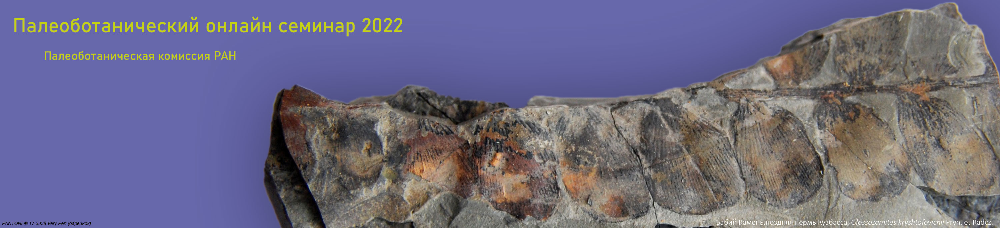

<!-- # Тезисы докладов 2022 года -->

[[toc]]

## Предисловие

В 2022 году продолжил работу Палеоботанический онлайн семинар, организованный Палеоботанической комиссией при Научном совете РАН. Мы сохранили формат единственного продолжительного доклада на каждом заседании и свободной дискуссии после него. Состоялось шестнадцать докладов, тезисы которых опубликованы в настоящем сборнике.
Выбирая доклады, мы старались, чтобы они были интересны для большого числа слушателей. В первую очередь к аудитории семинара относятся, конечно же, профессиональные ученые – палеоботаники, ботаники, биологи и геологи широкого профиля. Доклады, мы надеемся, полезны и интересны преподавателям ВУЗов и школ, а также их подопечным – студентам и школьникам. Мы будем рады, если в число слушателей докладов войдут все, кому интересно знать, над чем работают и что изучают современные палеоботаники.
В выступлениях были рассмотрены вопросы эволюции ранних покрытосеменных на современном и ископаемом материале и проблема датировок отложений, в которых были обнаружены некоторые ключевые находки ископаемых покрытосеменных. Обсуждались современные подходы к морфогенетической классификации плодов, перспективы применения ТЭМ при изучении макроостатков мезозойских растений и при изучении ультраструктуры каменноугольных спор. Были затронуты особенности взаимодействия высших растений с позвоночными и насекомыми, палеоклиматические реконструкции. Рассмотрена история открытия и изучения акритарх и современное состояние этой области палеопалинологии. Палинологические доклады затронули и палиностратиграфию и палеообстановки переходных юрско-меловых отложений, реконструкцию систем землепользования юга лесной зоны Российской Федерации. Доклады по материалам изучения пермских отложений Русской платформы были посвящены позднепермским ландшафтам этого региона и истории их формирования, а также значению новых находок остатков ископаемых корней для дополнения наших представлений о позднепермских палеобстановках.

<i>С уважением, Наталья Завьялова</i>

## Герман А.Б.

<small>Геологический институт РАН, Москва</small>

### Парниковый палеоклимат мелового периода: замечательные гипотезы и отвратительные противоречия
Меловой период отличается тем, что (1) это – одно из наиболее теплых, если не самое теплое, время в фанерозойской истории Земли; (2) мел был талассократическим временем; (3) в мелу появились первые покрытосеменные растения, прошла их начальная диверсификация, и к концу мела они стали преобладать в большинстве флор Земли. 

Рассмотрены некоторые аспекты палеогеографии и палеоклимата мелового периода.

**_1. Палеоклиматическая зональность мелового периода: как образовался жаркий влажный экваториальный пояс?_**

В начале мела и до аптского века экваториальный пояс на Земле отсутствовал. Его появление связывали с иной атмосферной циркуляцией (с одной экваториально-полярной конвекционной ячейкой), что в принципе невозможно на вращающейся планете. Наиболее вероятно, что появление влажного экваториального пояса в альбе было результатом постепенного раскрытия
Атлантического океана в течение мела.

**_2. Теплая меловая Арктика: какие океанические течения переносили тепло в северные высокие широты?_**

Меловая Арктика была аномально теплой даже на фоне глобально парникового климата. Была высказана гипотеза о существовании в мелу иного (в противоположном нынешнему направлении) океанического термогалинного конвейера с теплыми апвеллингами в северной полярной области, чему противоречит мелководность проливов, соединявших Арктический бассейн с Мировым океаном. Основной перенос тепла в Арктику, вероятно, осуществлялся из района Карибского бассейна теплым морским течением в северном направлении по Западному внутреннему проливу в Северной Америке.

**_3. Ветры какого направления преобладали на Северо-Востоке Азии в позднемеловое время?_**

На севере Аляски в верхнемеловых отложениях многочисленны бентониты, но вулканов – источников вулканических пеплов, там нет. Однако на то же время приходится активный вулканизм в Охотско-Чукотском вулканическом поясе (ОЧВП) на северо-востоке Азии. К западу от него, в бассейне р. Вилюй, вулканогенные породы отсутствуют или их мало. Все это свидетельствует о преобладании западных ветров на северо-востоке Азии, переносивших пепловый материал на север Аляски, что может быть связано со значительным ослаблением северной полярной ячейки атмосферной циркуляции.

**_4. Какой высоты был Охотско-Чукотский вулканический пояс?_** 

Существует мнение, что сооружения ОЧВП достигали высоты до 2-3 км над уровнем моря и, возможно, даже больше. Наши расчеты с использованием метода CLAMP приблизительной высоты существования турон-коньякской арманской флоры в 610 м, возможно, этому противоречат, однако (1) в этом расчете велика ошибка метода и (2) приведенное значения – это не высота ОЧВП, а вероятная высота, на которой росли и захоранивались растения арманской флоры.

**_5. Внутриконтинентальная Азия мелового периода: существовал ли в позднем мелу (резко) континентальный климат (и почему это важно)?_** 

Тестирование адекватности современных компьютерных моделей климата (моделей общей циркуляции – GCM) для предсказаний нынешнего антропогенного потепления возможно при их применении к ситуации парникового климата мела. Сравнение рассчитанными методом CLAMP (по значению энтальпии) параметров позднемелового климата по сеноманской, туронской и маастрихтской флорам бассейна р. Вилюй с “ретросказаниями” GCM свидетельствуют, что модели недооценивают возможные климатические изменения в будущеми, следовательно, их последствия для хозяйственной деятельности человека.

<iframe width="560" height="315" src="https://www.youtube.com/embed/euhVNvcLhLU" title="YouTube video player" frameborder="0" allow="accelerometer; autoplay; clipboard-write; encrypted-media; gyroscope; picture-in-picture" allowfullscreen></iframe>

## Ершова E.Г.

<small>Московский государственный университет имени М.В. Ломоносова, Москва</small>

### Реконструкция систем землепользования лесной зоны РФ по данным спорово-пыльцевого анализа

История производящего хозяйства исследуется прежде всего археологами и археоботаниками при изучении археологических памятников. Однако все возрастающий интерес вызывает поиск следов различных типов землепользования за пределами раскопок, локализация зон хозяйственной активности поселений, оценка интенсивности вмешательства в природную среду и оценка влияния этого вмешательства на формирование современных ландшафтов. Такого рода задачи можно решить изучая природные или природно-антропогенные стратифицированные отложения — болота, озера, пруды, овражно-балочные почвенно-седиментационные серии с помощью палеоэкологических методов, в том числе с помощью спорово-пыльцевого анализа. 

Основной метод реконструкции истории землепользования в пыльцевом анализе — метод антропогенных индикаторов (AI), т.е. выявление в спорово-пыльцевых спектрах микроостатков растений, так или иначе связанных с хозяйственной деятельностью. Метод разработан и используется палинологами достаточно давно, однако до сих пор остается много вопросов, связанных с региональными особенностями AI, спецификой изучаемых отложений, проблемами датирования, сложностью идентификации и т.д. Мы рассмотрим следующие аспекты применения метода AI для юга лесной зоны РФ.

1. Выявление пыльцевых индикаторов в почвах, прошедших через различные способы землепользования (пашня, подсека, выпас, дороги) в настоящее время или в исторически документированном прошлом.
2. Пыльцевой анализ погребенных почв и водно-болотных отложений: в чем различия и преимущества каждого из подходов?
3. История земледелия по болотным колонкам: можно ли доверять датировкам раннего земледелия, полученным палинологами?
4. Основные результаты междисциплинарных работ по реконструкции истории землепользования на примере нескольких регионов (Московская и сопредельные области, Среднее Поволжье): палинологический аспект.

<iframe width="560" height="315" src="https://www.youtube.com/embed/DHMuGI1Q_zU" title="YouTube video player" frameborder="0" allow="accelerometer; autoplay; clipboard-write; encrypted-media; gyroscope; picture-in-picture" allowfullscreen></iframe>

## Бакаев А.С.

<small>Палеонтологический институт им. А. А. Борисяка РАН, Москва</small>

### Растительноядность позвоночных: появление, становление и развитие

Фитофагия – трофическая специализация, при котором животное приспособлено (анатомически и физиологически) к поеданию преимущественно растительной пищи. Растения, являясь продуцентами (т.е. автотрофами), имеют громадную биомассу и очень широко распространены, однако относительно мало питательны и менее удобоваримы, чем животная пища. Основной компонент клеточных стенок растений – целлюлоза – очень устойчивый полисахарид. У позвоночных животных ферменты, способные расщеплять целлюлозу (в частности целлюлаза), не вырабатываются, поэтому они вынуждены либо питаться только наиболее мягкими, почти не содержащими целлюлозы частями растений, либо иметь в ЖКТ разнообразных симбионтов (в основном бактерий). Обработку растительной пищи можно условно разделить на три этапа:

1.	Отделение растения от субстрата (например, при соскребании нитчатых водорослей с камней) или фрагмента растений от его остальной части (например – откусывание листьев от веток);
2.	Механическое измельчение и перемалывание;
3.	Ферментация. 

Изучение процесса ферментации на палеонтологическом материале возможно только по косвенным признакам (например, по состоянию содержащихся в бромалитах, особенно копролитах, остатков растений, или по относительному размеру брюшной полости животного). Поэтому наиболее информативным источником, свидетельствующим о растительноядности того или иного животного, является строение его ротового аппарата, где, как правило, происходит отделение и перетирание пищи (исключением являются животные, использующие для перетирания проглоченные камни – гастролиты). В некоторых случаях, когда животное питается относительно мягкими (например - генеративные органы растений или нитчатые водоросли) растениями, перемалывание пищи не производится, и тогда фрагменты растений сразу попадают в пищеварительный тракт для дальнейшей ферментации.

Несмотря на то, что как растения, так и первые позвоночные появились в воде, появление растительноядности среди наземных позвоночных изучено гораздо лучше. Первые растительноядные тетраподы появляются в позднем карбоне (Sahney et al., 2012). Причиной их появления считается исчезновение биома тропических дождевых лесов, что привело к дроблению среды обитаний тетрапод, освоению ими более засушливых (с разнообразной низкорослой растительностью) мест обитания и их выход в крупный размерный класс (формирование так называемого «доминантного блока»). Процесс шёл параллельно в сразу нескольких линиях «рептилий», как анапсидных (Diadectidae), так и синапсидных (Edaphosauridae, Caseidae). Во всех случаях у них формировались резцеобразные (чаще всего многовершинные, лепестковидные) зубы в передней части челюстей и давящее озубление в задней части или на нёбе. При этом челюстные суставы не позволяли нижней челюсти двигаться в нескольких проекциях (а только закрываться и открываться), что препятствовало эффективному перетиранию (по всей видимости, животные питались относительно мягкой растительностью). Однако малая эффективность перетирания компенсировалась эффективной ферментацией в очень длинном и объёмном пищеварительном тракте. 

Доподлинно не известно, как тетраподы обзавелись симбиотической микрофлорой, однако предполагается (Sues, Reisz, 1998; Berman et al., 2020), что симбионты попали в ЖКТ тетрапод благодаря поеданию растительноядных членистоногих. В перми специализация растительноядных тетрапод нарастает. В ряде групп это происходит экстенсивно. Так, Caseidae увеличиваются в размерах и увеличивают относительный объём брюшной полости (_Cotylorhynchus_). Другие группы добиваются успеха благодаря интенсификации перетирания пищи, что достигается формированием более подвижного челюстного сустава (позволяющего продольные движения нижней челюсти) и перетирающих поверхностей: роговых челюстей (Dicynodontia) или дифференцированных зубов с настоящей окклюзией (Bolosauria), что позволило освоить мелкий размерный класс и более грубую, волокнистую растительность. Однако и эти группы не избежали вымирания, что привело к независимому освоению фитофагии разными группами синапсид и диапсид в мезозое.

Возникновение растительноядных позвоночных в водных экосистемах изучено гораздо хуже. До недавнего времени считалось, что растительноядные рыбы появились только в эоцене (Bellwood, 2003). Однако в последнее время доказано, что растительноядные костные рыбы появились ещё в перми (Бакаев и др., в печати), а некоторые предполагаемые фитофаги обнаружены среди панцирных рыб девона (О.А. Лебедев, перс. сообщ). Вероятно, освоение фитофагии произошло в разных линиях бентосных рыб, питавшихся позвоночными, обитавшими в перефитоне (благодаря чему были получены необходимые симбионты). Попадавшая в ЖКТ растительность со временем становилась всё более значимым компонентом питания. Таким образом, в конце палеозоя костные рыбы смогли освоить большинство экологических ниш, представленных среди современных рыб-фитофагов. Однако, как и в случае с растительноядными тетраподами, более поздние рыбы осваивали фитофагию независимо от своих экологических предшественников.

<iframe width="560" height="315" src="https://www.youtube.com/embed/7-11TBOGrl4" title="YouTube video player" frameborder="0" allow="accelerometer; autoplay; clipboard-write; encrypted-media; gyroscope; picture-in-picture" allowfullscreen></iframe>

## Соколов Д.Д.

<small>Московский государственный университет имени М.В. Ломоносова, Москва</small>

### Проблема ранней эволюции гинецея покрытосеменных: что могут сказать о ней ископаемые, сближаемые с _Ceratophyllum_ и Chloranthaceae

Наличие гинецея, состоящего из плодолистиков – важнейшая особенность покрытосеменных растений. При этом морфологическая природа плодолистика до сих пор остается неясной. Традиционно считается, что исходным для покрытосеменных типом гинецея является апокарпный (со свободными плодолистиками). Эта точка зрения скорее всего является верной, но ее не так просто доказать. Особенно неопределенной выглядит ситуация с исходным типом гинецея в выявляемой по молекулярным данным кладе mesangiosperms, которая включает все современные покрытосеменные, за исключением Amborellales, Nymphaeales и Austrobaileyales. Клада mesangiosperms включает однодольные, высшие двудольные, (эу)магнолииды, а также Chloranthaceae и _Ceratophyllum._ На основании сравнительно-морфологических и отчасти молекулярных данных обоснована гипотеза о сестринских отношениях между Chloranthaceae и _Ceratophyllum_ (Endress, Doyle, 2009, 2015). Гинецей Chloranthaceae и _Ceratophyllum_ традиционно интерпретируют как состоящий из одного асцидиатного плодолистика. Однако данные по изменчивости репродуктивных органов современных видов рода _Ceratophyllum_ говорят в пользу сложного сценария редукции женского цветка в этой группе. По нашим представлениям, предки _Ceratophyllum_ (и предки Chloranthaceae) имели гинецей из сросшихся плодолистиков и нижнюю завязь. Несмотря на весьма полное сходство гинецея хлорантовых с асцидиатными плодолистиками, например, _Amborella_, эти структуры, возможно, не гомологичны между собой. К настоящему времени описано большое число ископаемых, убедительно сближаемых с Chloranthaceae и _Ceratophyllum_. К сожалению, большинство из них не проливает свет на проблему ранней эволюции гинецея в данной группе. Исключительно информативным и при этом загадочным ископаемым является _Canrightia_ (Баррем – Альб Португалии, Friis, Pedersen, 2011). Это ископаемые плоды растения, родство которого с Chloranthaceae и _Ceratophyllum_ хорошо обосновано. Гинецей _Canrightia_ интерпретируется как одногнездный, радиально-симметричный, с несколькими свисающими семяпочками. Гинецей _Canrightia_ можно считать образованным полностью сросшимися пликатными плодолистиками либо представляющим собой единственный асцидиатный плодолистик необычного, не описанного у современных растений типа. 

- Endress, P. K., and Doyle, J. A. (2009). Reconstructing the Ancestral Angiosperm Flower and its Initial Specializations. Am. J. Bot. 96, 22–66. https://doi.org/10.3732/ajb.0800047

- Endress, P. K., and Doyle, J. A. (2015). Ancestral Traits and Specializations in the Flowers of the Basal Grade of Living Angiosperms. Taxon 64, 1093–1116. https://doi.org/10.12705/646.110.1002/646.1 

- Friis, E. M., and Pedersen, K. R. (2011). _Canrightia resinifera_ gen. et sp. nov., a New Extinct Angiosperm with Retimonocolpites-type pollen from the Early Cretaceous of Portugal: Missing Link in the Eumagnoliid Tree? Grana 50, 3–29. https://doi.org/10.1080/00173134.2011.559728

Доклад основан на материалах совместной статьи:

_Sokoloff D.D., El E.S., Pechenyuk E.V., Carrive L., Nadot S., Rudall P.J., Remizowa M.V._ Refined interpretation of the pistillate flower in _Ceratophyllum_ sheds fresh light on gynoecium evolution in angiosperms. Frontiers in Cell and Developmental Biology. [https://doi.org/10.3389/fcell.2022.868352](https://doi.org/10.3389/fcell.2022.868352)

<iframe width="560" height="315" src="https://www.youtube.com/embed/pfBkAxep-VA" title="YouTube video player" frameborder="0" allow="accelerometer; autoplay; clipboard-write; encrypted-media; gyroscope; picture-in-picture" allowfullscreen></iframe>

## Гоманьков А.В.

<small>Ботанический институт им. В.Л. Комарова РАН, Санкт-Петербург</small>

### Позднепермские ландшафты Восточно-Европейской платформы и их предыстория

При выходе многоклеточных растений на сушу в силуре они начали осваивать прежде всего влажные места обитания и это освоение новых экологических ниш оказалось очень быстрым и эффективным. Уже в позднем девоне среди высших растений (причём независимо и одновременно в нескольких филетических линиях) возникли настоящие деревья, которые образовывали настоящие леса. Эти болотные леса, достигшие наиболее пышного расцвета в карбоне, не только значительно увеличили суммарную массу биосферы, но и начали активно «перекачивать» углерод из атмосферы в литосферу, создавая беспрецедентные залежи каменного угля. В результате произошло многократное и резкое сокращение количества углекислого газа в атмосфере с замещением его свободным кислородом, что вызвало сильное похолодание и последующее иссушение климата. Для каменноугольных лесов углекислый газ оказался исчерпаемым ресурсом, и после того, как в конце карбона его содержание в атмосфере достигло примерно современного уровня(0,05%), эти леса вымерли.
В перми угленакопление, которое может происходить только во влажных обстановках, сохранилось лишь во внеэкваториальных областях – Ангарской и Гондванской, а на экваторе и в субтропиках (примерно до 40-го градуса широты) распространились ландшафты пустынного и полупустынного типа. Примером таких пермских пустынь (или полупустынь) могут считаться ландшафты Восточно-Европейской платформы (ВЕП). Нижнепермские отложения ВЕП – преимущественно морские, и по ним трудно составить представление о наземных обстановках того времени, но мощные отложения эвапоритов (гипса и каменной соли) в кунгурском ярусе явно свидетельствуют об аридном климате. В поздней перми началось воздымание Палеоурала и снос материала с этой горной страны стал компенсировать прогибание коры, которое обуславливало существование пермского морского бассейна, на всё более обширной территории. К востоку от казанских морских отложений распространена красноцветная континентальная белебеевская свита, формировавшаяся в условиях предгорной озёрно-аллювиальной равнины. В уржумское время связь Казанского моря с океаном прервалась и на его месте образовалось пресноводное Уржумское озеро- море, тогда как на востоке к нему по-прежнему примыкала предгорная равнина, постепенно распространявшаяся всё дальше на запад. Наконец в позднетатарское время прогиб оказался полностью скомпенсированным сносом с Палеоурала. Вся территория ВЕП была занята озёрно-аллювиальной равниной с большим количеством мелких (в обоих смыслах) и короткоживущих (в результате заиливания) озёр. Растительность этой равнины была, по- видимому, довольно скудной, концентрировалась преимущественно по берегам водоёмов и имела отчётливые черты ксероморфности (мелколистность, толстая кутикула, глубоко погруженные устьица). Кордаиты, бывшие в Ангариде главными углеобразователями и, следовательно, сравнительно влаголюбивыми растениями, на большей части территории ВЕП исчезли ещё в раннеказанское время, сохранившись до конца перми лишь в рефугиуме Башкирского палеофлористического округа на крайнем юго-востоке платформы. Структура спорово-пыльцевых спектров часто оказывается хорошо соответствующей структуре захоронений растительных макрофоссилий, что в современных фитоценозах соответствует обстановкам с аридным климатом.

<iframe width="560" height="315" src="https://www.youtube.com/embed/GV1Re8x5xX4" title="YouTube video player" frameborder="0" allow="accelerometer; autoplay; clipboard-write; encrypted-media; gyroscope; picture-in-picture" allowfullscreen></iframe>

## Бобров А.В.

<small>Московский государственный университет им. М.В. Ломоносова, Москва</small>

### Современные подходы к морфогенетической классификации плодов

Дорогие коллеги, вы открываете книгу – флору (ископаемую или современную), таксономическую монографию, учебник – и читаете
в описании семейства, рода или вида: «листья мягкие», «стволы толстые», «соцветия пышные», «цветки красивые» и т. п. Немыслимо, такого не бывает! В морфологических описаниях вегетативных органов, цветков и соцветий покрытосеменных подобные «признаки» не используют, но почему же плоды в профильной литературе (не в каталоге зеленщика!) считают возможным охарактеризовать как «сочные» или «сухие», причем нередко этим и ограничиваются? Более того, зачастую не делают различий между плодами и соплодиями, плодами апокарпными и ценокарпными, мономерными и псевдомономерными, полимерными апокарпными плодами и соплодиями, абсолютно произвольно употребляют названия типов плодов, etc. Колоссальное морфологическое и анатомическое разнообразие плодов, незначительная часть которого описана и проанализирована в XIX–XX вв., кажущаяся «необозримость» полиморфизма плода, многочисленные попытки разных авторов создать классификацию (или типологию) плодов, вероятно, настолько сильно пугают современных ботаников, что в актуальной научной литературе уровень описания плодов стремится к долинневскому. А это ужасно, потому что плод – уникальная и универсальная структура Angiospermae – концентрирует в себе признаки, анализ которых необходим для прогресса наших знаний в всех областях науки о растениях – от филогенетической систематики до фитосоциологии.
Возможно ли создание не описательной, а подлинно морфогенетической классификации плодов, которая станет одним из инструментов реконструкции эволюции цветковых растений? Принципы анализа морфогенеза плодов, подходы к созданию эволюционной классификации плодов, синтез результатов карпологических исследований и «молекулярных данных», перспективы изучения закономерностей гистогенеза плода и регулирующих этот процесс генов мы и попробуем обсудить.

<iframe width="560" height="315" src="https://www.youtube.com/embed/4unmk7im8rg" title="YouTube video player" frameborder="0" allow="accelerometer; autoplay; clipboard-write; encrypted-media; gyroscope; picture-in-picture; web-share" allowfullscreen></iframe>

## Носова, Н.В.

<small>Ботанический институт им. В.Л. Комарова РАН, Санкт-Петербург</small>

### Результаты изучения макроостатков мезозойских растений при помощи трансмиссионной электронной микроскопии

В течение последних трех десятилетий появился ряд работ, посвященных исследованию ультратонкого строения кутикулы листьев ископаемых растений на ТЭМ. В типичном случае кутикула имеет следующее строение. Снаружи откладывается чистый кутин. Этот слой обозначается как кутиновый слой А, который подразделяется на очень тонкий многопластинчатый слой А1, представленный чередованием электронно-плотных (непрозрачных) и электронно-прозрачных слоев, и аморфный, иногда с гранулами различной величины, слой А2. Далее вглубь следует кутикулярный слой В, подразделяющийся на слой с фибриллами целлюлозы В1 и гранулярный В2. Кроме этого, в слоях А1 и А2 могут выделяться подслои – верхний (U) и нижний (L).

Г. Гиньяр, один из ведущих специалистов по изучению ультратонкого строения кутикулы ископаемых растений, предложил два подхода для определения типа кутикул: один с наличием или отсутствием слоев A1, A2, B1, B2, другой – комплексный анализ, учитывающий комбинации всех выявленных признаков. Он полагает, что ультраструктурные особенности ископаемых кутикул можно считать столь же значимыми в таксономии, как и любой другой признак, и даже предлагает включать ультраструктурные особенности кутикулы в диагноз вида или рода (Guignard, 2019). Мы провели ряд исследований ультратонкого строения кутикулы юрских и меловых листьев некоторых представителей гинкговых и хвойных (Nosova et al., 2016; 2019; Nosova, 2020). Некоторые из полученных нами данных не совсем вписываются в предложенную Гиньяром классификацию кутикул. Например, Гиньяр, с учетом наших данных о кутикуле _Pseudotorellia_, выделяет для Ginkgoales две группы формул: A2+B1 (тип I) – для _Baiera_-_Sphenobaiera_, и A1U+A1L+A2+B1 (тип II) – для _Ginkgo_-_Ginkgoites_-_Pseudotorellia_. Однако у одного из изученных нами видов, Pseudotorellia asiatica, в верхней кутикуле видны только три слоя: A1+A2+B1. Такая же формула была предложена Гиньяром для _Pachypteris_ (Pteridospermales) и _Pseudoctenis_-_Ticoa_ (Cycadales). Выделенный тип I для _Baiera_-_Sphenobaiera_ основан на изучении только одного вида для каждого из этих родов (_B. furcata_ и _S. huangii_). Мы недавно изучили ультратонкое строение кутикулы средне-юрских листьев _Sphenobaiera angrenica_. Она сложена слоями A1U+A1L+A2 +B1. Однако такая формула указана для группы _Ginkgo-Ginkgoites-Pseudotorellia_.

Среди хвойных мы исследовали кутикулы листьев трех видов Mirovia, двух видов _Sciadopityoides_, и по одному виду – родов _Kanskia_, _Anabarella_ и _Tritaenia_. Обнаружены существенные различия в ультратонком строении кутикулы трех видов _Mirovia_. На основе полученных результатов не получается вывести единую формулу строения кутикулы для этого рода.

Сравнивая строение кутикулы листьев трех разных таксонов (двух видов _Pseudotorellia_ и одного вида _Mirovia_), описанных из одной и той же свиты Мангышлака, мы не обнаружили какого-либо ожидаемого сходства в строении кутикулы или в соотношении толщины кутинового (А) и кутикулярного (В) слоев, которое могло бы быть связано с экологической обстановкой.

Выявлено, что кутикулы с одинаковой формулой могут иметь различные особенности строения слоев, особенно слоя A1 и его подслоев A1U и A1L. Некоторые признаки, например, извилистость слоя А1 или характер подслоя А1L, могут заметно отличаться для разных таксонов. Однако это не отражено в сводной таблице с предположительно всеми выявленными признаками кутикул, которая легла в основу комплексного анализа для выделения типов кутикул, сделанного Гиньяром.

В настоящее время, на мой взгляд, не достаточно данных для утверждения о большой значимости ультраструктурных особенностей кутикулы в таксономии ископаемых растений. Также, я не поддерживаю предложение Гиньяра включать ультраструктурные особенности кутикулы в диагноз вида или рода.

Работа выполнена при поддержке гранта РФФИ, № 20-04-00355.

- Guignard G. Thirty-three years (1986–2019) of fossil plant cuticle studies using trans-mission electron microscopy: a review. Rev. Palaeobot. Palynol. 2019. V. 271.
- Nosova N., Yakovleva O., Ivanova A., Kiritchkova A. First data on the fine structure of the leaf cuticle of a Mesozoic conifer, Mirovia Reymanówna (Miroviaceae). Rev. Palaeobot. Palynol. 2016. V. 233. P. 115–124.
- Nosova N., Yakovleva O., Kotina E. First data on the leaf cuticle ultrastructure of the Mesozoic genus Pseudotorellia Florin. Rev. of Palaeobot. Palynol. 2019. V. 271.
- Nosova N. The leaves of Anabarella Abramova (Pinopsida) from the Cretaceous of the north of East Siberia (Russia). Rev. of Palaeobot. Palynol. 2020. V. 278.

## Robert A. Spicer <Badge type="info" text="1" />, Alexander Farnsworth <Badge type="info" text="3" />
1. The Open University, Milton Keynes, UK, email: [r.a.spicer@open.ac.uk](r.a.spicer@open.ac.uk)
2. Bristol University, Bristol, UK email: [alex.Farnsworth@bristol.ac.uk](alex.Farnsworth@bristol.ac.uk)

### The (Harsh) Life and Times of Maastrichtian Arctic Dinosaurs
Overall the Maastrichtian was the coolest Stage of the Late Cretaceous and yet the Arctic has a rich fossil record of Maastrichtian plants and dinosaurs that lived within a few hundred kilometres of the North Pole. To understand this extinct polar environment in detail requires combining the abundant fossil record of the region with the latest high spatial and temporal resolution climate modelling. At the highest latitudes where there was land (~80° N) deciduous conifer-dominated forests, periodically ravaged by fire, hosted a depauperate understory of predominantly herbaceous angiosperms with few woody taxa of flowering plants. Ground cover was mostly one of ferns and sphenophytes. Tree ring, sediment and paleomagnetism data suggest the magnetic and rotational poles were roughly coincidental, which means that continuous winter darkness lasted 3 months with 3 weeks of bounding twilight in spring and autumn. A combination of plant fossil paleoclimate proxies point to the mean annual air temperature being 7±2 °C with the warmest summer month being 14.5±3 °C and the coldest winter month –2±4 °C. Even during the summer there were periods when tree growth stopped, suggesting days or weeks with temperatures <10 °C. At around 75 °N light (only 1.5 months of continuous darkness) and temperature (MAT as high as 12 °C depending on location) allowed the development of a more diverse woody angiosperm flora admixed with conifers, including some evergreen taxa. A relatively warm Arctic Ocean maintained winter coastal temperatures close to freezing, but also invigorated the hydrological cycle. Arctic air was humid year-round with near-constant fog, even with high winds, under a polar cloud cap. The only respite was in the summer. Winter snow storms were common, particularly away from the coast and in the mountains. Despite these conditions within the Maastrich-tian Arctic circle there is evidence for dinosaur nesting behaviour and with embryo/egg shell isotope data suggesting long (~56 days) incubation periods at 36-39 °C, this implies sophisticated nest management strategies. Moreover, egg laying was in the early spring as isotope compositions suggest the parents were drinking cold meltwater. Living in large herds with high resource demands large-bodied herbivores would have had to have ranged over long distances and the paleogeography favoured access to the south where, although conditions were warmer, they encountered intense storms and higher fire-frequency. Using the latest climate modeling combining atmosphere, ocean and vegetation dynamics, we examine not just Maastrichtian climate but “weather”, stepping through a typical Maastrichtian year in 1 hour time increments, to share insights into life as a polar dinosaur.

<iframe width="560" height="315" src="https://www.youtube.com/embed/C7MXT8Ba6Pc" title="YouTube video player" frameborder="0" allow="accelerometer; autoplay; clipboard-write; encrypted-media; gyroscope; picture-in-picture; web-share" allowfullscreen></iframe>

## Раевская Е.Г.   

<small>Всероссийский геологический институт им. А.П. Карпинского («ВСЕГЕИ»)</small>

### Акритархи: 60 лет спустя создания группы 

Созданная искусственно в 1963 году группа Acritarcha объединила все известные на то время микроскопические органикостенные (неминерализованные) остатки, встречающиеся в палинологических препаратах, чья биологическая принадлежность не могла быть уверенно определена в рамках существующих классификаций. В нее вошли соразмерные и морфологически схожие с палинологическими объекты, которые по мнению разных исследователей могли относиться как к остаткам морских одноклеточных водорослей, стадиям их жизни, цистам, так и к яйцам морских животных или спорам низших наземных и полуназемных растений (Downie, 1967 и мн. др.) – что-то вроде бокса для неопределимого «сора» (Servais, 1995). 

В процессе последующего изучения акритарх некоторые таксоны были переведены в известные биологические группы. Так, например, считавшиеся ранее акритархами _Cymatiosphaera_, _Leiosphaeridia_, _Pterospermella_, _Tasmanites_, _Duvernaysphaera_, _Dictyotidium_ перешли уверенно в состав празинофитовых водорослей (Prasinophyta) – отдел зеленых водорослей (Fensome et al., 1990; Molyneux et al., 1996). Род _Moyeria_, по мнению некоторых специалистов (Gray, Boucot, 1989), обнаружил родство с группой эвгленоидных протист из отдела зоомастигофор, считающихся пресноводными (Molyneux et al., 1996). _Gloeocapsomorpha prisca_, встречающаяся в виде разрозненных округлых клеток или отдельных фрагментов колоний, морфологически и геохимически близка современной хроококовой цианобактерии _Еnthophysalis_. Существуют и другие примеры. 

Однако большинство акритарх, вероятнее всего, является остатками покоящихся стадий жизненного цикла или цистами планктонных эвкариотных водорослей, весомая доля которых по своей морфологии и химическому составу стенки наиболее близка динофлагеллатам. Морфологическая близость была отмечена еще на стадии создания группы. Предполагалось, что многие из акритарх являются предковыми формами динофлагеллат, у которых еще не сформировались (или не проявлены) устойчивые диагностические признаки. Позднее были получены свидетельства наличия в составе некоторых таксонов кембрийских акритарх (_Globosphaeridium_, _Comasphaeridium_, _Skiagia_ и _Lophosphaeridium_) биомаркерных молекул 4α-метил-24этилхолистен, свойственных только для _Dinophyceae_ (Talyzina, 1998; Moldowan, Talyzina, 1998; Talyzina et al., 2000). Но, поскольку указанные молекулы были установлены не только в составе перечисленных форм, а также во вмещающей их породе, желаемая однозначность выводов не была достигнута. Трудности интерпретации биохимических данных возникли и по результатам пиролиза ордовикских галеатных акритарх (Versteeg et al., 2004), чье высокое сходство с диноцистами определено полигональным строением оболочек ("паратабуляцией") и наличием ярко выраженного пилома ("археопиля"). Проблема прямого биохимического анализа акритарх состоит в сложности выделения и отбора необходимого количества «чистого» исходного материала и в отсутствии представительной базы палеоданных для сравнительного анализа. Поэтому морфоструктурный анализ остается пока основным методом таксономических исследований акритарх.

За почти 60-летний опыт изучения группы накоплен богатый материал: составлены представления о таксономическом разнообразии, морфологической изменчивости, фациальной приуроченности, палеогеографической дифференциации акритарх, о стратиграфических диапазонах распространения видов. Невозможность осуществления филогенетических построений не лишает акритарх практического значения при решении разного рода геологических, в том числе биостратиграфических задач. Благодаря наработанным за прошедшие десятилетия результатам, акритархи признаны одной из руководящих групп ископаемых для позднего докембрия, кембрия и ордовика. Морфологическая эволюция акритарх, наблюдаемая в последовательном усложнении строения оболочек, появлении характерных структур, дает основу для выделения событийных уровней, позволяющих довольно дробно расчленять и коррелировать вмещающие отложения. А при изучении погребенных отложений в скважинах труднодоступных территорий, в частности, Арктического шельфа России, акритархи являются практически единственной группой, способной обеспечить датирование и корреляцию древних горизонтов осадочного чехла.

<iframe width="560" height="315" src="https://www.youtube.com/embed/iXWq9JfJ1U8" title="YouTube video player" frameborder="0" allow="accelerometer; autoplay; clipboard-write; encrypted-media; gyroscope; picture-in-picture; web-share" allowfullscreen></iframe>

## Пещевицкая Е.Б.

<small>Институт нефтегазовой геологии и геофизики им. А.А. Трофимука СО РАН, Новосибирск</small>

### Палиностратиграфия и палеообстановки переходного юрско-мелового
Сегодня в стратиграфии уделяется большое внимание изучению пограничных интервалов различных ярусов в связи с установлением точек глобального стратотипа. Разрез на р. Маурынья представляет интерес, поскольку здесь обнажается непрерывная последовательность осадков верхневолжского подъяруса и нижней части рязанского яруса, что также является переходным интервалом между юрской и меловой системами. Разрез расположен в предгорьях Северного Урала. Здесь в береговых обнажениях р. Маурынья обнажаются сероцветные алевриты и песчаники федоровской свиты (волжский ярус–низы рязанского яруса). Разрез хорошо известен, и еще в прошлом веке здесь были собраны представительные коллекции макрофауны и установлены биостратиграфические последовательности (Сакс, Нальняева, 1964, 1966; Захаров, 1970; Граница..., 1972; Санин и др., 1984; Месежников, Брадучан, 1982; Месежников и др., 1983).
В ходе полевых работ 2007 г. сотрудниками ИНГГ СО РАН (г. Новосибирск) под руководством О.С. Дзюбы было проведено новое изучение этого разреза. В нижней части он был вскрыт более полно, его базальная часть, примерно 2.5 м, ранее не изучался. Наряду с находками макрофауны были впервые отобраны образцы на палинологический и изотопный анализы. Комплексное изучение материалов позволило определить в разрезе положение границы юры и мела (Дзюба и др., 2018). Это основано на комплексной корреляции данных по макрофауне и изотопной кривой по углероду в разрезах Маурынья и Нордвик, который расположен на севере Сибири, на побережье моря Лаптевых, и где зональные последовательности по макрофауне и изотопная кривая откалиброваны относительно магнитостратиграфической шкалы. Граница юры и мела установлена в середине магнитохрона M19n.2n. Это в свою очередь позволяет проводить сопоставление с тетическими разрезами, типовыми для титона и берриаса.

Палинологические последовательности в разрезе Маурынья были изучены впервые. Особенности таксономического состава спо-рово-пыльцевых комплексов и присутствие стратиграфически важных видов позволили выделить два слоя со спорами и пыльцой. В слоях с _Rouseisporites reticulatus_ в нижней части верхневолжского подъяруса важно отметить присутствие бугорчатых и ребристых спор схизей-ных папоротников родов _Trilobosporites_ и _Cicatricosisporites_, которые являются стратиграфически важными таксонами для верхней юры (Jansonius, McGregor, 1996). Они появляются в верхней части оксфорда в Западной Европе, Северной Америке, Австралии и Сибири. Однако встречаются они в верхней юре редко (Jansonius, McGregor, 1996; Никитенко и др. 2015), и предыдущими исследованиями в волжском ярусе на севере Урала не были выявлены (Малявкина, 1961; Вахрамеев, Котова, 1980; Федорова и др., 1993). Важным признаком также является присутствие в разрезе Маурынья спор печеночных мхов рода _Rouseisporites_. Наиболее древние находки вида _R. reticulatus_ Pocock обнаружены в верхнем титоне Австралии (Backhouse, 1988), хотя в целом этот род более характерен для мела (Burden, Hills, 1989). Отметим, что на севере Сибири представители этого рода также появляются позднее, в валанжине (Пещевицкая, 2007, 2010). Слои с _Coronatispora perforata_, _Plicatella sibirica_ установлены в верхней части верхневолжского подъяруса и нижней части рязанского яруса, в интервале аммонитовых зон _Craspedites taimyrensis_ – _Hectoroceras kochi_. Появляются новые виды _Cicatricosisporites_ и _Plicatella_, а также _Coronatispora perforata_ Dettmann.В разрезе также изучен микрофитопланктон, как морского, так и наземного генезиса. В целом он менее обилен по сравнению со спорами и пыльцой. Наиболее многочисленны празинофиты (7–20%) и зе-леные водоросли озерного генезиса. Диноцисты и акритархи встречаются, в основном, единично. Анализ вариаций структуры комплексов микрофитофоссилий свидетельствует о развитии в маурыньинской акватории морских мелководных обстановок. Таксономический состав спорово-пыльцевых ассоциаций с обилием спор плаунов и различных папоротников, а также небольшим количеством пыльцы хейролепидиевых свидетельствует об умеренно теплых и влажных условиях на прибрежных территориях.

Гранты: РНФ 22-17-00054 и РФФИ 20-05-00076.

<iframe width="560" height="315" src="https://www.youtube.com/embed/A7r176emanE" title="YouTube video player" frameborder="0" allow="accelerometer; autoplay; clipboard-write; encrypted-media; gyroscope; picture-in-picture; web-share" allowfullscreen></iframe>

## Мамонтов Д.А. <Badge type="info" text="1" />, Duncan McLean <Badge type="info" text="2" />

1. Московский государственный университет им. М.В. Ломоносова, Москва [palynologist.dm@mail.ru](mailto:palynologist.dm@mail.ru)
2. MB Stratigraphy Limited, Sheffield, United Kingdom
[mbstratigraphy@gmail.com](mailto:mbstratigraphy@gmail.com)

### ПРИЗНАКИ ГЛЕЙХЕНИЕВЫХ ПАПОРОТНИКОВ (GLEICHENIALES) В УЛЬТРАСТРУКТУРЕ МИОСПОР MAIASPORA ИЗ РАННЕГО КАРБОНА ЦЕНТРАЛЬНОЙ РОССИИ И ВЕЛИКОБРИТАНИИ
Порядок Gleicheniales включает три реликтовых семейства: Gleicheniaceae, Matoniaceae и Dipteridaceae. Большинство предшествующих молекулярно-филогенетических исследований показали монофилию для клады Gleicheniales (Schuettpelz et al., 2016), что хорошо соотносится с глейхениоидной ультраструктурой спородермы, также обособляющей Gleicheniales от других групп лептоспорангиатных папоротников (Tryon & Lugardon, 1991). В частности, глейхениоидная ультраструктура спородермы характеризуется развитием трехслойного экзоспория только в области проксимальных киртомов вдоль щели разверзания. Между внутренним и наружным слоями здесь развит срединный экзоспорий в виде серии волнообразных ламелл с микрополостями между ними. Во внеапертурных частях спородермы экзоспорий состоит из двух слоев: внутреннего и наружного. Подобные признаки весьма консервативны и наиболее рано в ископаемой летописи появляются у спор из спорангиев _Radiitheca dobranyana_, описанных из московского яруса бассейна Пльзень Чехии и Саарско-Лотарингского бассейна Франции (Brousmiche-Delcambre et al., 1997). В то же время такие микроспоры сходны с миоспорами рода _Maiaspora_ из верхнего визе Центральной России (Mamontov et al., 2021) как по наличию метаретикулоидной скульптуры, так и по развитию глейхениоидной ультраструктуры (Мамонтов и др., 2022).
В ходе переизучения широко распространенного в карбоне вида M.concavа из визейских и намюрских отложений Великобританиии Центральной России было показано наличие у него метаретикулоидной скульптуры и глейхениоидной ультраструктуры. Таким образом, первая морфологическая апоморфия для клады Gleicheniales зафиксирована в визейском ярусе из двух разных регионов Северногополушария. По молекулярным данным время дивергенции Gleicheniales – ранняя пермь (Schuettpelz & Pryer, 2009), что вроде бы соотносится с находками микроспор с глейхениоидной ультраструктуройиз ассельских отложений Северного Китая (Мамонтов и др., 2022).Однако наличие подобной ультраструктуры у миоспор _Maiaspora_, широко распространенных в позднем визе, позволяет предполагать болеераннее ответвление Gleicheniales от лептоспорангиатных папоротников, а именно в раннем карбоне (до позднего визе).
Полученные результаты могут быть в дальнейшем использованы для калибровки молекулярных данных по времени дивергенции Gleicheniales.

- Мамонтов Д.А., Гаврилова О.А. Орлова О.А. Ильина Н.В. Ультратонкое строение визейских миоспор Maiaspora Mamontov et al., 2021 и их вероятное ботаническое родство // Актуальные проблемы современной палинологии: Материалы XV Всероссийской палинологической конференции. М.: ГЕОС, 2022. С. 208–212.
- Brousmiche-Delcambre C., Lugardon B., Coquel R., Goubet P. Decouverte dans le basin Houiller Sarro-Lorrain du genre Radiitheca (organs reproducteurs de Filicophytes) et ultrastructure du genre Microreticulatisporites. Geobios. 1997. V. 30. P. 3–14. [https://doi.org/10.1016/S0016-6995(97)80253-7](https://doi.org/10.1016/S0016-6995(97)80253-7)
- Mamontov D.A., McLean D., Orlova O.A., Gavrilova O.A. Maiaspora: a new miospore genus with enigmatic sculpture from the late Visean of European Russia // Pap. Palaeontol. 2021. V. 7. № 1. P. 263–306. [https://doi.org/10.5061/dryad.23h4r85](https://doi.org/10.5061/dryad.23h4r85)
- Schuettpelz E., Pryer K.M. Evidence for a Cenozoic radiation of ferns in an angiosperm-dominated canopy // PNAS. 2009. V. 106. № 27. P. 11200–11205. [https://doi.org/10.1073/pnas.0811136106](https://doi.org/10.1073/pnas.0811136106)
- Schuettpelz E., Schneider H., Smith A.R. et al. A community-derived classification for extant lycophytes and ferns // Journal of Systematics and Evolution. 2016. V. 56. №6. P. 563–603 (PPG I (2016)) [https://doi.org/10.1111/jse.12229](https://doi.org/10.1111/jse.12229)
- Tryon A.F., Lugardon B. Spores of the Pteridophyta: surface, wall structure, and diversity based on electron microscope studies. N.-Y. Springer-Verlag, 1991. 648 p. [https://link.springer.com/book/10.1007/978-1-4613-8991-0](https://link.springer.com/book/10.1007/978-1-4613-8991-0)

## Zavada Mike 

<small>Department of Geosciences and Biology, University of Texas Permian Basin</small>

### The role of inaperturate pollen in the evolutionary transition from a distal monosulcus in the basal angiosperms to the equatorial apertures of the eudicots
Speculation on the evolutionary trends in the basal angiosperms invariably takes a parsimonious approach by deriving eudicot equatorial triaperturate pollen directly from the distal monosulcate pollen types of the basal. The primary basis for accepting this hypothesis is this scenario is the most parsimonious. There are three major aspects that confound our understanding of the monosulcate – tricolpate transition. First, the selective forces in the evolution of reproductive structures in plants (and animals) are more reasonably assumed to be sexual selection. Sexual selection is defined by Safran (2013) “as the result of the differential reproductive success that arises from competition for mates and access to fertilizations”. A common scenario is, males compete for females, and females choose males. Males develop strategies to exclude other males and gain access to all the available females (maximizing genetically related offspring), and females develop strategies to assess male vigor and permit acceptable genetically diverse males to mate (maximizing offspring variability in an uncertain world). Second, morphological and developmental evolutionary trends in the basal angiosperms suggest that this morphological transition was not a direct transition, but through an inaperturate/omniaperturate intermediate. This is supported by a majority of the basal angiosperms exhibiting in their ordinal clades an evolutionary transition from the monosulcate pollen type to the inaperturate/omniaperturate pollen types, not the triaperturate. Third, a known feature of the inaperturate/omniaperturate pollen of many of the basal angiosperms is the pollen is not durable when acetolyzed. This suggests these pollen types may not survive fossilization and post depositional diagenesis leaving somewhat of a historical gap in the pollen record. There is a dearth of fossilized inaperturate/omniaperturate pollen in the fossil record that can be attributed to the basal angiosperms. The data suggest the most reasonable hypothesis is that equatorial triaperturate pollen is derived from the monosulcate type via the inaperturate/omniaperturate pollen types.

- Safran R.J., Scordato E.S.C., Symes L.B. et al. Contributions of natural and sexual selection to the evolution of premating reproductive isolation: a research agenda // Trends in Ecology & Evolution. 2013. V. 28. № 11. P. 643–650. [https://doi.org/10.1016/j.tree.2013.08.004](https://doi.org/10.1016/j.tree.2013.08.004)

<iframe width="560" height="315" src="https://www.youtube.com/embed/En0XZqyMPcs" title="YouTube video player" frameborder="0" allow="accelerometer; autoplay; clipboard-write; encrypted-media; gyroscope; picture-in-picture; web-share" allowfullscreen></iframe>

## Doyle James 

<small>University of California Davis, USA</small>

### Integrating Cretaceous fossils into the phylogeny of living angiosperms 

Chloranthaceae were among the first common angiosperm lines in the mid-Cretaceous, at which time they were much more diverse morphologically than the four relict living genera. Phylogenetic analyses clarify the position of these fossils in molecular phylogenies of living angiosperms and their implications for morphological evolution in Chloranthaceae. The Cenomanian mesofossil _Couperites_, represented by uniovulate carpels with adhering pollen of the Clavatipollenites type, is not securely related to Chloranthaceae. By contrast, Albian plants that produced _Asteropollis_ pollen, which had three tepals adnate to a single carpel, are nested within crown group Chloranthaceae, associated with _Hedyosmum_; seed anatomy and more labile in situ pollen place them on the stem lineage of _Hedyosmum_ rather than in the crown group. The Albian mesofossil Canrightiopsis, which had three stamens attached to the back of a carpel, is inferred to be sister to _Sarcandra_ and _Chloranthus_. This corroborates earlier inferences from later Cretaceous fossils (_Chloranthistemon_) that the bizarre trilobate androecium of _Chloranthus_ was derived by fusion of three stamens. By contrast, Albian bisexual flowers named _Canrightia_, which phylogenetic analyses attach to the stem lineage of Chloranthaceae, illustrate an intermediate stage in reduction from the many-parted flower of the first angiosperms. Other fossils support morphological and molecular analyses that identify the reduced aquatic genus _Ceratophyllum_ as the sister group of Chloranthaceae. Albian plants with pollen of the _Pennipollis_ type appear to be related to Chloranthaceae and/or _Ceratophyllum_, not to monocots as originally proposed. The Albian mesofossil genus _Appomattoxia_, which has pollen of the _Tucanopollis_ type, has equivocal affinities, but _Pseudoasterophyllites_, a Cenomanian halophyte with similar pollen and stems with reduced leaves, shows better evidence of being a link between Chloranthaceae and _Ceratophyllum_. These results imply that flowers of Chloranthaceae became unisexual before losing their perianth, while the bisexual flowers of _Canrightiopsis_, _Sarcandra_, and _Chloranthus_ may be secondarily derived from unisexual flowers. Impressions of leaves and inflorescences from the Albian of Spain indicate that Chloranthaceae had reached a modern level in non-floral characters too, but they also appear to be stem relatives of modern clades rather than crown group members of any genera. The unexpected importance of Chloranthaceae during the rise to dominance of angiosperms may reflect adaptation to more open habitats and a reversion from insect to wind pollination as the family spread out from the tropical belt.

<iframe width="560" height="315" src="https://www.youtube.com/embed/wf1A33zMMjA" title="YouTube video player" frameborder="0" allow="accelerometer; autoplay; clipboard-write; encrypted-media; gyroscope; picture-in-picture; web-share" allowfullscreen></iframe>

## Храмов А.В. 

<small>Палеонтологический институт им. А. А. Борисяка РАН, Москва</small>

### Эволюция насекомоопыления

Вопрос о том, как складывались и эволюционировали мутуалистические отношения между растениями и насекомыми-опылителями, невозможно разрешить без помощи палеоэнтомологии. Палеоэнтомологические свидетельства на этот счет можно разделить на две основные группы: находки ископаемых насекомых (1) с пыльцой на поверхности тела или в кишечнике и/или (2) со специализированным ротовым аппаратом, предназначавшимся для питания сладковатыми выделениями репродуктивных органов растений. Исходя из принципа актуализма, также можно ориентироваться на ископаемые находки представителей современных групп насекомых-опылителей, даже если у них нет видимых морфологических специализаций к антофилии или отсутствуют следы пыльцы. Однако этот материал не подходит для реконструкции ранних этапов эволюционной истории насекомоопыления, в особенности тех, что предшествовали появлению цветковых растений, когда экологическую нишу опылителей могли занимать совсем другие насекомые, чем сейчас.
Не считая копролитов из каменноугольных отложений, древнейшие примеры питания насекомых пыльцой были задокументированы в раннепермском местонахождении Чекарда (Пермский край), непосредственные доказательства палинофагии также получены при изучении позднеюрских и раннемеловых отпечатков прямокрылых, перепончатокрылых и др. (Krassilov et al., 2007). В Чекарде найдены и древнейшие насекомые с пыльцой на теле, относящиеся к роду Tillyardembia (Cnemidolestida: Tillyardembiidae) (Khramov et al., 2023). Несмотря на немногочисленность экземпляров с прилипшими пыльцевыми зерна ми, можно сделать предварительный вывод, что уже в ранней перми насекомые проявляли избирательность при посещении мужских генеративных органов, которая, вероятно, была первым шагом к возникновению опылительного симбиоза. Следующие по возрасту находки насекомых с пыльцой как голосеменных, так и цветковых на поверхности тела известны из меловых янтарей (Bao et al., 2019; Peñalver
et al., 2012; Peñalver et al., 2015). Что касается каменных отпечатков насекомых с пыльцой на теле, то после тилльярдембий из Чекарды они появляются в палеонтологической летописи лишь в эоцене (Compton et al., 2010; Wappler et al., 2015). Присутствие отдельных пыльцевых зерен отмечалось также на отпечатках раннемеловых мух (Labandeira et al., 2007), но эти данные нуждаются в уточнении.
Если говорить о специализациях ротового аппарата, таких как длинные хоботки и рострумы, то древнейшие длиннохоботковые нектарофаги найдены также в нижней перми Чекарды и относятся к семейству Protomeropidae (stem-Amphiesmenoptera) (Khramov et al., 2022). Начиная со средней юры, разнообразие длиннохоботковых нектарофагов стало резко расти:известно около 70 мезозойских видов с сохранившимися хоботками в составе 12 семейств и трех отрядов (Neuroptera, Mecoptera и Diptera) (Khramov et al., 2020). Эти находки доказывают, что задолго до появления цветковых насекомые с удлиненными ротовыми частями питались на репродуктивных органах голосеменных и, скорее всего, активно участвовали в их опылении. Распространение цветковых в середине мелового периода повлекло за собой вымирание беннеттитовых и других мезозойских энтомофильных голосеменных, равно как и связанных с ними насекомых. В результате на смену вымершим хоботковым сетчатокрылым и скорпионницам в начале кайнозоя пришли пчелы и макролепидоптеры, тогда как двукрылые нектарофаги в целом сохранили свои позиции. Поскольку насекомоопыляемость не уберегла мезозойских энтомофильных голосеменных от поражения в конкурентной борьбе, то ее преимущества не следует переоценивать. Можно предположить, что цветковые вырвались вперед не за счет насекомых-опылителей, а благодаря способности к быстрому росту и другим особенностям, связанным со строением вегетативных органов.

- Храмов А.В., Башкуев А.С., Лукашевич Е.Д. Длиннохоботковые насекомые-нектарофаги в палеонтологической летописи // Энтомологическое обозрение. 2020. Т. 99. № 4. С. 737–844.

- Bao T, Wang B, Li J, Dilcher D. 2019 Pollination of Cretaceous flowers. Proc. Natl Acad. Sci. USA 116, 24 707-24 711. http://dx.doi.org/10.1073/pnas.1916186116 

- Compton SG, Ball AD, Collinson ME, Hayes P, Rasnitsyn AP, Ross AJ. 2010 Ancient fig wasps indicate at least 34 myr of stasis in their mutualism with fig trees. Biol. Lett. 6, 838-842. http://dx.doi.org/10.1098/rsbl.2010.0389

- Khramov A.V., Naugolnykh S.V., Węgierek P. Possible long-proboscid insect pollinators from the Early Permian of Russia // Current Biol. 2022. V. 32. P. 3815–3820.

- Krassilov VA, Rasnitsyn AP, Afonin SA. 2007 Pollen eaters and pollen morphology: co-evolution through the Permian and Mesozoic. Afr. Invertebr. 48, 3-11. [link](http://paleobotany.ru/pdf/Krassilov,%20Rasnitsyn%20et%20al.%202007%20-%20Pollen%20eaters%20and%20pollen%20morphology.pdf)

- Labandeira CC. 2010 The pollination of mid Mesozoic seed plants and the early history of long-proboscid insects. Ann. Missouri Bot. Gard. 97, 469-513. http://dx.doi.org/10.3417/2010037

- Peñalver E, Labandeira CC, Barrón E, Delclòs X, Nel P, Nel A, Tafforeau P, Soriano C. 2012Thrips pollination of Mesozoic gymnosperms. Proc. Natl Acad. Sci. USA 109, 8623-8628. http://dx.doi.org/10.1073/pnas.1120499109 

- Peñalver E, Arillo A, Pérez-de la Fuente R, Riccio ML, Delclòs X, Barrón E, Grimaldi DA. 2015 Long-proboscid flies as pollinators of Cretaceous gymnosperms. Curr. Biol. 25, 1917-1923. http://dx.doi.org/10.1016/j.cub.2015.05.062

- Wappler T, Labandeira CC, Engel MS, Zetter R, Grimsson F. 2015 Specialized and generalized pollen-collection strategies in an ancient bee lineage. Curr. Biol. 25, 3092-3098. http://dx.doi.org/10.1016/j.cub.2015.09.021

Доклад основан на материалах совместной статьи:
- Khramov A.V., Foraponova T., Węgierek P. The earliest pollen-loaded insects from the Lower Permian of Russia // Biology letters, 2023. V. 19. № 3. P. 20220523. http://dx.doi.org/10.1098/rsbl.2022.0523

## Карасев Е.В. <Badge type="info" text="1,2" />, Сенников А.Г. <Badge type="info" text="1" />

1. Палеонтологический институт им. А. А. Борисяка РАН, Москва
2. Казанский (Приволжский) федеральный университет, Казань

### Ризолиты и признаки педогенеза из терминальной перми Центральной России

Остатки ископаемых корней в отложениях перми Московской синеклизы встречаются достаточно часто. Тем не менее, работ с описанием ископаемых корней и корнеподобных органов не так уж много. В 2004 г. А.Г. Сенников собрал из отложений обнорской свиты в окрестностях г. Вязники у д. Балымотиха первые несколько образцов красных алевритов и алевролитов с вертикально расположенными ризолитами. В последующие годы выходы коренных пород в данном месте не наблюдались, так как были перекрыты наносами ручья. В 2020 г. Д.С. Мизинцев вновь обнаружил остатки корней и передал для изучения представительную их коллекцию. В обнажении ризолиты приурочены к слою алевритов и глин мощностью около полутора метров, однако основная масса обнаружена в нижней его части. По простиранию слоя остатки корней распространены без видимого порядка. Размеры ризолитов, главным образом, зависят от того, насколько были развиты корни, и от объема образований вокруг них. По длине они варьируют от нескольких миллиметров до 50 см, а их диаметр – от 1–5 до 30–40 мм. Условно, по типу сохранности ризолиты можно разделить на три группы: ризоконкреции (конкреции, образованные вокруг корня), слепки или отпечатки поверхности корней и псевдоморфозы по корням. Большая часть образцов представлена тем или иным типом сохранности. В некоторых случаях даже на одном образце можно видеть различные комбинации или одновременно все три типа сохранности. Корни прямые или слабо извилистые, часто видны места отхождения осей второго порядка, под углом 80–90°, в редких случаях около 45°, к основному корню. На двух образцах хорошо развитых корней можно различить места отхождения боковых корней, расположенных четырьмя ризостихами. Ныне живущие растения, как правило, образуют боковые корни напротив лучей первичной ксилемы. Таким образом, можно предположить, что обнаруженные ископаемые корни с четырьмя ризостихами имели центральный проводящий луч тетрархного типа. Тетрархный тип проводящего пучка характерен для хвощовых, следовательно, по крайней мере некоторые из ризолитов могли принадлежать этой группе растений. Существуют две принципиально различные возможности захоронения растительных остатков на месте произрастания. Первая имеет место при катастрофически быстрой аккумуляции кластических осадков. Вторая связана с почвообразованием и аналогичными формами фитогенного породообразования (Красилов, 1972). 

Находки остатков корневых систем в отложениях обнорской свиты, часто в вертикальном положении и без каких-либо следов транспортировки, а также карбонатные стяжения в средней и верхней частях слоя c ризолитами указывают на первые стадии первичного почвообразования. Подобные пермские отложения c остатками корней и карбонатными нодулями известны из верхней части группы Бофорт бассейна Кару в Южном полушарии (Smith et al., 1993). Таким образом, находки инситных ризолитов указывают на то, что их образование происходило в относительно спокойных условиях ритмического осадконакопления в мелководной прибрежно-отмельной, временами ненадолго осушавшейся части водного бассейна. Новые находки растительных остатков, захороненных в прижизненном положении, существенно дополняют наши представления о палеообстановках и палеоэкосистеме в поздней перми в центре Русской платформы.

Исследование выполнено за счет гранта Российского научного фонда №22-77-10045.

- Красилов В.А. Палеоэкология наземных растений (Основные принципы и методы). Владивосток: ДВНЦ АН СССР. 1972. 212 с.
- Smith R.M.H., Eriksson P.G., Botha W.J. A review of the stratigraphy and sedimentary environments of the Karoo-aged basins of Southern Africa // Journal of African Earth Sciences (and the Middle East). 1993. V. 16. № 1-2. P. 143–169.

## Sun Ge <Badge type="info" text="1-3" />
1. Key-Lab of Evolution of Past Life in NE Asia, Ministry of Natural Resources, China 
2. College of Paleontology, Shenyang Normal University, China
3. Paleontological Museum of Liaoning: Shenyang 110034, China

### Recent advance in study of Early Cretaceous angiosperms and their bearing strata from eastern Northeast China, with discussion on the correlation to those from South Primorye,Russia
The Early Cretaceous East Asian coastal region nearby the paleo-Pa-cific Ocean, including the eastern Heilongjiang and Jilin of NE China, and their adjacent 􀀶outh Primorye of Russia, plays an important role in study of the origin, early evolution of angiosperms globally. The early angiosperms have been recorded in this region for nearly a century (Kryshtofovich, 1929; Krassilov, 1967; Tao & Zhang, 1990, 1992; 􀀶un et al., 1992, 1995, 2000; Sun & Dilcher, 2002; Krassilov & Volynets, 2008; Volynets, 2005, 2006; Golovneva et al., 2018). However, it has been difficult in precise correlation of the early angiosperm-bearing strata from the above adjacent areas of China and Russia, mainly due to the long-term debate on the ages of the strata in the China side, which was mainly caused by the lack of isotopic dating, and with some interference from the marine biostratigraphic research in age. The above problems have been concerned by the geoscientists of China and Russia, and expected to be solved as soon as possible.

Fortunately, in recent years, along with the new discoveries of the early angiosperms from the Lower Cretaceous in the above three areas, particularly with the progress in radiometric dating on these strata yielding the early angiosperms in the China side, the age determinations of the early angiosperms and their strata have become more and more accurate, and the correlation (comparisons) among the three areas become clearer in recognizing. In this presentation the author would briefly introduce the main achievements in the recent study of the biostratigraphic ages in China side, which would involve in the related correlation (comparisons) of the strata and their early angiosperms from the South Primorye of Russia.

The studied areas with new progress mainly include the Jixi Basin of eastern Heilongjiang represented by the Lower Cretaceous coal-bearing Chengzihe Formation and Muling Formation (their early angiosperms simplified called as the “Jixi angiosperms”), and the Dalazi Basin of eastern Jilin represented by the Lower Cretaceous Dalazi Formation (its early angiosperms called as “Dalazi angiosperms”). The involved strata and early angiosperms from South Primorye of Russia mainly include the Starosuchan, Severosuchan, and Frentsevka formations, and particularly involved the early angiosperms and their strata from the Bolshoy-Kamen area of the Partizansk Basin of South Primorye, found recently before.

This progress in comparisons and correlation of the Early Cretaceous angiosperms and their strata in the adjacent areas of China and Russia, and the gradual unification of the understanding of the ages, would be more significant for study of the origin, early evolution of angiosperms in the East Asia and their global comparisons during the Early Cretaceous. The accurate biostratigraphic correlation would also be more beneficial to the paleoecological restoration and searching for fossil energy resources in the East Asian region during the later stages of the Early Cretaceous.

- Golovneva L., Alexseev P., Bugdaeva E., Volynets E. 2018. An angiosperm dominated herbaceous community from the early-middle Albian of Primorye, Far East of Russia. Fossil Imprint, 74 (1-2): 165–178.
- Feng Y.H., Yang T., Liang F., Liu F.X., Sun G. 2022. New zircon U-Pb age of the Didao Formation in Jixi Basin and its significance for the geology and paleogeography in Jixi and eastern Heilongjiang region in the Early Cretaceous. Cretaceous Research, 135: 105169.
- Sun G. 2022. New information on the research results of Cretaceous flora and strata in eastern Northeast China. Geology & Resources, 31 (3): 289–302 (in Chinese with English abstract).
