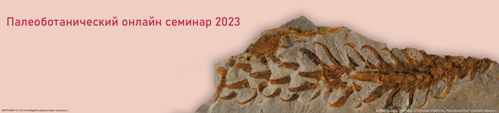

<!-- # Тезисы докладов 2023 года -->

[[toc]]

##  Предисловие

Палеоботанический онлайн семинар был организован по инициативе Палеоботанической комиссии при Научном совете РАН в 2021 году. С тех пор дважды в месяц с февраля по май и с сентября по декабрь мы встречаемся у экранов компьютеров для обсуждения интересных и актуальных вопросов палеоботаники и палеопалинологии. В настоящем сборнике опубликованы тезисы докладов третьего года работы семинара.

В докладах 2023 года рассматривалось изучение цист динофлагеллят для целей палиностратиграфии отложений различных возрастов. В палинологических докладах обсуждались разнообразие девонских дисперсных мегаспор, использование палинологической базы данных «Sporopollen Database» для палеоэкологических и палеоклиматических реконструкций, особенности палинологической интерпретации местонахождения мамонтовой фауны и места охоты древнего человека. Один из докладов был посвящен мумифицированным древесинам. Обсуждались новые находки макроостатков ископаемых высших растений из юрских и меловых отложений. Были рассмотрены эволюция и районирование позднемеловой флоры Горной Охотско-Чукотской палеофлористической провинции. Мы познакомились с результатами палеоботанических исследований кайнозойских отложений Тибета, с эволюцией разнообразия высших растений в регионе, вероятными путями флористических миграций, использованием палеоботанических данных для реконструкции палеоландшафтов. Обсуждалась реконструкция палеорастительности с использованием функциональных типов растений, были затронуты история этого метода и проблемы интерпретации результатов, представлены успешные примеры применения для кайнозойской растительности Сибири и Казахстана. Была показана назревшая необходимость интеграции палеоботанических данных в эволюционную биологию развития и продемонстрировано несколько примеров таких работ. Вопросы возникновения и эволюции листа были проанализированы на ископаемом и современном материале.

Записи большинства заслушанных докладов доступны на интернет-странице нашего семинара [https://www.youtube.com/@paleobotany\_seminar](https://www.youtube.com/@paleobotany_seminar)

Семинар возобновит доклады в феврале 2024 года. Они будут посвящены как представлению новых находок, так и обзорам по результатам многолетних исследований, а также рассмотрению перспектив, проблем, границ применимости используемых методов. Мы планируем обсудить, какое место палеоботанические и палеопалинологические результаты занимают в общей системе знаний, рассмотрению противоречий и поиску консенсуса с выводами, полученными другими методами. Мы надеемся на участие в этом семинаре всех наших коллег – в качестве как слушателей, так и докладчиков!

<i>С уважением, Наталья Завьялова</i>

## Preface

In 2021, Paleobotanical online workshop was organized on the initiative of the Paleobotanical Commission of the Scientific Council of the Russian Academy of Sciences. Since then, we meet at computer screens twice a month, from February to May and from September to December, to discuss paleobotanical and paleopalynological topics. Abstracts of the third year of the workshop are published in this volume.

The reports discussed the application of dinocysts for the palynostratigraphy of various deposits. Palynological talks described the diversity of Devonian dispersed megaspores, the use of the palynological database "Sporopollen Database" for paleoecological and paleoclimatic reconstructions, and considered a mammoth fauna location and hunting sites of ancient man from the palynological point of view. One of the lectures was related to mummified wood. New finds of Jurassic and Cretaceous fossil plants were presented. The evolution and zonation of the Late Cretaceous flora of the Mountainous Okhotsk-Chukchi paleofloristic province were considered. We learned about results of paleobotanical studies of the Cenozoic of Tibet, the evolution of the diversity of the higher plants in the region, the probable paths of floristic migrations, and the use of paleobotanical data for the reconstruction of paleolandscapes. The reconstruction of paleovegetation using functional plant types was discussed, the history of the method and interpretational problems were touched upon, and some examples of application for Cenozoic vegetation of Siberia and Kazakhstan were presented. The necessity to integrate paleobotanical data into the field of evo-devo was stressed and several examples of such studies were presented. The origin and evolution of the leaf were analyzed on fossil and modern plants.

Records of most meetings are available via [https://www.youtube.com/@paleobotany\_seminar](https://www.youtube.com/@paleobotany_seminar)

The workshop will recommence its activity in February 2024. Both new findings and reviews of long-term studies will be presented. Some lectures will touch methodical issues. We plan to discuss the place that paleobotanical and paleopalynological results occupy in the general system of knowledge and consider contradictions and struggle for a consensus with conclusions obtained by other methods.

We look forward to the participation of all our colleagues, as both listeners and speakers!

<i>Sincerely, Natalia Zavialova</i>

## Golovneva Lina 

<small>Komarov Botanical Institute, Russian Academy of Sciences, St. Petersburg, Russia</small>

### Evolution and phytogeographical differentiation of the Late Cretaceous floras of the Okhotsk-Chukotka volcanogenic belt

The Cretaceous Okhotsk-Chukotka volcanic belt (OCVB) is a large volcanic province of Northeastern Eurasia related to active continental margin. It extends from the western coast of the Sea of Okhotsk to the east of the Chukchi Peninsula (3200 km long). The total thickness of volcanic deposits ranges between 2 and 4 km. The time of active eruptions is estimated from the Albian up to Campanian, but the greatest part of volcanic pile seems to be accumulated between the Turonian and Campanian. Volcanic rocks of the OCVB comprise lavas (basalts, andesites, rhyolites, and ignimbrites) and pyroclastic interlayers, which have been formed in a continental environment. Ash-fall tuff deposits contain numerous localities of fossil plants. The Cretaceous mountain floras were significantly distinct from contemporaneous floras of adjacent coastal lowland, which were distributed from the eastern (sea-side) margin of the volcanic belt. They are characterized by a predominance of conifers, extremely lowcontentof angiosperms,largenumber ofEarlyCretaceousrelicts(some ferns, ginkgoaleans,czekanowskialeans, andcycadophytes),andbyhighendemism.

The territory of OCVB is assigned to the Mountain Okhotsk-Chukotka provinceof the Siberian-Canadian palaeofloristic Region. In spite of the virtually total absence of angiosperms, taxonomic evolution did not stop in mountain areas. There are many newly formed species and genera among ferns, cycadophytes and conifers. The majority of these taxa had narrow geographic ranges within OCVB. Due to the high endemism of local floras, the territory of this mountain volcanic belt was characterized by very high phytochorological differentiation during the Late Cretaceous. The Mountain Okhotsk-Chukotka province is subdivided into four subprovinces: the Chukotka, the Penzhina, the Okhotsk and the Ul'ya subprovinces.

The development of the Late Cretaceous floras of the Okhotsk-Chukotka volcanic belt took place in three stages: the Arman stage (Turonian-Coniacian), the Chaun stage (Coniacian) and the Ola stage (Santonian–early Campanian). The processes of formation of endemic taxa of conifers among Taxodiaceae and Pinaceae, which formed new types of vegetation in the upper mountain zones, are the main florogenesis direction of the Okhotsk-Chukotka volcanic belt. The number of angiosperm species in the Okhotsk-Chukotka volcanic belt flora reflects primarily the altitude and deposition environment.

## Kvaček Jiří 

<small>National Museum Prague, Czechia</small>

### New gymnosperms and angiosperms of the Cenomanian Peruc Flora, Czechia, Central Europe

During the last decade there were new data gathered about fossil plants from the Peruc-Korycany Formation. The formation is Cenomanian in age being situated in the most basal position within the Bohemian Cretaceous Basin. Among cycads new _Nilssonia mirovanae_ was described showing stomata in longitudinal rows surrounded by large papillae. This plant was interpreted as a mesophyte to xerophyte. A bennettite _Zamites pateri_ was designated as a rare example of upland vegetation. It shows very thin adaxial cuticle with nearly invisible anticlinal walls and very thick abaxial cuticle with typical syndetocheilic stomata. Among conifers ovuliferous cones _Stutzeliaestrobus bohemicus_ were described borne on twigs earlier assigned to _Cyparissidium bohemicum_.

Herbaceous angiosperm _Pseudoasterophyllites cretaceus_ shows simple pistillate and staminate flowers and simple needle-like leaves arranged in pseudo-whorls. It is interpreted as a possible link between Chloranthaceae and Ceratophyllaceae. Serrate angiosperm leaves _Todziaephyllum saportaneum_ and _Ascarinophyllum pecinovense_ show chloranthoid teeth and semicraspedodromous venation. Their systematic affinity is interpreted within Chloranthaceae. Another dentate leaf _Papillaephyllum labutae_ is characterised by chloranthoid teeth and numerous papillae covering each cell of the abaxial cuticle. Its systematic affinity is less certain.

## Nosova Natalya  <Badge type="info" text="1" />and Andrey Fedyaevskiy <Badge type="info" text="2" />, Anna Lyubarova <Badge type="info" text="1" />

1. Komarov Botanical Institute RAS, St. Petersburg
2. Palynology and Stratigraphy Lab 'PalyStrat' LLP, Almaty, Kazakhstan

### Plant remains from the Middle Jurassic of the Stoilensky open mine in the Belgorod Region (Russia): a preliminary report
Plant fossils collected in the Stoilensky open mine (Belgorod Region, Russia) are represented by numerous fragments of leaves, generative structures and lignified or carbonized wood. Plant fossil-bearing deposits are dated to the Bathonian–Early Callovian on the basis of dinocyst and spore-pollen assemblages. Based on the study of the morphology and epidermal-cuticular features of plant remains, members of ferns, corystospermaleans, cycads, bennettites, ginkgoaleans, leptostrobaleans and conifers are determined.The ferns are represented by fragmentary pinnae of _Cladophlebis_ and _Dictyophyllum_. Of interest in this relation is that the palynospectra are dominated by cyatheaceous spores. Two types of _Pachypteris_ (Corystospermales) leaves are recorded. The first type is similar to leaves of _P. rutenica_, originally described from the Bathonian of the Kursk Region (Gordenko, 2007a). The leaves of the second type are comparable with _P._ cf. _major_. The only cycad is determined as _Ctenis_ sp. The bennettites are represented by numerous leaf segments of _Pterophyllum_ and the only found leaf fragment of _Ptilophyllum_. Ginkgoalean leaves of _Sphenobaiera_ _angrenica_ dominate in some samples. Originally, this species was described from the Middle Jurassic of Uzbekistan (Nosova, 2013). Collar structures of _Nagrenia_ and seeds of _Allicospermum_ are found. The leptostrobaleans are represented by leaf fragments of _Czekanowskia._ Remains of coniferous leaves are found in all studied samples, wherein _Mirovia_ leaves dominate. Two species of _Mirovia_ are distinguished:_M. oskolica_ (Nosova, Lyubarova, 2023) and _M. eximia,_ originally described as _Oswaldheeria eximia_ from the Kursk Region (Gordenko, 2007b). Besides _Mirovia_, there are numerous linear leaves of _Podocarpophyllum kazachstanicum,_ originally described from the Lower Jurassic of Kazakhstan (Nosova, Kiritchkova, 2008), and leaf fragments of _Pityophyllum_ sp. Lanceolate leaves with obliquely to transversely oriented stomata in the stomatal bands were determined as _Elatocladus_ sp. Fossil wood is attributed to _Circoporoxylon_ sp_._ (Podocarpaceae).

This study was supported by the Russian Science Foundation (No 23-24-00105).

**References:**

_Gordenko N.V._ A new species of _Pachypteris_ (Brongniart) Harris (Corystospermales) from the Bathonian continental deposits of the Kursk Region, Russia. Paleontol. J. 2007a. V. 41. P. 1091–1102.

_Gordenko N.V._ A new species of the conifer genus _Oswaldheeria_ with well-preserved leaf anatomical elements from the Bathonian of the Kursk Region. Paleontol. J. 2007b. V. 41(3). P. 319–326.

_Nosova N._ Revision of the genus _Grenana_ Samylina from the Middle Jurassic of Angren, Uzbekistan. Rev. Palaeobot. Palynol. 2013. V. 197. P. 226–252.

_Nosova N.V., Kiritchkova A.I._ A new species and a new combination of the Mesozoic genus _Podocarpophyllum_ Gomolitzky (Coniferales). Paleontol. J. 2008. V. 42(6). P. 665–674.

_Nosova N., Lyubarova__A_. First data on coniferous leaves from the Middle Jurassic of the Belgorod Region, Russia. Rev. Palaeobot. Palynol. 2023. V. 317.

## Orlova Olga A.

<small>Lomonosov Moscow State University</small>

### Givetian megaspore diversity of the Voronezh Anteclise

The origin of heterospory is the greatest evolutionary change in the history of plants. The first evidence of advent of heterosporous reproduction comes from the Early Devonian. The first rare dispersed megaspores (_Dictyotriletes canadensis)_ were detected by Richardson and McGregor (1986) in the Upper Pragian to the Lower Emsian deposits of Canada. The first heterosporous strobile with in-situ megaspores (_Omniastrobus dawsonii)_ was described from the Early Emsian of Canada (Bonacorsi et al., 2021). Several studies of the Late Emsian – Eifelian megaspores have been published from England, Norway, Poland, and other countries. Rich megaspore assemblages were found in the different Givetian (Middle Devonian) localities of Canada, Poland, Belgium, China, Libya, and other countries. They are also known from the Voronezh Anteclise of the central Russia. The assemblages are diverse, composed of more than 10 genera, with more than 20 species. Megaspores of genus _Biharisporites_ dominated among the other megaspores. Earlier, some species of _Biharisporites_ have been found in situ in archaeopteridalean progymnosperms, but some others (at least, Givetian _B. arcticus_ var. _productus_) showed a lycopsid type of the sporoderm ultrastructure (Kanarkina et al., 2022). _Contagisporites_ megaspores are often observed in the Givetian assemblages of the Voronezh Anteclise, and they are associated with archaeopteridalean plants too. Seed megaspores of _Granditetraspora_, which show more similarities to archaeopterids than to lycopsids by the sporoderm ultrastructure (Turnau et al., 2009; unpublished data by Kanarkina et al. on these tetrads from the Voronezh Anteclise), are met only in two of the studied localities and in small amounts. Megaspores of _Lagenicula_ with a prominent hologula are found in the majority of the assemblages, but in small amounts. They have been always considered as megaspores of lepidodendralean lycopsids. Occasionally, megaspores of _Hystricosporites, Heliotriletes, Corystisporites_, _Grandispora,_ and _Verrucisporites_ are abundant in several assemblages of the Voronezh Anteclise. Enigmatic megaspores of _Nikitinsporites_ are very rarely observed in the Givetian of the Voronezh Anteclise.Most significantly, although _Biharisporites_ and _Lagenicula_ have a wide stratigraphic range (the former genus lasts since the Givetian until the Cretaceous and the latter until the Early Permian), other members of the megaspore assemblages of the Voronezh Anteclise are restricted to a shorter time interval.

**References**

Bonacorsi, N.K., Gensel, P.G., Hueber, F.M., Lesli, A.B., 2021. _Omniostrobus_ gen. nov., an Emsian plant with implications for the evolution of heterospory in the early Devonian. Int. J. Plant Sci. 182 (3), 198–209.

Kanarkina, A., Zavialova, N., Orlova, O., Joshi, A., 2022. Sporoderm ultrastructure of some Devonian and Permian representatives of _Biharisporites_ and their botanical affinity. Palynology. 46 (4), https://doi.org/10.1080/01916122.2022.2054876

Richardson, J.B., McGregor, D.C., 1986. Silurian and Devonian spore zones of the Old Red Sandstone continent and adjacent regions. Geol. Surv. Canada, Bull. 364, 1–79.

Turnau, E., Zavialova, N., Prejbisz, A., 2009. Wall ultrastructure in some dispersed megaspores and seed-megaspores from the Middle Devonian of northern Poland. Rev. Palaeobot. Palynol. 156 (1–2), 14–33.

## Spicer Robert A. <Badge type="info" text="1,2,3" />

1. State Key Laboratory of Tibetan Plateau Earth System, Resources and Environment (TPESRE), Institute of Tibetan Plateau, Chinese Academy of Sciences, Beijing 100101, China
2. CAS Key Laboratory of Tropical Forest Ecology, Xishuangbanna Tropical Botanical Garden, Chinese Academy of Sciences, Mengla, China
3. School of Environment, Earth and Ecosystem Sciences, The Open University, Milton Keynes, MK7 6AA, UK

### The Ups and Downs of Palaeoaltimetry: Plant Fossils and Isotopes Compared and Combined

It is not unusual for papers on the orogenic development of the Pan Tibetan Plateau region to bemoan the ongoing confusion in this research field. This lack of consensus on measurements of past surface height changes is real. In particular, two directly-conflicting endmember frameworks persist regarding the formation of the modern plateau, where either: 1) a high central 'proto-plateau' existed prior to the onset of India-Asia continental collision, or 2) the early Paleogene landscape comprised a wide lowland no higher than ~ 1-2 km above mean sea level, bounded by high (\> 4.5 km) mountain systems, and a near-modern plateau only formed in the early Neogene. Reconstructing plateau development correctly is fundamental to running realistic Earth system models that explore monsoon development and its consequential influence on the rich biodiversity in the region. Understanding monsoon sensitivity to landscape characteristics, and how both landscape and climate influence biodiversity, are critical for future resource management. This presentation explores the inherent strengths and weaknesses in different palaeoaltimetric methodologies using examples from the Tibetan region and highlights the (often contradictory) outcomes from them that source the current confusion. The outlook is far from bleak, however. By using these various methodologies together, appreciating the vulnerabilities arising from their underlying assumptions and searching for consilience (agreement), it is possible reconstruct paleo-landscapes that can then be used to inform further research. To achieve consilience requires testing and improving the methodologies using numerical climate modelling with realistic boundary conditions, so that the overall approach is truly multidisciplinary and iterative. The presentation ends with a summary of Tibetan landscape climate and biodiversity evolution through the Cenozoic that shows most consilience with the available data.

## Tao Su <Badge type="info" text="1" />, Jian Huang <Badge type="info" text="1" /> , Jia Liu <Badge type="info" text="1" /> , Shu-Feng Li <Badge type="info" text="1" /> , Robert A. Spicer <Badge type="info" text="1,2" /> , Zhe-Kun Zhou <Badge type="info" text="1" />

1. CAS Key Laboratory of Tropical Forest Ecology, Xishuangbanna Tropical Botanical Garden, Chinese Academy of Sciences, Mengla 666303, China
2. School of Environment, Earth and Ecosystem Sciences, The Open University, Milton Keynes, MK7 6AA, United Kingdom

### The evolution of plant diversity in central Tibet

The collision between Indian and Eurasian plates by ~60 Ma formed the Tibetan Plateau, which led to the fundamental change of biodiversity there; however, our understanding for the evolution of biodiversity in this region is far from complete largely due to lack of fossil records. Recent paleobotanical investigation suggests unexceptionally rich plant diversity in east-west trend valley of central Tibet during the Paleogene. The Middle Eocene (~47 Ma) Jianglang flora in the Bangor Basin enumerates more than 80 morphotypes of leaves, fruits/seeds, flowers, and tubers, thus showing the highest species richness among all reported Cenozoic floras. Some components of the Jianglang flora represent the earliest fossil records of those taxa in Asia and even, to our current knowledge, in the world. Very interestingly, the Jianglang species assemblage is most similar to that of the Early-Middle Eocene Green River flora in the western interior USA, with 16 taxa in common at the genus/family level, including some with unclear taxonomic affinities to modern plants. The Jianglang flora also contains eight taxa in common at the genus/family level with the Middle Eocene Messel flora in Germany. The Late Eocene (~39 Ma) Dayu flora in the Lunpola Basin is represented by woody dicots with seven spiny morphotypes andherbaceous species, indicating open woodlands instead of the subtropical forest of the Jianglang flora. Another younger flora (35 Ma) in Xiongmei, Lunpola Basin, has similar floristic components to the Dayu flora. These Eocene floras show significant changes in both floristic components and vegetation from the Middle to Late Eocene accompanying by paleoenvironmental changes. Palynological evidence shows it was not until the Neogene that the modern ecosystem was formed in central Tibetan Plateau. Further work is needed with a focus on floras of different geological ages to better decipher the evolution of plant diversity in response to the growth and paleoclimatic changes of the Tibetan Plateau.

## Tomescu Mihai

<small>California State Polytechnic University – Humboldt, USA</small>

### Evolution and the arrow of time: bringing paleobotany to the "high table" of evolutionary plant biology

Biological evolution is the history of life and its diversity. As a historical process, biological evolution is underpinned by contingency – prior states determine the subsequent states – and can be reconstructed only by following the arrow of time, i.e., by taking a "bottom-up" or upward outlook. Within this framework, fossils provide the only direct evidence to reconstruct evolutionary patterns and processes, especially those of deep time. Recognition of this reality drove the "paleobiological revolution", which in the 1980s led to the elevation of paleobiological disciplines from a previously perceived status of "stamp collecting" science to significant players in the efforts to reconstruct the history of life. However, during the four decades since the paleobiological revolution, neontological disciplines have slowly reverted, to a great extent, to a "top-down" approach that reconstructs evolutionary pattern and process using data from the modern biota, and relegates information derived from fossils to the role of mere checkpoints with no direct bearing on inferences of evolutionary processes or relationships. This epistemological pattern is conspicuous in the field of phylogenetics, where it has generated a vast body of literature that is replete with conflicting results and hypotheses. In contrast to phylogenetics, the field of evo-devo, which addresses the evolution of development and its regulation, has seen preciously few attempts to compare or integrate inferences of neontological studies with data from the fossil record. This is at least in part because the methods and epistemological paradigms of paleobiological studies raise intimidating barriers for those neontologists interested in querying the fossil record, if they lack extensive training in paleobiology. Thus, while evo-devo studies are ripe for integration of fossils, it befalls us, paleobotanists, paleontologists and paleobiologists, to lead the integration efforts by shining the limelight on fossil data in ways that make them meaningful to neontologists. I will discuss three examples, drawn from work undertaken in my lab on Early Devonian plants, of how integration of data from fossils informs our understanding of the evolution of plant development. The first example concerns the anatomy of _Psilophyton_, which supports a hypothesis on the shared evolutionary origin of conducting and sporogenous tissues and origination of the former by sterilization of the latter. The second example reviews the diversity of vascular architectures encountered in the Early Devonian, which confirm a pattern of early high anatomical disparity and biphasic evolution of disparity in euphyllophytes. The third example concerns the earliest woody plants, whose anatomy indicates that the regulatory toolkit responsible for secondary growth was assembled in a modular fashion at the base of the euphyllophyte clade. These examples will hopefully inspire other paleobotanists to look at the fossils they investigate also through the broader lens of evo-devo studies.

## Tomescu Mihai

<small>California State Polytechnic University – Humboldt, USA</small>

### What's new in leaf evolution?

The fossil record provides unequivocal evidence for independent leaf origins in lycophytes and euphyllophytes, and in several lineages of the latter. In each lineage, leaf-bearing members are stratigraphically younger and more derived that those that lack stem-leaf differentiation. However, the evolutionary processes underpinning each independent leaf origin are still unresolved. Lycophyte leaves arose early in the Devonian (possibly late Silurian). Euphyllophytes leaves appear 30 myr later, in the Middle Devonian. Evolving under the same physiological and developmental-structural constraints – maximizing photosynthesis and arising as appendages from a meristem required to maintain indeterminacy – leaves have converged toward the same defining features: vascularization, bilateral symmetry and dorsiventral polarity, regular arrangement, determinate growth. These structural features are underpinned by regulatory mechanisms, e.g., auxin-mediated primordium positioning (regular arrangement), KNOX/ARP interactions (determinacy), HD-ZIPIII/KANADI interactions (dorsiventral polarity). Leaf evolution can be addressed by deconstructing leaves into their defining structural features that can be traced back in the fossil record, and developmental regulatory mechanisms that can be studied in the living lineages. Lycophyte leaves likely have a single origin. Consistent with independent origin, some lycophyte leaves lack the dorsiventral patterning function that HD-ZIPIII/KANADI interactions have in euphyllophytes. Given the scarcity of anatomically-preserved fossils in the key interval for lycophyte leaf evolution (Silurian/earliest Devonian), understanding lycophyte leaf origins will require substantial new fossil discoveries. In euphyllophytes, the traditional view that leaves evolved from lateral branching systems has supported hypotheses of partial homology. However, regulatory studies show differences between ferns and seed plants in KNOX/ARP and HDZIPIII/KANADI pathways, supporting multiple origins. A close look at the lateral branching systems of Early to Middle Devonian euphyllophytes shows breadth of structural diversity that belies the apparent simplicity and morphological similarity, supports multiple leaf origins, and offers clues on tempo and mode of leaf evolution in different lineages. By the end of the Early Devonian, at least two euphyllophyte lineages had evolved appendages with regular arrangement and some with bilateral symmetry. A major hurdle is a lack of resolution of phylogenetic relationships between these Early Devonian plants and younger Devonian plants possessing bona fide leaves. Better resolved phylogenies of Devonian plants are needed to provide a framework for tracing the appearance of different leaf-defining features in each lineage. Significant advances will also come from functional studies in extant seed-free lineages where such information is currently minimal, to understand the mechanisms of parallel evolution of leaves.

## Jianguang Zhang <Badge type="info" text="1" />, Olaf Klaus Lenz <Badge type="info" text="1,2" />

1. Technische Universität Darmstadt, Schnittspahnstraße 9, 64287 Darmstadt, Germany
2. Senckenberg Gesellschaft für Naturforschung, General Directorate, Senckenberganlage 25, 60325 Frankfurt/Main, Germany

### Quantitative  analysis of Triassic-Jurassic  pollen and  spores for  paleoenvironmental and  paleoclimate  reconstructions based on the _ Sporopollen Database_

The eco-group classification based on growth-forms of plants (Eco-Plant model) established by the pioneering work of Warming (1895) and Schimper (1898) is widely used for palaeoenvironmental reconstructions (Zhang et al., 2020); the SEG model by Abbink et al. (2004) represents a simplified Eco-Plant model. However, the application of Eco-Plant model is limited for most Mesozoic dispersed sporomorphs, because their assignment to a specific eco-group remains uncertain and/or the botanical affinities to plant taxa are unclear.

A new database Sporopollen ([http://www.sporopollen.com](http://www.sporopollen.com/)) is created. Currently, it has enumerated 100,610 sporomorph pictures, 59,498 plant pictures, and 31,922 sporomorph descriptions. With the help of the database, 861 genera of dispersed Mesozoic sporomorphs of bryophytes, pteridophytes, and gymnosperms are evaluated by comparing their morphology, outline and structure/sculpture of the wall with those of pollen and spores of modern plants and _in situ_ fossil plants. The results show that 474 of them can be linked to their closest parent plants and Eco-Plant model at family or order level, but 387 of them cannot because of the lack of detailed ultrastructural data. The use of a light microscope alone for determination is one of the main reasons why some dispersed sporomorphs cannot be linked precisely to their parent plants. Nonetheless, the presented eco-groups for dispersed Mesozoic sporomorphs provide a possibility to reconstruct in detail the vegetation and palaeoenvironmental change in the Mesozoic, especially in the context of the climate change.

A new interface ([http://www.sporopollen.com/sporemesozoicsegs.php?opencode=paper1](http://www.sporopollen.com/sporemesozoicsegs.php?opencode=paper1)) was created based on the reviewed result to quickly link the dispersed sporomorphs to past vegetation patterns and climatic changes. The users can upload their data to the database and in return get quick results. It can automatically link all of the Mesozoic and Cenozoic sporomorphs to their possible parent plants at phylum, order, or family level. It can also automatically link all of the Triassic and Jurassic sporomorphs to the Eco-Plant model to assess the effects of humidity and temperature.

By using 30 palynological samples from a 10 m thick lignite bed from the Upper Triassic Haojiagou Formation (Rhaetian)in the Junggar Basin, Xinjiang, NW China, as an example, the palaeovegetation and palaeoenvironment of a peat-forming wetland are evaluated. We analyse the assemblages in terms of the Eco-Plant model, which assigns the parent plants of the sporomorphs to five groups based on humidity and four groups based on temperature; multivariate statistical analyses are used to infer palaeoclimate and palaeoenvironmental conditions. The results suggest that the palaeoclimate of the Rhaetian in the Junggar Basin was generally wet and subtropical with short seasonal drought periods. This study exemplifies that the Eco-Plant model may be a useful tool to reveal past vegetation patterns and climate changes and it is applicable to other Mesozoic assemblages.

**References**

Abbink, O.A., Van Konijnenburg-Van Cittert, J.H.A., and Visscher, H., 2004, A sporomorph ecogroup model for the Northwest European Jurassic - Lower Cretaceousi: concepts and framework: Netherlands Journal of Geosciences-Geologie En Mijnbouw, v. 83, p. 17-31.

Schimper, A.F.W., 1898, Pflanzen-geographie auf physiologischer Grundlage: Jena, Verlag von Gustav Fischer, 876 p.

Warming, E., 1895, Plantesamfund - Grundtræk af den økologiske Plantegeografi, Clarendon Press, Oxford, 335 p.

Zhang, J., Lenz, O.K., Hornung, J., Wang, P., Ebert, M., and Hinderer, M., 2020, Palynology and the Eco-Plant model of peat-forming wetlands of the Upper Triassic Haojiagou Formation in the Junggar Basin, Xinjiang, NW China: Palaeogeography, Palaeoclimatology, Palaeoecology, v. 556, p. 109888.

## Zhe-Kun Zhou

<small>CAS Key Laboratory of Tropical Forest Ecology, Xishuangbanna Tropical Botanical Garden, Chinese Academy of Sciences, Mengla 666303, China</small>

### Cenozoic plants from Tibet: an extraordinary decade of discovery, understanding and significance

Plant fossils play an important role in understanding landscape evolution across the Tibetan Region, as well as plant diversity across wider eastern Asia. Within the last decade or so, paleobotanical investigations within the Tibet Region have led to a paradigm shift in our understanding of how the present plateau formed and how this affected the regional climate and biota. 
This is because: 
1) Numerous new taxa have been reported. Of all the Cenozoic records of new plant fossil species reported from the Tibet (Xizang) Autonomous Region 46 out of 63 (73%) were documented after 2010. Among these, many represent the earliest records from Asia, or in some cases worldwide, at the genus or family level.
2) These fossils show that during the Paleogene, the region now occupied by the Tibetan Plateau was a globally significant floristic exchange hub. Based on paleobiogeographic studies, grounded by fossil evidence, there are four models of regional floristic migration and exchange, i.e., into Tibet, out of Tibet, out of India and into/out of Africa. 
3) Plant fossils evidence the asynchronous formation histories for different parts of the Tibetan Plateau. During most of the Paleogene, there was a wide east-west trending valley with a subtropical climate in central Tibet bounded by high (\> 4 km) mountain systems, but that by the early Oligocene the modern high plateau had begun to form by the rise of the valley floor. Paleoelevation reconstructions using radiometrically-dated plant fossil assemblages in southeastern Tibet show that by the earliest Oligocene southeastern Tibet (including the Hengduan Mountains) had reached its present elevation. 
4) The coevolution between vegetation, landform and paleoenvironment is evidenced by fossil records from what is now the central Tibetan Plateau. From the Paleocene to Pliocene, plant diversity transformed from that of tropical, to subtropical forests, through warm to cool temperate woodland and eventually to deciduous shrubland in response to landscape evolution from a seasonally humid lowland valley, to a high and dry plateau. 
5) Advanced multidisciplinary technologies and novel ideas applied to paleobotanical material and paleoenvironmental reconstructions, e.g., fluorescence microscopy and paleoclimatic models have been essential for interpreting Cenozoic floras on the Tibetan Region.

## Бурканова Е.М., Гулина А.В.

<small>Томский государственный университет, лаборатория континентальных экосистем мезозоя и кайнозоя.</small>

### Волчья Грива: местонахождение мамонтовой фауны и место охоты древнего человека с точки зрения палинолога
Местонахождение Волчья грива расположено на юге Западно-Сибирской равнины (ЗСР) в бассейне бессточного озера Чаны (Новосибирская область, Каргатский район). В настоящее время это крупнейшее в Азии мамонтовое «кладбище», сформированное in situ. Костеносный горизонт, представленный серией крупных линз, вмещает десятки тысяч костей и зубов мамонтов и др. млекопитающих. Максимальная концентрация иногда превышает 130 шт./м2. Исследования подтвердили наличие здесь самого южного и одного из самых молодых рефугиумов мамонтовой фауны в Евразии (14C date: 11,090±120 BP, 12,760–13,180 cal. BP).

В 2020 г. была найдена уникальная костная композиция. Ее основу представляет часть бедра мамонта, в которой выдолблена ниша. В нишу были вложены части черепа, челюсти и зубы песца и лисицы. Данная находка не имеет описанных аналогов, как для периода последнего ледникового максимума (LGM), так и всей палеолитической эпохи Сибири, являясь свидетельством архаичной культуры.

Изучение и интерпретация палеонтолого-стратиграфических материалов позволили выделить аспекты экологии мамонтовой фауны и древнего человека в период формирования местонахождения (MIS 2).

Акцент доклада сделан на палинологических исследованиях, с помощью которых удалось определить:

1) верхнюю границу и условия образования вмещающих гривных отложений;

2) условия и этапы развития ландшафтов в эпоху MIS 2 на юге ЗСР;

3) влияние деятельности древнего человека на состав локальной растительности местонахождения;

4) аномальный состав пыльцы, выделенный из породы заполняющей костную композицию, подтверждающий искусственное происхождение артефакта;

5) время начала формирования современных биотопов.

Экспедиции проводились в рамках проекта гос.задания Минобрнауки России, проект № 5.4217.2017/4.6. Основные лабораторные исследования, окончательная обработка палеонтологических материалов и сравнительный анализ выполнены за счет средств РНФ, грант № 20-17-00033.

Leshchinskiy S.V., Burkanova E.M. The Volchia Griva mineral oasis as unique locus for research of the mammoth fauna and the late Pleistocene environment in Northern Eurasia. //Quaternary Research. 2022., 109:157–182.

Leshchinskiy S.V, Zenin V.N., Burkanova E.M. Kuzmin Y.V. The unique Late Paleolithic artifactual bone assemblage from the Volchia Griva site, Western Siberia. //Quaternary Research (2023), 1–21.

## Лидская А. В.

<small>Геологический институт РАН, Москва</small>

### Биостратиграфия волжского яруса Русской плиты по диноцистам: состояние, перспективы

В свете значительного прогресса стратиграфии волжского яруса по аммонитам возрастают требования к детальности шкал и по другим группам фауны. Волжский ярус повсеместно богат микрофитопланктоном, в том числе на уровнях, где макрофауна отсутствует, поэтому диноцисты являются наиболее актуальной вспомогательной группой. Принятая зональная схема по диноцистам для Восточно-Европейской платформы включает четыре волжские зоны с типовыми разрезами Городищи и Кашпир в Поволжье (Ridingetal., 1999, Унифицированная схема…, 2012).

Новые данные, полученные автором доклада из ряда разрезов волжского яруса в Московской синеклизе и за ее пределами, показывают, что принятая зонация в этих разрезах не применима. При тщательном анализе основополагающей литературы очевидно, что зоны по диноцистам были приняты преимущественно как трансляция европейских зон с большим количеством допущений, без учета региональных факторов. Главным образом эти допущения связаны с недостатком фактического материала, отсутствием опробования на больших интервалах, очень редким опробованием в конденсированных частях разрезов. Последующие палинологические исследования стратотипических разрезов (Hardinget. al., 2011, Пещевицкая, 2021) внесли ряд уточнений в установленную ранее последовательность событий, и в данные о региональном разнообразии и распространении диноцист. Однако основной недостаток так и не был восполнен: отсутствие опробования на конкретных уровнях, неоднозначные аммонитовые датировки.

Для решения проблемы необходимо изучение хорошо датированных аммонитами разнофациальных разрезов с подробным шагом опробования. Аммонитовый контроль необходим для отслеживания полноты последовательности, скрытых перерывов и их объема на инфразональном уровне. Изучение диноцист из разных фаций и частей палеобассейна волжского времени важно для учета экологического фактора, который, несмотря на обилие олиготрофных, космополитных таксонов, очевидно, оказывает существенное влияние на присутствие, а значит, появление и исчезновение некоторых таксонов. Новые данные по распределению диноцист из разрезов, опробованных по этому принципу, демонстрируют большой потенциал для детального расчленения волжского яруса, а также для внутри- и межрегиональных корреляций.

**Список литературы:**

Пещевицкая Е.Б. 2021. Палиностратиграфия и палеообстановки в разрезе Городищи (Среднее Поволжье, кимеридж–готерив). Геология и геофизика. Т. 62. № 7. С. 939–966.

Унифицированная региональная стратиграфическая схема юрских отложений Восточно-Европейской платформы (14 листов). 2012. Объяснительная записка. М.: ПИН РАН – ФГУП «ВНИГНИ», 64 с.

HardingI.C., SmithG.A., RidingJ.B., WimbledonW.A.P. 2011. Inter-regional correlation of Jurassic/Cretaceous boundary strata based on the Tithonian–Valanginian, dinoflagellate cyst biostratigraphy of the Volga Basin, western Russia. Rev. Palaeobot. Palynol. V. 167. P. 82–116.

Riding J.B., Fedorova V.A., Ilyina V.I. 1999. Jurassic and lowermost Cretaceous dinoflagellate cyst biostratigraphy of the Russian Platform and northern Siberia, Russia. AAPSContributionser. V. 36. 184 p.

## Попова С. С.

<small>Ботанический ин-т им. В. Л. Комарова РАН, Санкт-Петербург</small>

### Реконструкция палеорастительности при помощи функциональных типов растений. История метода, интерпретация результатов
Задачи выделения групп (типов) растений, так или иначе связанных с их функциональной ролью в экосистеме, имеют давнюю историю в экологии (Pillar V.D., Orloci L., 1992, 2000; Steffen W.L., 1992 и т.д.). Функциональный тип растений (ФТР) чаще всего определяется как группа растений, не обязательно филогенетически связанных, но имеющих сходные адаптационные механизмы к среде и способы воздействия на нее. Функциональные группы видов служат для обобщенного описания растительности в глобальном масштабе, что делает их удобным инструментом, при моделировании динамики экосистем с учетом воздействий разного рода (Смирнов 2007).

Классификация функциональных типов растений, используемая для реконструкции кайнозойской растительности и в частности для оценки разных моделей климата и растительности, построенных на базе палеоботанических данных, впервые была предложена для реконструкции древесной растительности Утешером и др. (Utescheratal, 2007) и включала в себя 13 классов. Позже на ее основе Франсуа и соавторы (Francoisatal, 2011) разработали классификацию, состоящую из 26 классов: 5 травянистых, 8 кустарничковых и 13 древесных, обобщающую все группы растений. В основе выделения данных функциональных типов растений (ФТР) лежат морфологические признаки растений, в частности их жизненная форма (деревья, кустарники, травы), физиогномические и фенологические признаки (широколиственные, хвойные и вечнозеленые, листопадные), функциональные, здесь - путь фотосинтеза (С3 и С4 растения), а также их биоклиматическая толерантность (умеренный, тропические, бореальные и т.д., температурные интервалы, которой рассчитаны Вульфом для растительных зон Северного полушария (Wolfe, 1979). Точность определения конкретного функционального класса для ископаемого таксона напрямую зависит от таксономического уровня (семейство, род, вид) выявленного близкородственного современного аналога. Важным преимуществом метода является то, что микро- и макрофлору можно анализировать, используя тот же подход. Однако по той же самой причине, при анализе данных учитывается только наличие или отсутствие ископаемого таксона, и не принимается во внимание количество, таким образом уменьшая погрешность, вызванную тафономическим фактором. Экоспектры, полученные в результате анализа ФТР для палеофлор, описанных по разным типам остатков, конечно, отличаются, так, как известно, листовые флоры лучше характеризуют региональную древесную растительность, карпологические флоры большей частью локальную водную-рудеральную растительность, а споро-пыльцевые спектры описывают зональную растительность. Также следует иметь в виду, что в зависимости от таксономического ранга современного аналога, ископаемый таксон может относиться к нескольким различным ФТР одновременно, следовательно, пропорции данные для ФТР, относятся к общей сумме ввода. Данная методика была опробована нами и применяется успешно для реконструкции кайнозойской растительности Западной Сибири, Казахстана по флорам разного типа сохранности (Popova 2013, 2017, 2018, 2019; Averyanova 2021, 2022).

## Степанова А.В.

<small>Ботанический институт им. В. Л. Комарова РАН</small>

### К вопросу о мумифицированных древесинах
Мумифицированные древесины - ископаемые неокаменевшие древесины, фигурируют в десятках источников новейшей литературы, такие находки часто называют редкими или даже уникальными. В специальном обзоре мумифицированные древесины определяют как состоящие из исходных тканей, клетки которых подверглись деградации в минимальной степени (Mustoe, 2018), но это определение, как и его использование, вызывает ряд возражений (Luczaj et al., 2018). Показано, что исследователи, работающие в диапазоне от плиоцена до олигоцена, чаще описывают их под термином «субфоссилия», кроме того древесины с хорошо сохранившимся органическим веществом называют ксилитами, лигнитами, низкосортными бурыми углями; существующие разногласия в классификации углей также усложняют задачу получения цельной картины этого явления. Сохранение органического вещества на протяжении миллионов лет, безусловно, представляется удивительным, однако, так ли это явление исключительно?

Предлагаемый доклад затрагивает ряд тем, связанных с мумифицированными древесинами:

- Структура клеточной стенки, процессы ее деградации и их причины.
- Типы углей и их созревание.
- Встречаемость мумифицированных древесин, их географическая, временная и экологическая приуроченность.
- Возможности исследования мумифицированных древесин традиционными и новейшими методами

По результатам анализа литературы будет предпринята оценка адекватности термина и широты его определения.

Mustoe G. E. 2018. Non-Mineralized Fossil Wood. Geosciences 8, 223.

Luczaj J. A., Leavitt S. W., Csank A. Z., Panyushkina I.P. and Wright W. E. 2018. Comment on "Non-Mineralized Fossil Wood" by George E. Mustoe. Geosciences 8, 462.

