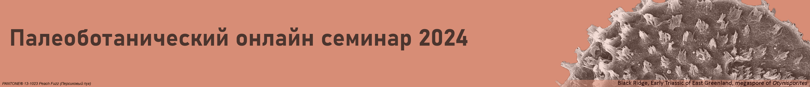

[[toc]]

## Предисловие

В настоящем сборнике опубликованы тезисы докладов Палеоботанического онлайн семинара. В 2024 г., на четвертый год работы семинара, состоялось 16 заседаний, на которых были заслушаны как обзорные лекции, так и доклады о новых результатах. Были рассмотрены результаты изучения ископаемых растений девона, карбона, перми, триаса, юры, мела. Биостратиграфические аспекты были затронуты в докладах о микрофитопланктоне ордовика Балтоскандии и ископаемых высших растениях девона Китая и перми России. Одна из лекций была посвящена методике эпидермального анализа при изучении позднепалеозойских растений. В нескольких докладах обсуждалась ультраструктура спородерм ископаемых и современных мхов, папоротников и плауновидных. Один из докладов был посвящен позднепалеозойским мхам и их возможным связям с современными таксонами. Была сделана попытка реконструировать филогению схизейных папоротников на основе комбинированного анализа данных по ископаемым и современным представителям этого порядка. Результаты исследования некоторых современных водорослей обсуждались в контексте эволюции жизненного цикла наземных растений. Впервые одно из заседаний было посвящено истории палеоботаники, а на двух других были рассмотрены перспективы изучения таких палеоботанических объектов как кораллиновые красные водоросли и фитолиты. Записи большинства докладов доступны по адресу: [https://www.youtube.com/@paleobotany_seminar](https://www.youtube.com/@paleobotany_seminarhttps://).

Семинар возобновит свою работу в феврале 2025 г., с докладов о результатах изучения пыльцы и палеоботанических остатков из кайнозойских отложений. Если вы (или ваши студенты) хотели бы получать анонсы семинара, напишите Н.Е. Завьяловой (zavial@mail.ru).

<i>С уважением, Наталья Завьялова</i>

## Preface

The volume contains abstracts of talks that were presented at the Russian Paleobotanical online workshop. In 2024, which was the fourth year of the existence of the workshop, 16 sessions took place, with review lectures as well as talks on newly obtained results. Devonian, Carboniferous, Permian, Triassic, Jurassic, and Cretaceous fossil plants were discussed. Biostratigraphical topics were touched upon in presentations on the microphytoplankton from the Baltoskandian paleobasin and on the higher plants from the Devonian of China and Permian of Russia. One of the lectures was related to the analysis of epidermal remains of Late Paleozoic plants. Several talks addressed the ultrastructure of sporoderms of fossil and living bryophytes, ferns, and lycopsids. One of the talks dealt with Late Paleozoic bryophytes and their possible relationships to modern taxa. An attempt was made to reconstruct the phylogeny of the Schizaeales by analyzing fossil and modern members of the order. Observations on some modern algae were discussed in light of the evolution of the life cycle of land plants. For the first time one of the sessions was devoted to the history of paleobotany and two others dealt with such objects of paleobotanical studies as coralline algae and phytoliths.

Records of most sessions are available at [https://www.youtube.com/@paleobotany_seminar](https://https://www.youtube.com/@paleobotany_seminar).

The sessions will recommence in February 2025, with talks on Cenozoic pollen grains and plant macrofossils. If you (or your students) would like to receive the announcements of the workshop, write to N. Zavialova (zavial@mail.ru).

<i>Respectfully, Natalia Zavialova</i>

## Julio Aguirre

<small>Dpto. Estratigrafía y Paleontología, Facultad de Ciencias, Fuentenueva s/n, Universidad de Granada, 18002 Granada, Spain</small>

<small>jaguirre@ugr.es</small>

### CORALLINE ALGAE IN SPACE AND TIME: A PALAEONTOLOGICAL PERSPECTIVE

Crustose coralline algae (Corallinophycidae, Rhodophyta) represent one of the most successful groups of recent macrophytes, yet are the least investigated. They are marine organisms that are able to inhabit any place within the photic zone from the Equator to circumpolar regions. Nonetheless, new unexpected findings have shown that they survive even in freshwaters. Within this wide distribution, corallines are important marine ecological engineers creating particular ecosystems that represent diversity hotspots in which corallines provide refugee and constitute nursery centres for a plethora of organisms. These marine ecosystems are rhodolith/maerl beds. At present-day, these valuable ecosystems are endangered due to global change (mostly temperature increase, atmospheric *p*CO2 increase and ocean pH decrease) and direct anthropogenic activities (overfishing, trawling, invasive species, coastal contamination, open-marine oil spills, and eutrophication due to massive delivery of fertilizers). Most studies suggest that calcification and growth rates of present-day coralline algae can be drastically reduced due to the ongoing global change. Nonetheless, looking back to the geological record of coralline algae, they show a successful diversification history despite intense temperature, *p*CO2 and pH variations that have occurred through geological time. Their success is the result of a great versatility and adaptability during their long evolutionary history that commenced in the Lower Cretaceous, about 140 million years ago.

In the last 50 years, investigations on fossil corallines have provided increasing fundamental information to reconstruct this macroevolutionary history. In addition, important advances on their potential use as palaeoenvironmental indicators have been made; most critical has been to infer key ecological factors controlling their development and distribution. This progress has been possible due to a parallel improvement of the taxonomy of fossil corallines. On the other hand, the taxonomy of present-day counterparts is continuously evolving due to new molecular and phylogenetic studies. Palaeontologists work with morphospecies; therefore, it is crucial to find anatomical-reproductive characters identifying taxonomic groups obtained with molecular phylogenetic analyses and then to evaluate whether they are potentially preserved and, therefore, possibly (and effectively) used for the identification of fossil corallines.

In this talk, we will explore the different topics commented above:

1) the palaeoecological value of coralline algae to infer paleoenvironmental conditions.
2) the phylogenetic origin and diversification history of the group.
3) the importance of coralline algae as engineering ecosystems and the resilience of these ecosystems through time.
4) the palaeogeographic history of the rhodolith/maerl beds and particular coralline algal taxa.

## Heidi M. Anderson-Holmes

<small>Honorary research associate, Evolutionary Studies Institute, University of the Witwatersrand, Johannesburg, South Africa</small>

<small>hmsholmes@gmail.com</small>

### THE CUPULE KANNASKOPPIA FROM THE UPPER TRIASSIC, MOLTENO FLORA, GONDWANA: EXPLORING THE WHOLE PLANT AND HABITAT

A monograph on the genus *Kannaskoppia* and affiliates, in the order Petriellales has recently been e-published (Anderson, Anderson, 2023). This derives from the Upper Triassic Molteno Formation, Southern Africa, which is the most extensively collected and documented macro-flora in the Gondwana Triassic. The collection includes *c*.30,000 catalogue slabs from 100 assemblages in 43 super-localities. Some 61 genera and 211 species have been described in a series of publications from the early 1980s covering most of the plant groups. In this volume, the plants are described in greater detail than previously in 2003, and explore the question of whole-plant genera and species.

The ovulate strobilus with numerous cupules, *Kannaskoppia*, has a single species *K. vincularis* and occurs in only one assemblage ‒ where it is common with *c*.50 specimens, including 5 with both the foliage and strobili found attached to shoots. This find remains unique for the Gondwana Triassic. The male strobilus, *Kannaskoppianthus*, with 8 species recognised (4 described as new), occurs in 12 assemblages; at 2 of these, both distinct species, it is found attached to shoots. The foliage *Rochipteris*, with 12 Molteno species recognised (7 described as new), is known from 26 of the 100 Molteno assemblages; at 4 of these, in 3 distinct species, the foliage has been found attached to shoots. As in previous Molteno publications, the Palaeodeme approach is followed in the circumscription of species. Only brief reference is made to this as it merits a separate talk.
For each of these 26 assemblages, geographic and stratigraphic information plus the associated flora and plant/insect records are provided in the publication. In this presentation only a brief discussion of the type assemblage is given.

Whole-plant species from the Molteno have been recognised, based on considerations of affiliation and taphonomy. For each of these the habit and habitat are reconstructed in colour. Each is placed in its most-likely habitat within the Molteno Biome, with the 7 primary habitats (ecozones) as recognised previously for the Formation. A few of these are discussed. These plants are typically considered perennials to about one metre high that grew in a variety of habitats and were often associated with *Dicroidium*/*Umkomasia* or with *Heidiphyllum*/*Telemachus* trees.
The current study of *Kannaskoppia* supports previous phylogenetic, anatomical and ecological studies that amongst the gymnosperms the order Petriellales constitutes a likely sister group of the angiosperms.

**Reference**

Anderson J.M. & Anderson H.M. 2023. Molteno *Kannaskoppia*, mid-Triassic gymnosperm case study for whole plant taxonomy // Palaeontologia Africana, 57 (spec. iss.), p. 1–345. https://wiredspace.wits.ac.za/items/ecee3950-337f-43c4-8893-a39f015ee09e.

## Alexey V. Gomankov

<small>Komarov Botanical Institute of the Russian Academy of Sciences. Saint-Petersburg</small>

<small>gomankov@mail.ru</small>

### EPIDERMAL STRUCTURES OF PLANTS FROM THE DUBENSKY QUARRY (THE KUNGURIAN OF THE SOUTHERN FORE-URALS)

The Dubensky Quarry, where the Kungurian deposits are mined for the purpose of extracting gypsum, is located in the Orenburg Region. A nice collection of fossil plants was collected in this quarry in 2019 and 2021. Many impressions of fossil plants have retained compressions that are good enough to study their epidermal structure in detail. Besides that, a lot of dispersed cuticles were extracted from the rock using bulk maceration. All this made it possible to recognize a large diversity of epidermal types among plants from the Dubensky Quarry. Three groups of compressions can be distinguished here according to their relation to the classification based on the gross morphology of plants. The first group consists of compressions associated with impressions and hence having a well-defined taxonomic position. It includes two species, namely *Ginkgophyllum cuneifolium* and *Dubenskia insolita*. The epidermal study in this case expands our knowledge of the anatomy of the corresponding plants. The second group includes small dispersed compressions which, however, can be assigned to the previously known species with the previously known epidermal structure. This group is represented by Steirophyllum gomankovii, Entsovia kungurica and Taxodiella bardaeana. It expands our knowledge of the geographical and stratigraphic occurrences of the included taxa. The dispersed cuticles demonstrating a previously unknown epidermal structure constitute the third group. At least seven different epidermal types can be recognized within it. All of them are completely new for science and merit to be described as new genera and species. However, many of them are represented by a single specimen demanding more material for such a description.

## Michael S. Ignatov <Badge type="info" text="1,2" />

1. Tsitsin Main Botanical Garden, Russian Academy of Sciences, Moscow, Russia
2. Lomonosov Moscow State University, Faculty of Biology, Moscow, Russia

<small>misha_ignatov@list.ru</small>

### LATE PALEOZOIC MOSSES AND THEIR POSSIBLE RELATIONSHIPS TO EXTANT TAXA

Paleozoic mosses are known from Carboniferous by a few records that are not informative enough for determining their place in the system of bryophytes. During the Permian, the moss diversity increased considerably, and they were recorded from many localities. The most abundant moss fossils were reported from the Permian of Angaraland. From that area, Neuburg described nine genera, referring six of them to the order Bryales (that time understood as including both Polytrichopsida and Bryopsida) and three genera to the order Protosphagnales, which she erected for extinct mosses. Protosphagnalean genera demonstrate *Sphagnum*-like cell dimorphism in their leaves, but have a costa, which never occurs in *Sphagnum* (Neuburg, 1960).

Later on, positions of meristematic zones not known in extant mosses were revealed in protosphagnalean mosses (Maslova et al., 2012). Then Ivanov et al. (2018) described a unique for protosphagnalean mosses сell division pattern, making the leaf cells arranged in T-triads, TT-tetrads and TTT-pentads. These morphogenetic patterns of cell divisions expanded the set of unique diagnostic traits of the order Protosphagnales, suggesting the inclusion in it a few genera that are only moderately similar to the core of the order. A study of new collections from the Upper Permian Aristovo locality, northeast of European Russia, has revealed a need for further broadening of Protosphagnales, up to 11 (–13?) genera, most of which were not previously classified within the order.

There are only a few records of Permian mosses that apparently belong to extant groups. One of them is *Arvildia*, a genus known from the Aristovo locality. Its affinity to the lineage that includes Andreaeopsida and Andreaeobryopsida is supported by a unique pattern of leaf cell division. *Palaeocampylopus*, from the Lower Permian of the southern Russian Far East, is a genus which position in either Polytrichopsida or Dicranidae is obvious, though the known structural details are not sufficient for choosing one of the two groups. Bryidae are still awaiting a confirmation for their existence in Paleozoic.

None of known Permian mosses possesses a complex structure of costa. However, some protosphagnalean mosses have a costa structure that is quite different from that in any extant taxa. It seems that the conductive elements in protosphagnalean mosses functioned quite differently from those in later evolved groups, including extant ones.

Later on, positions of meristematic zones not known in extant mosses were revealed in protosphagnalean mosses (Maslova et al., 2012). Then Ivanov et al. (2018) described a unique for protosphagnalean mosses сell division pattern, making the leaf cells arranged in T-triads, TT-tetrads and TTT-pentads. These morphogenetic patterns of cell divisions expanded the set of unique diagnostic traits of the order Protosphagnales, suggesting the inclusion in it a few genera that are only moderately similаr to the core of the order. A study of new collections from the Upper Permian Aristovo locality, northeast of European Russia, has revealed a need for further broadening of Protosphagnales, up to 11 (–13?) genera, most of which were not previously classified within the order.

There are only a few records of Permian mosses that apparently belong to extant groups. One of them is Arvildia, a genus known from the Aristovo locality. Its affinity to the lineage that includes Andreaeopsida and Andreaeobryopsida is supported by a unique pattern of leaf cell division. Palaeocampylopus, from the Lower Permian of the southern Russian Far East, is a genus which position in either Polytrichopsida or Dicranidae is  obvious,  though  the  known  structural  details  are  not  sufficient for choosing one of the two groups. Bryidae are still awaiting a confirmation for their existence in Paleozoic.

None of known Permian mosses possesses a complex structure of costa. However, some protosphagnalean mosses have a costa structure that is quite different from that in any extant taxa. It seems that the conductive elements in protosphagnalean mosses functioned quite differently from those in later evolved groups, including extant ones.

**References**

* Ivanov O.V., Maslova E.V., Ignatov M.S. 2018. Development of the sphagnoid areolation pattern in leaves of Palaeozoic protosphagnalean mosses // Ann. Botany (Oxford), n.s. 112: 915–925. https://doi.org/10.1093/aob/mcy046

* Maslova E.V., Mosseichik Y.V., Ignatiev I.A., Ivanov O.V. & Ignatov M.S. 2012. On the leaf development in Palaeozoic mosses of the order Protosphagnales // Arctoa 21: 241–264. https://doi.org/10.15298/arctoa.21.24

* Neuburg M.F. 1960. Leafy mosses from the Permian deposits of Angaraland // Trans. Geol. Inst. Acad. Sci. USSR (Moscow) 19: 1–104 + 78 pl. [In Russian]

## Harufumi Nishida <Badge type="info" text="1,2"/>, Shosei Ohwi <Badge type="info" text="3"/>, and Julien Legrand <Badge type="info" text="4"/>

1. Patagon Institute of Palaeobotany, Japan
2. Chuo University, Japan
3. Obunsha Co., Japan
4. Shizuoka University, Japan

<small>haru.nishida@gmail.com</small>

### RECENT ADVANCES IN RECONSTRUCTING HOLOPHYLOGENY OF THE SCHIZAEALES BASED ON NEWLY FOUND PERMINERALIZED FERTILE SEGMENTS AND KNOWN FOSSIL RECORDS

Holophylogeny is a new word coined by H.N., for the first time here. It means a phylogeny reconstructed by combining molecular and fossil evidence. To obtain a holophylogenetic tree of a certain taxonomic group, enough fossil taxa that have well-described morphological data to represent past diversity of the basal group are necessary. Permineralized fossils provide detailed anatomical information that can be compared with the anatomy of extant generic crown groups which are also the source of molecular tree that can constrain the holophylogenetic tree. However, only a limited number of taxa have fossil data useful to reconstruct their holophylogeny.

In major orders of leptosporangiate ferns (subclass Polypodiidae), Cyatheales and Schizaeales have rather large numbers of fossil taxa that deserve to be a model group to reconstruct their holophylogeny. Here we show a preliminary result of our analysis on the Schizaeales using anatomically preserved fertile segments or frond part, some of which are new to us (see table).

We compiled a morphological character matrix comparing 19 characters for 43 fossil and 9 extant taxa. Schizaeales ferns do not form sorus, instead share a fertile structure that has been historically termed as sorophore or sporangiophore, etc., which are author dependent (e.g., Wikström et al., 2002). Here we use sorophore to represent an ultimate segment that bears sporangia in abaxial two rows along the midvein.

We concluded that the specimen ANI20609 from Wakayama, which contained Ischyosporites variegatus spores, is attributable to midto Late Jurassic genus Stachypteris that bears those spore types. Stachypteris is known as impression/compression genus and the Wakayama permineralized fossil is probably the latest record of Stachypteris-like ferns. The Mikasa specimen is identified as a new species of Schizaeopteris based on the difference in the number of sporangial apical cap cells and in spore morphology. Each of the three specimens from Antarctica (Nishida et al., 2016) and Chile highly probably belongs to a new genus.

Phylogenetic analysis was performed using TNT ver. 1.5 and constrained by molecular topology (e.g., Ke et al., 2022). A holophylogenetic tree shown here represents a 50% majority consensus tree from 125 most parsimonious trees. Three families including extant and fossil taxa are well resolved in time sequence.

## Elena G. Raevskaya

<small>Karpinsky Russian Geological Research Institute, Saint-Petersburg, Russia</small>

<small>Elena_Raevskaya@karpinskyinstitute.ru</small>

### ORDOVICIAN MICROPHYTOPLANKTON IN BALTOSCANDIAN PALEOBASIN: RISE, DISTRIBUTION AND ACRITARCH BASED BIOSTRATIGRAPHY

Baltoscandian palaeobasin represents a typical epicontinental interior sag basin and is one of the best studied Lower Palaeozoic sedimentary basins in the world. It occupies the north-west part of the East European Platform which was the separate paleocontinent Baltica drifted throughout the Ordovician from the high and moderate latitudes of the southern hemisphere to the equator (Torsvik, Coocks, 2013). Despite of a number of small breaks in shallow shelf areas the Ordovician succession of Baltoscandian paleobasin is almost complete from biostratigraphic point of view.

Ordovician microphytoplankton from the Baltic region is normally abundant and well-preserved due to the favorable set of many factors:
i) warm climate for most of the period, ii) vast epicontinental seas because of high level of the Ocean, iii) open-see environment conditions with terrigenous-carbonate sedimentations and clayey rocks, ensuring a preservation of organic-walled shells, iv) practically no metamorphism and low degree of temperature transformation of organic matter, etc. (Harper, Servais, 2013). Almost uninterrupted history of Baltoscandian paleobasin since the Late Precambrian, what is well documented in the sedimentary succession, makes the region unique for studying acritarch evolution and recognition of main stages of their morphological innovations during the Ordovician. Thus, it is an attractive object for palynologists since Eisenack (e.g. 1931, 1938). However, despite the fact that hundreds of articles are dealing with acritarchs from the Ordovician of Baltica, there is no comprehensive picture of acritarch diversity and distribution through the entire Ordovician and no biostratigraphic zonation based on acritarchs has been established yet, except some limited stratigraphic intervals (Volkova, 1995, 1999; Paškevičiene, 1998; Raevskaya, 2000, 2007; Uutela, 2008; Delabroye et al., 2011). To get this goal several investigations in the last two decades had been undertaken in different parts of the Baltoscandian palaeobasin covering different facies zones. These studies carried out on the material from: the borehole sections of Moscow sineclise (Pestovo-1, Lezha-1 and Lyubim-1 located in the Yaroslavl’ region) (Raevskaya, Zaitsev, 2014), a series of outcrops along the Baltic-Ladoga clint and borehole Lisino-10 from the Leningrad region (Raevskaya, 1999, 2000, 2007; Raevskaya, Iskül, 2023) and two boreholes Viki-1 and Valga-10 from Estonia (Raevskaya, Hints, 2019). The obtained results together with published data review allowed one to construct а more or less complete succession of acritarch assemblages from the Cambrian-Ordovician boundary to the base of the Silurian, which reflects the whole evolutionary trend of microphytoplankton of Baltica.

After the global fall in sea level at the end of the Cambrian almost all typical Late Cambrian acritarchs disappeared by the end of the Tremadocian. Only a few forms continued to exist in the Ordovician. A real rise of acritarch diversity began with occurrence of principally new morphological elements in Early-Middle Ordovician and reached its peak in the Darriwillian. Then it was gradual decrease to minimum in the Hirnantian due to the global cooling at the end of Ordovician. Not all pronounced morphological innovations or massive extinctions of characteristic taxa correspond to high-rank stratigraphic boundaries, but occur near regional ones. New data provide the basis for compiling a complete stratigraphic sequence of the Ordovician acritarch assemblages of the Baltoscandia.
**Acknowledgements**. This study is a contribution to the IGCP 753 “Rocks and rise of Ordovician life: filling knowledge gaps in the Early Palaeozoic biodiversification”.

## Susanne S. Renner<Badge type="info" text="1"/>, Dmitry D. Sokoloff <Badge type="info" text="2"/>

1. Department of Biology, Washington University in Saint Louis, St. Louis, MO 63130, USA
2. School of Plant Sciences and Food Security, Faculty of Life Sciences, Tel Aviv University,Tel Aviv 6997820, Israel

<small>srenner@wustl.edu</small>

### ON THE EVOLUTION OF THE LIFE CYCLE OF LAND PLANTS

The evolution of the land plant alternation of generations has been an open question for the past 150 years. Two hypotheses have dominated the discussion: the antithetic hypothesis, which posits that the diploid sporophyte generation arose de novo and gradually increased in complexity, and the homologous hypothesis, which holds that land plant ancestors had independently living sporophytes and haploid gametophytes of similar complexity. Changes in ploidy levels were unknown to early researchers. The antithetic hypothesis fit well with the idea of vascular plants being derived from a grade of bryophyte lineages with their simple sporophytes, but phylogenomic data tend to suggest monophyly of bryophytes. Since the 1980s, data on coeval gametophytes and sporophytes of Lower Devonian Rhynie chert plants, which had similar morphologies, have contradicted the antithetic hypothesis, and some even more ancient sporophytes exhibit comparable, if not higher, complexity (corresponding gametophytes remain unknown). A major problem of the homologous hypothesis has been the absence of multicellular sporophytes in all three extant lineages of algae most closely related to land plants because of their apparently consistent zygotic meiosis. New and previously overlooked data regarding the life cycles of these algae demonstrate their lability of (i) ploidy levels, (ii) relative timing of spore wall formation and meiosis, and (iii) types of reproduction. Based on these data, we propose that the ancestors of land plants possessed unstable life cycles (as regards ploidy), likely with predominant clonal growth, as is common in conjugate algae. When sexual reproduction became stabilized, the timing of gamete fusion, meiosis, and resistant wall formation became standardized, with wall formation permanently delayed. Under our hypothesis, independently living adult sporophytes are the land plant ancestral condition, and life-long sporophyte retention on the gametophyte is a bryophyte apomorphy.

## Hong-He Xu <Badge type="info" text="1"/>, Bing-Cai Liu <Badge type="info" text="2"/>, Kai Wang <Badge type="info" text="1,2"/>, Ning Yang <Badge type="info" text="1"/>, Yi Wang <Badge type="info" text="1"/>

1. State Key Laboratory of Palaeobiology and Stratigraphy, Nanjing Institute of Geology and Palaeontology, Chinese Academy of Sciences, Nanjing 210008, China
2. University of Chinese Academy of Sciences, Beijing 100049, China hhxu@nigpas.ac.cn

### AN INTRODUCTION TO DEVONIAN PALEOBOTANY AND STRATIGRAPHY OF WEST JUNGGAR, XINJIANG, CHINA

Mid to Late Devonian witnessed the first forest and global flora prosperity on the Earth. The West Junggar paleo-terrain, being comprised of a series of active volcanic arcs and aligned with the Kazakhstan Paleoblock, acted as a key role of land bridge in global plant dispersal during the Devonian Period. Its well-developed Middle to Upper Devonian deposits yielded abundant macroand microplant fossils and promoted a number of paleobotanical and palynological studies, as typical in the study of three floras.
The Hujiersite Flora, mainly based on plant fossils from the Hujiersite Formation in 251 Hill section of West Junggar, with the age of late Emsian to Frasnian by palynology and Givetian to early Frasnian (380-385 Ma) by U-Pb geochronology, consists of over 20 species of lycopsids, zosterophyllopsids, progymnosperms, and fern-like plants. These plants might constitute a small-scaled forest dominated of lycopsids, in which the layered structure of forest was probably formed by endemic tree-like lycopsid Hoxtolgaya, up to 4-5 m in height, as the canopy and widespread herbaceous lycopsids and zosterophyllopsids as the understory. The possible climber plant, Leclercqia uncinata found only from this flora, furthermore, indicates the complexity of this regional forest.

The Zhulumute Flora was recovered from the Zhulumute Formation in Saerba, Bulongguoer and Gannaren sections and contains at least four plant taxa based on mineralized materials. The age of the Zhulumute Flora ranges from the Frasnian to the earliest Famennian (371.5±0.9 Ma). This flora is probably dominated of arborescent plants, including woody cladoxylopsid Xinicaulis, progymnosperm Callixylon and lycopsid Leptophloeum, also with herbaceous lycopsid, Hefengistrobus. The tree-like plants of the Zhulumute Flora might form the regional forest and share similarities with that in Laurentia in a sense of paleoecology.

The Hongguleleng flora is recognized from the Hongguleleng Formation in Kekesayi, western Yangzhuang, and other sections from West Junggar, with the latest Famennian age, and the shallow marine or nearshore paleoenvironment. Macroplants of the Hongguleleng flora, both endemic and cosmopolitans, so far contains four species, Hoxtolgaya cf. robusta, Frenguellia eximia, Leptophloeum rhombicum and Helicophyton sp. The palynomorphs of the Hongguleleng Flora are dominated of retusoid and laevigate trilete spores. The Hongguleleng Flora shows relation with coeval floras in Laurentian, Kazakhstan, Siberia, Gondwana and South China.

## Natalia Zavialova

<small>A.A. Borissiak Paleontological Institute of the Russian Academy of Sciences, Moscow, Russia</small>

<small>zavial@mail.ru</small>

### MULTILAMELLATED ZONES IN SPORODERMS OF LYCOPSIDS AND THEIR POSSIBLE SIGNIFICANCE

Multilamellated zones (MZs) are small areas in the inner exospore of lycopsid spores, where this layer of the sporopollenin wall becomes thicker by splitting into branching lamellae. Trilete megaspores possess numerous MZs along the rays of the proximal scar; MZs in microspores are confined to the proximal pole: three MZs are present in trilete microspores between the rays of the scar, and two MZs in monolete microspores are situated at both sides of the scar. MZ is an ultrastructural character, since the lamellae are only discernible in ultrathin sections. However, inner papillae that are often reported in microspores by light microscopical observations most probably represent MZs that shine through external layers of the sporoderm. MZs are visible in megaspores in particular preservational cases, such as when only inner (exosporial) bodies are left from megaspores or when inner casts of megaspores are preserved. As to monolete (and also some trilete) microspores, MZs are registered only in transmission electron microscope. 

In sum, detection of MZs is a difficult task, but the accumulating information about their occurrence points on their probable evolutionary and taxonomic importance. MZs have been found in spores of heterosporous lycopsids of various ages (Devonian to modern time). The majority of their records are ascribed with different degrees of certainty to Isoetales s.l., but they are also known in some members of Selaginellales. The only homosporous plant with MZs is the Early Devonian Leclercqia. Modern Isoetes and Selaginella possess them only in microspores of some species. It has remained so far unclear when megaspores lost MZs and whether it was a single event. Thus, they are absent in megaspores of the Late Devonian Kossoviella, which microspores possess MZs, present in megaspores of the Middle Triassic Lepacyclotes (=Annalepis), and unknown in megaspores of geologically younger lycopsids. The available information is incomplete: ultrastructural characteristics are accumulated about microspores of several fossil heterosporous lycopsids, but there is a lack of data on their megaspores. The occurrence of MZs nearly exclusively in heterosporous lycopsids and their repeated presence in isoetaleans are begging for phylogenetic interpretation (e.g., Grauvogel-Stamm et al., 2022; Bek, Frojdova, 2023), but their occurrence in some species and absence in other species of the same genera and especially the deficiency of the relevant information about so many heterosporous lycopsids tips the scales to a more cautious conclusion (Zavialova et al., 2024). The location of MZs only in the vicinity of the proximal scar and the fact that they originated as early as in the Devonian and are still present suggest that they have some function. Although the most commonly expressed hypothesis relates them to spore germination, no confirmation on the modern material has been so far obtained.

**References**

Bek J., Frojdova J.V. 2023. Spore evidence for the origin of isoetalean lycopsids? Life 13, 1546.

Grauvogel-Stamm L., Lugardon B., Zavialova N. 2022. Microspores of the Middle Triassic lycopsid Lepacyclotes (syn. Annalepis) zeilleri: morphology, ultrastructure, laminated zones and comments about the lycopsid evolution // Rev. Palaeobot. Palynol. 301, 104642.

Zavialova N., Karasev E., Schneebeli E. and Li W. 2024. Permian/Triassic megaspores of Otynisporites (Fuglewicz) Karasev et Turnau, 2015: diversity, botanical affinity, and stratigraphic significance // Rev. Palaeobot. Palynol. 105232.

## Е.В. Бугдаева

<small>Федеральный научный центр биоразнообразия наземной биоты Восточной Азии ДВО РАН, Владивосток</small>

<small>bugdaeva@biosoil.ru</small>

### РАСТЕНИЯ БИОТЫ ЖЕХОЛ

В середине XIX века А.Ф. Миддендорф из путешествия по Сибири привез находки ископаемых насекомых, остракод, конхострак, рыб и растений, найденных в местонахождении на р. Турга в Забайкалье. С этого времени началась история палеонтологических исследований в регионе; в ХХ веке подобные фоссилии были обнаружены на территории Забайкалья, Монголии, Кореи и Китая. А.У. Грабау назвал комплекс этих органических остатков «фауна Жехол» по названию одной из бывших провинций Китая. Позже китайские стратиграфы предложили название «биота Жехол», поскольку она включает также и остатки растений.

С открытием оперенных динозавров биота Жехол привлекла пристальное внимание мирового научного сообщества. Были сделаны важные находки позвоночных, беспозвоночных, а также растений (в их числе проангиоспермы и ранние покрытосеменные). Их великолепная сохранность позволяла изучить все мелкие детали строения. Эти палеонтологические открытия имеют большое значение для понимания происхождения и эволюции нескольких основных групп организмов, а также зарождения и начального формирования современных наземных экосистем.

Считается, что середина мела являлась миром парникового климата. Однако для территорий, где обитали представители биоты Жехол, реконструируются высокогорные среды обитания с морозными зимами и вулканическими извержениями (Zhang et al., 2021). Также высказывалось мнение, что распространение биоты Жехол совпадает с начальными и пиковыми фазами деструкции Северо-Китайского кратона (Zhou et al., 2021). Последовательность геологических событий кульминирует пенепленизацией рельефа, потеплением климата, заболачиванием низменностей и углеобразованием. Затихание вулканической активности приходится на деградацию биоты Жехол и «размывание» ее эндемичных элементов. Установлено, что с баррема по ранний альб в этом регионе преобладал холодный наземный климат, например, средняя температура воздуха составляла около 10±4 °C (Amiot et al., 2011). Эти авторы считают, что характер биоты Жехол обусловлен довольно холодными климатическими условиями.

Растения реагировали выработкой приспособлений, позволяющих выжить в высоко-стрессовых условиях обитания, например, Tarphyderma (представитель хвойных) имела очень толстую кутикулу листьев с экстремально глубоко погруженными устьицами. Примечательна находка таких хвойных, как Arctopytis и Holkopytis, обычных для мезозойских высокоширотных флор (Bose, Manum, 1990). Для их листьев характерны толстая кутикула, срединная устьичная зона, погруженная в бороздку, защищенные папиллами устьица. В захоронениях зачастую доминируют растения с признаками как голосеменных, так и покрытосеменных, В.А. Красилов назвал их проангиоспермами (Krassilov & Bugdaeva, 1982). Угли селенгинской свиты Бурятии более чем на 50% сложены инертинитом – показателем природных пожаров. Во флоре этой свиты доминирует Athrotaxites, чешуелистное хвойное, по всей видимости, устойчивое к пожарам. Таким образом, флора биоты Жехол существовала в экстремальных условиях, что и предопределило ее необычность и высокий уровень эндемизма. Мощный вулканизм и жесткие климатические условия являлись факторами дестабилизации растительных сообществ, в результате которой появились активные эксплеренты (гнето-антофитные околоводные сообщества). Некогерентная фаза развития в условиях продолжительного дисклимакса, поддерживаемого неустойчивостью средовых факторов, способствовала проявлению ароморфогенных процессов.
Работа выполнена в рамках государственного задания Министерства науки и высшего образования Российской Федерации (тема № 124012200182-1).

## А.А. Гольева

<small>Институт географии РАН, Москва</small>

<small>golyevaaa@yandex.ru</small>

### ФИТОЛИТЫ: ГЕНЕЗИС, МОРФОЛОГИЯ, ИНФОРМАЦИОННЫЕ ВОЗМОЖНОСТИ ДЛЯ ПАЛЕОБОТАНИЧЕСКИХ РЕКОНСТРУКЦИЙ

Фитолиты – опаловые копии клеток растений, которые формируются в генетически строго определенных клетках в процессе жизненного цикла. При полном заполнении клетки аморфным кремнеземом образуется ее кремниевая копия, имеющая специфический морфологический облик. Попадая в почву вместе с опадом, данные клетки теряют органическую оболочку и накапливаются в виде бесцветных оригинальных частиц – фитолитов. Размеры фитолитов сопоставимы с размерностью клеток, в которых формируются. Для палеоботанических реконструкций чаще всего используются фракции фитолитов >5μ, которые наиболее устойчивы, наименее миграционно способны и хорошо видны в световом микроскопе.

Фитолиты характерны не для всего растительного мира. Больше всего морфологически значимых фитолитов образуется в Poaceae, Cyperaceae, Cucurbitaceae. Во многих других растительных семействах окремнение клеток имеет место, но морфологически значимые формы не образуются.

Ввиду относительно высокой плотности и инертности к окружающей среде, фитолиты сохраняются в почвах и других органоминеральных седиментах тысячи лет, а при погребении фитолитосодержащего грунта – миллионы лет, что позволяет использовать эти частицы для палеоботанических реконструкций. Автором был проведен фитолитный анализ колонки образцов из археологического памятника Карахач в северной Армении, возрастом около 2 млн лет. Археологическая основа исследования была выполнена археологами В.П. Любиным и Е.В. Беляевой из Института истории материальной культуры, С.-Петербург. Полученные результаты позволили реконструировать природную среду периода миграции древних гоминид, еe динамику во времени.
Работа выполнена в рамках темы государственного задания Института географии РАН FMWS-2024-0010.

## А.В. Гоманьков

<small>Ботанический институт им. В.Л. Комарова РАН, Санкт-Петербург</small>

<small>gomankov@mail.ru</small>

### ЭПИДЕРМАЛЬНЫЙ АНАЛИЗ ПОЗДНЕПАЛЕОЗОЙСКИХ РАСТЕНИЙ: МЕТОДИКА И ИСПОЛЬЗУЕМЫЕ ПРИЗНАКИ

Исследование эпидермальной структуры у ископаемых растений возможно благодаря сохранению кутикулы – плeнки, которая покрывает снаружи все мягкие органы растений, выполняет защитную функцию и несeт на своей внутренней поверхности отпечатки клеток эпидермы. Стандартная процедура выделения чистых кутикул – окисление фитолейм в смеси Шульце (раствор бертолетовой соли в азотной кислоте) с последующим растворением продуктов окисления в щелочи. Основные методы микроскопического изучения кутикул связаны с применением светового, люминесцентного (флуоресцентного) и сканирующего электронного микроскопов. При описании эпидермальной структуры различают топографические признаки, связанные со взаимным расположением клеток и устьиц, и структурные признаки, характеризующие каждую индивидуальную клетку или устьице. Клетки могут располагаться беспорядочно (изогональная структура) или могут быть собраны в ряды. Часто наблюдается структура промежуточного типа – когда клетки над жилками (в костальных зонах) собраны в ряды, а между жилками (в интеркостальных зонах) расположены беспорядочно. Устьица при этом обычно концентрируются в интеркостальных зонах, образуя устьичные полосы. Сами клетки могут быть изометричными или вытянутыми. Радиальные стенки клеток могут быть ровными или извилистыми. Периклинальные стенки могут нести трихомы различной формы и размеров. Замыкающие клетки устьиц могут иметь очень разнообразную форму и быть погруженными под поверхность эпидермы или лежать на поверхности. Иногда погружаются целые устьичные полосы, образуя так называемые дорзальные желобки. В случае погруженных устьиц разнообразные кутиновые усложнения могут присутствовать на побочных клетках по краю устьичной ямки. Многочисленные типы устьиц (аномоцитный, циклоцитный, актиноцитный и др.) выделяются на основании формы и взаимного расположения побочных клеток. Все признаки, рассматриваемые в докладе, иллюстрируются на примерах эпидермальных структур позднепалеозойских растений.

## Д.А. Мамонтов

<small>Московский государственный университет имени М.В. Ломоносова, геологический факультет, кафедра палеонтологии, Москва, Россия</small>

<small>palynologist.dm@mail.ru</small>

### ГЛЕЙХЕНИЕВЫЕ ПАПОРОТНИКОВИДНЫЕ (GLEICHENIALES):ПОЯВЛЕНИЕ И РАННЯЯ ИСТОРИЯ ПО ПАЛИНОЛОГИЧЕСКИМ ДАННЫМ

Глейхениевые (порядок Gleicheniales) – древняя группа лептоспорангиатных папоротниковидных, широко распространенная и разнообразная в мезозое (Skog, 2001), но ограниченная в настоящее время тремя реликтовыми семействами: Gleicheniaceae, Matoniaceae и Dipteridaceae. Эти светолюбивые травянистые наземные, в частности эпилитные, растения произрастают в Палеотропическом, Неотропическом и Австралийском флористических царствах. Общими признаками для современных глейхениевых являются: наличие 3-5 протоксилемных полей в проводящем пучке корней, развитие антеридиев со стенками, состоящими из 6-12 узких извилистых клеток (Simpson, 2019), а также своеобразная ультраструктура оболочек спор – Gleichenia-type (Lugardon, 1971, 1974; Tryon & Lugardon, 1991).

Современные молекулярно-филогенетические исследования кроновой группы глейхениевых указывают на ее вероятное появление в ранней перми (Nitta et al., 2022; Lima et al., 2023). С одной стороны, на это могут указывать приуральские макроостатки черешка вайи у Chansitheca wudaensis (северный Китай) (He et al., 2021), где в проводящем пучке сохранилось С-образное поперечное сечение с адаксиально отогнутыми краями, как у представителей сем. Gleicheniaceae. С палинологической точки зрения раннепермское появление Gleicheniales также подтверждается по глейхениоидной ультраструктуре, описанной у спор in situ из спорангиев Oligocarpia kepingensis (Wang et al., 1999, 2009) (северо-западный Китай). Однако другие признаки стерильных и фертильных вай трудно сопоставить с глейхениевыми, из-за чего указанные китайские находки относятся скорее к продвинутым представителям стволовой группы Gleicheniales. С другой стороны, ультраструктура Gleichenia-type достоверно известна у более ранних спор in situ из спорангиев Radiitheca dobranyana, описанных из московского яруса бассейна Пльзень Чехии и Саарско-Лотарингского бассейна Франции (Brousmiche-Delcambre et al. 1997). Принадлежность к семейству или порядку для фертильных вай R. dobranyana до конца не установлена. В то же время споры R. dobranyana морфологически и по строению экзоспория сходны с миоспорами Maiaspora из верхнего визе Центральной России и Северной Англии (Mamontov et al., 2024). На основании комплексного исследования морфологической изменчивости, ультратонкого строения, а также стратиграфического и палеогеографического распространения миоспор M. concava и M. panopta нами показано, что Maiaspora является наиболее древним (примитивным) членом стволовой группы Gleicheniales в Лавруссии. Наиболее ранние находки такой группы в миоспоровой летописи прослеживаются не древнее стандартной палинозоны K. triradiatus – K. stephanephorus (TS) в области перигондванских террейнов (южная Португалия). В результате сопоставления первого появления Maiaspora в Португалии, на Британских островах и Центральной Европе с радиоизотопными датировками вмещающих отложений из упомянутых регионов возникновение глейхениевых, вероятно, случилось близко к отметке 344 млн л. н. Это позволяет считать, что стволовая группа Gleicheniales отделилась от предковой линии в результате первой адаптивной радиации лептоспорангиатных папоротниковидных в раннем карбоне, т.е. намного древнее, чем предполагалось по методу молекулярных часов.

**Список литературы** (см. в статье)

* Mamontov D.A., McLean D., Gavrilova O.A. Maiaspora: the hallmark of gleichenioid ferns (Gleicheniales) from the Early Carboniferous // Papers in Palaeontology. 2024. V. 3. № 1. e1561. DOI 10.1002/spp2.1561

## С.В. Полевова

<small>Биологический факультет МГУ имени М.В. Ломоносова</small>

<small>spolevova@gmail.com</small>

### УЛЬТРАСТРУКТУРА СПОРОДЕРМЫ МХОВ И АНТОЦЕРОТОВЫХ

Развитие методов филогенетики вызвало всплеск интереса к самым незаметным группам организмов. Среди наземных растений это мохообразные (Bryomorphae). Стараниями молекулярных филогенетиков и бриологов мохообразные перестали считаться монофилетической группой, и взаимоотношение мхов (mosses, Bryophyta), антоцеротовых (hornworts, Anthocerophyta), печеночников (liverworts, Marchantiophyta) и остальных растений (vascular plants, Tracheophyta) я не берусь обсуждать (Bechteler et al., 2023). В этом контексте еще более интригующим представляется вопрос об общем предке этих групп растений. И тут не обойтись без спор, поскольку это первые и наиболее хорошо представленные остатки ископаемых растений. Мохообразные – довольно крупная группа, 54 порядка. Споры их разнообразны по размерам, от 5 мкм (Polytrichum) до 300 мкм (Archidium), причем подавляющее большинство мхов имеют мелкие споры (Boros & Járai-Komlódi, 1975). Обычно ацетолизированные споры мохообразных описывают как алетные, реже трилетные с гранулярной скульптурой. У неацетолизированных спор часто имеется лептома. Ультраструктуру описывают как состоящую из эндоспория (интины), экзоспория (экзины) и периспория (перины). Обычно экзина гомогенная, а перина гранулярная. Однако соотношение экзины и перины для спор многих мохообразных вызывает дискуссии. Антоцеротовые – самая малочисленная группа, всего 10 родов, хотя они и распределены между 5 порядками. Разнообразие спор антоцеротовых вполне согласуется с таксономическим рангом не ниже порядков. Размеры спор от 15 мкм до 50-60 мкм. Почти у всех споры трилетные, с богатой скульптурой, которая обычно сильно отличается на дистальной и проксимальной сторонах. Спородерма обычно толстая с тонким эндоспорием (интиной) и гранулярным экзоспорием (экзиной). Выделение периспория (перины) проблематично. Среди ископаемых спор обычны споры сфагновых мхов в субрецентных спектрах. Гораздо реже встречаются указания на споры антоцеротовых. Настоятельно назрела необходимость провести специальные поиски спор ископаемых мохообразных, и обязательно изучить ультраструктуру их спородермы.

**Список литературы**

* Bechteler J.G., Peñaloza-Bojacá D., Bell J.G., Burleigh S.F., McDaniel E.C., Davis E.B., Sessa et al. 2023. Comprehensive phylogenomic time tree of bryophytes reveals deep relationships and uncovers gene incongruences in the last 500 million years of diversification. American Journal of Botany 110(11): e16249. https://doi.org/10.1002/ajb2.16249.

* Boros A., Járai-Komlódi M. 1975. An Atlas of Recent European Moss Spores // Akadémiai Kiadó, pp. 465. ISBN 9630502127.

## С.К. Пухонто

<small>Государственный геологический музей им. В.И. Вернадского РАН</small>

<small>puh@sgm.ru</small>

### МЕЖРЕГИОНАЛЬНАЯ КОРРЕЛЯЦИЯ КОНТИНЕНТАЛЬНЫХ ПЕРМСКИХ ОТЛОЖЕНИЙ НА ТЕРРИТОРИИ РОССИИ ПО ФЛОРЕ

Международной пермской стратиграфической подкомиссией поставлена задача провести корреляцию пермских отложений в связи с принятием в 2006 г. трехчленного деления перми. Особенно это актуально для России, так как значительная часть пермских отложений относится к континентальным, где отсутствует морская фауна: аммоноидеи, фораминиферы и конодонты, по которым создана обновленная Международная хроностратиграфическая шкала. Российскими учеными была создана и принята новая актуализированная более детальная ОСШ с трехчленным делением перми на отделы и новыми ярусными подразделениями (Постановления МСК, 2006). Проведена корреляция пермских континентальных отложений Печорского бассейна, Печорского Приуралья, Сибири, Северо-Востока России и юга Дальнего Востока по флоре. Выявлена выдержанная зональная последовательность ископаемых растений в пограничных отложениях приуральского и биармийского отделов Бореальной области. Установлены аналоги соликамского горизонта и кунгурского яруса в основных угленосных бассейнах Северо-Востока России и юга Дальнего Востока. Выделен корреляционный флористический горизонт, протягивающийся от востока Восточно-Европейской платформы в Печорское Приуралье, на Пай-Хой, в Сибирь, Кузнецкий бассейн, на Северо-Восток России и юг Дальнего Востока. Установлено единство шешминско-казанских неморских комплексов флоры и неморских двустворок, соответствующих морской биоте казанского возраста, и их отличие от кунгурских. Прослежена кунгурско-казанская граница в пределах всей Бореальной области. Установлена невалидность уфимского яруса. Казанский ярус соответствует роудскому ярусу МСШ.

Основными материалами для исследований послужили данные, полученные при изучении пермских отложений и содержащихся в них органических остатков Печорского Приуралья, Печорского, Кузнецкого и Тунгусского бассейнов, континентальных отложений Северо-Восточной Азии (Мейен, 1970; Бураго, 1986; Дуранте, 1989; Бетех-
тина и др., 1991; Наугольных, 1993; Пухонто, 1996, 2010; Зимина, 1997; Фефилова, 1997; Есаулова, 1998; Дуранте, Пухонто, 2000 и др.). В регионах установлено появление роадского рода Wattia в подошве аналогов шешминских отложений (Durante, Pukhonto, 1999; DiMichele et al., 2001).

Граница нижнего (приуральского) и среднего (биармийского) отделов ОСШ проведена во всех регионах на одном стратиграфическом уровне и сопоставлена с границей уфимского и казанского ярусов, принятой в ОСШ. Она считалась изохронной границе приуральского и гваделупского отделов в МСШ на основании присутствия в роадском и казанском ярусах роадского комплекса аммоноидей. Неоднократно поднимался вопрос о неоднородности и невалидности уфимского яруса в ОСШ, проведении границы отделов внутри яруса и необходимости отнесения соликамского горизонта к кунгурскому ярусу. На основании изменения флористических ассоциаций в пограничных нижне-среднепермских разрезах Печорского Приуралья и сравнения с динамикой их развития в стратотипической области доказана необходимость понижения границы отделов в основании шешминского горизонта, на основании единства шешминско-раннесейдинского флористического комплекса и его резкого отличия от соликамского. На необходимость отнесения шешминского горизонта к среднему отделу перми указывали Бураго (1990), Котляр (1997, 2015), Есаулова (1998), Пронина (1999), Котляр и др. (2004).

## С.К. Пухонто

<small>Государственный геологический музей им. В.И. Вернадского РАН, Москва</small>

<small>s.pukhonto@sgm.ru</small>

### МИХАИЛ ДМИТРИЕВИЧ ЗАЛЕССКИЙ И ЕГО РОЛЬ В РАЗВИТИИ ПАЛЕОБОТАНИКИ СЕВЕРО-ВОСТОКА ЕВРОПЕЙСКОЙ РОССИИ

Выдающийся российский палеоботаник, геолог, стратиграф, член-корреспондент АН СССР Михаил Дмитриевич Залесский (1877-1946) родился в г. Орел в семье заведующего химической лабораторией акцизного управления города Дмитрия Ивановича Залесского, человека весьма образованного, окончившего Петербургский университет. Дмитрий Иванович рано овдовел и троих детей воспитывал один. Михаил был старшим сыном и помогал отцу в воспитании братьев. После окончания Орловской классической гимназии в 1896 г. Михаил поступил на естественное отделение Физикоматематического факультета Петербургского университета, где специализировался на кафедре ботаники. Интерес к естествознанию он проявлял еще в гимназические годы, собирая гербарии и составляя коллекции насекомых. В студенческие годы активно участвовал в работе кружка «маленькие ботаники». К этому времени относится увлечение Залесского палеоботаникой. Специальных курсов по изучению этой науки тогда не было, и постигать палеоботанику Залесскому приходилось самостоятельно. Своим учителем он считал Шарля Рене Зейллера (1847-1915), одного из основателей французской палеоботанической школы, изучавшего флору карбона и перми.

В 1900 г. Геологический комитет командирует выпускника университета Залесского ассистентом кафедры геологии и палеонтологии Екатеринославского высшего горного училища. Он изучает каменноугольную флору Донецкого бассейна, переводит и публикует раздел «Палеонтология растений и палеофитология» из курса ботаники Г. Потонье и окончательно становится палеоботаником. С 1903 по 1910 гг. он – младший геолог Геологического комитета, с 1910 по 1940 гг. занимает должности геолога, палеонтолога, старшего геолога, в 1920-1940-е гг. работает в Донецком, Печорском и Кузнецком бассейнах, на Урале, на Дальнем Востоке. Изучение ископаемых растений было первостепенной задачей. На протяжении 25 лет, начиная с 1913 г., он изучал коллекции флоры из пермских отложений Печорского Приуралья, Среднего Урала и востока Русской платформы («Палеозойская флора Ангарской серии», 1918; «К палеозойской флоре Ангарской серии», 1926; «Пермская флора Уральских пределов Ангариды», 1927 и др.).

Следующий этап изучения флоры западного склона Среднего Урала и Печорского Приуралья начался с планомерного проведения на этой территории геолого-поисковых работ Северной экспедицией под руководством профессора А.А. Чернова, открывшего Печорский угольный бассейн (1924), и Г.А. Чернова, первооткрывателя Воркутского угольного месторождения (1930). Весь палеоботанический материал передавался М.Д. Залесскому, а результаты его исследований были опубликованы в ряде монографий и статей (Залесский, 1929, 1930, 1934, 1936, 1944; Залесский, Чиркова, 1938, и др.). Эти работы явились основанием для развития палеоботаники на северо-востоке Европейской России.
Война застала Залесского в Орле. Во время оккупации города в 1943 г. он был увезен в Германию, освобожден советскими войсками в 1945 г. Скончался Михаил Дмитриевич в декабре 1946 г. в Ленинграде, где и похоронен на Богословском кладбище.

